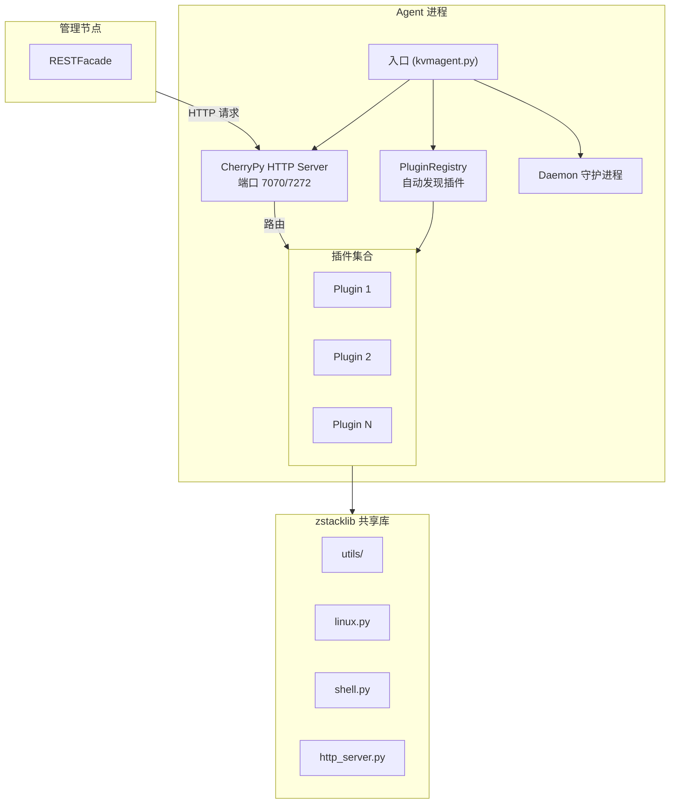

# Agent 通用架构

ZStack 的 Agent 体系采用统一的插件式架构，部署在计算/存储/网络节点上，通过 HTTP 接收管理节点的指令。所有 Agent 共享同一套框架代码（zstacklib），但各自专注于不同领域。

## 通用架构



## 通信模型

```
Management Node (Java)
    │
    │  HTTP POST (JSON)
    ▼
Agent (Python, 各自端口)
    │
    ├── Plugin A → 具体功能
    ├── Plugin B → 具体功能
    │
    │  系统命令 / 外部服务
    ▼
OS / libvirt / dnsmasq / haproxy / ...
```

- **管理节点 → Agent**：HTTP POST，body 为 JSON
- **Agent → 管理节点**：通过 `SEND_COMMAND_URL` 主动上报事件（如 VM 状态变更）
- 所有请求/响应均为 JSON 格式，使用 `jsonobject` 序列化

## Agent 清单

| Agent | 端口 | 插件数 | 核心职责 |
|-------|------|--------|----------|
| kvmagent | 7070 | 44 | VM 生命周期、网络、存储、监控 |
| virtualrouter | 7272 | 9 | DHCP、DNS、EIP、SNAT、LB、端口转发 |
| cephagent | 7270 | - | Ceph 存储管理 |
| sftpbackupstorageagent | 7271 | - | SFTP 备份存储 |

## 共享框架：zstacklib

所有 Agent 共享 `zstacklib/` 工具库，提供 74 个工具模块：

| 类别 | 模块 | 功能 |
|------|------|------|
| **系统基础** | `linux.py`, `linux_v2.py`, `shell.py`, `bash.py`, `daemon.py` | Linux 系统操作、Shell 执行、守护进程 |
| **网络** | `ip.py`, `iproute.py`, `iptables.py`, `iptables_v2.py`, `ebtables.py`, `ovs.py`, `ovn.py`, `ipset.py` | IP/路由/防火墙/OVS/OVN 管理 |
| **存储** | `iscsi.py`, `lvm.py`, `ceph.py`, `qemu_img.py`, `qemu_nbd.py`, `nbd_client.py`, `multipath.py`, `drbd.py` | iSCSI/LVM/Ceph/qcow2/NBD/多路径 |
| **虚拟化** | `qemu.py`, `qmp.py`, `qga.py`, `libvirt_singleton.py`, `vm_operator.py`, `pci.py`, `gpu.py` | QEMU/QMP/Guest Agent/libvirt/PCI/GPU |
| **序列化** | `jsonobject.py`, `xmlobject.py`, `xmlhook.py` | JSON/XML 处理 |
| **并发/同步** | `lock.py`, `thread.py`, `singleton.py`, `portalocker.py` | 锁/线程/单例 |
| **框架** | `plugin.py`, `http.py`, `log.py`, `defer.py`, `rollback.py` | 插件/HTTP/日志/延迟执行/回滚 |
| **工具** | `sizeunit.py`, `uuidhelper.py`, `misc.py`, `image.py`, `ssh.py`, `secret.py` | 单位转换/UUID/镜像/SSH/密钥 |

## 插件框架核心类

### Plugin 基类

```python
# zstacklib/zstacklib/utils/plugin.py
class Plugin(object):
    """所有 Agent 插件的基类"""
    def start(self):
        """子类重写，注册 HTTP 路由"""
        pass

    def configure(self, config):
        """接收配置注入"""
        pass

    def stop(self):
        """清理资源"""
        pass
```

### PluginRegistry — 插件注册表

```python
# zstacklib/zstacklib/utils/plugin.py
class PluginRegistry(object):
    def __init__(self, plugin_path):
        """扫描 plugin_path 目录下的所有 .py 文件"""

    def configure_plugins(self, config):
        """将配置注入所有插件"""

    def start_plugins(self):
        """调用所有插件的 start() 方法"""
```

### HttpServer — HTTP 服务器

```python
# zstacklib/zstacklib/utils/http.py
class HttpServer(object):
    def register_async_uri(self, path, handler, cmd=None):
        """注册异步路由（Agent 处理完后回调管理节点）"""

    def register_sync_uri(self, path, handler, cmd=None):
        """注册同步路由（管理节点等待 HTTP 响应）"""

    def start_in_thread(self):
        """在线程中启动 HTTP 服务器"""

    def start(self):
        """阻塞式启动 HTTP 服务器"""
```

底层基于 CherryPy 封装，`cmd` 参数用于请求体的 JSON 反序列化模板。

### Daemon — 守护进程

```python
# zstacklib/zstacklib/utils/daemon.py
class Daemon(object):
    def __init__(self, pidfile, py_process_name):
        """标准 Unix daemon：PID 文件、后台运行"""

    def run(self):
        """子类重写，启动 Agent"""
```

## 统一错误处理：@replyerror

所有 HTTP handler 方法都使用 `@replyerror` 装饰器：

```python
# 各 Agent 主入口中定义
def replyerror(func):
    @functools.wraps(func)
    def wrap(*args, **kwargs):
        try:
            return func(*args, **kwargs)
        except Exception as e:
            rsp = AgentResponse()
            rsp.success = False
            rsp.error = str(e)
            return jsonobject.dumps(rsp)
    return wrap
```

确保异常不会导致 HTTP 请求崩溃，而是返回 `{"success": false, "error": "..."}` 的 JSON 响应。

## 命令/响应基类

```python
class AgentCommand(object):
    """请求基类，由 jsonobject 自动反序列化"""

class AgentResponse(object):
    """响应基类"""
    success = True
    error = None
```

每个插件定义自己的 Command/Response 子类，如 `StartVmCmd`、`CreateEipCmd` 等。

## Agent 启动流程

```
1. main() 解析命令行参数
2. 创建 Daemon 实例
3. Daemon.run() 创建 Agent 主控类
4. Agent 主控类创建 PluginRegistry
5. PluginRegistry 扫描 plugins/ 目录
6. configure_plugins() 注入配置
7. start_plugins() 调用各插件 start()
   → 各插件在 start() 中注册 HTTP 路由
8. HttpServer.start() 启动 HTTP 服务
```

## 关键设计模式

| 模式 | 实现 | 说明 |
|------|------|------|
| **Plugin 模式** | `PluginRegistry` + `Plugin` 基类 | 动态加载插件，每个插件注册 HTTP 路由 |
| **HTTP RPC** | CherryPy + `register_async/sync_uri` | 管理节点通过 HTTP JSON 调用 Agent |
| **统一错误处理** | `@replyerror` 装饰器 | 所有 handler 自动捕获异常 |
| **命令对象模式** | `AgentCommand` / `AgentResponse` | 请求/响应强类型化 |
| **Daemon 模式** | `daemon.Daemon` | 标准 Unix 守护进程 |
| **文件锁** | `portalocker` / `file_lock` | 防止多进程并发操作 iptables 等 |
| **回滚** | `@rollback` 装饰器 | 操作失败时自动回滚 |
