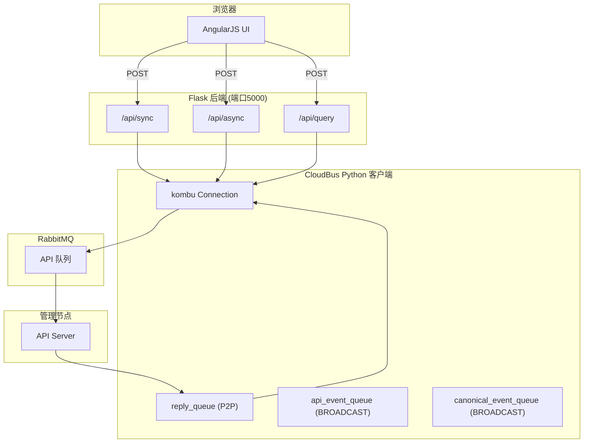

# Dashboard 后端

Dashboard 后端是一个 Flask 应用，通过 RabbitMQ 与管理节点通信，为前端提供 HTTP API 代理层。

## 架构概览



## 整体架构

```
浏览器 ──HTTP──> Flask (web.py) ──RabbitMQ──> 管理节点
                   │
                   ├── /api/sync   同步调用
                   ├── /api/async  异步调用
                   ├── /api/query  轮询异步结果
                   └── /           首页
```

Dashboard 本身不包含业务逻辑，它是一个**消息转发网关**：接收前端的 HTTP 请求，转换为 CloudBus 消息发送给管理节点，再将回复返回给前端。

## 入口与启动

`zstack-dashboard/zstack_dashboard/web.py:495-502`

```python
def main():
    logging.getLogger('pika').setLevel(logging.DEBUG)
    port = os.getenv('ZSTACK_DASHBOARD_PORT')  # 从环境变量读取端口
    if not port:
        port = 5000                            # 默认 5000
    else:
        port = int(port)
    app.run(host="0.0.0.0", port=port, threaded=True)  # 多线程模式
```

启动时创建全局 `Server` 实例，Server 内部创建 `CloudBus`，CloudBus 创建 `Connection` 连接 RabbitMQ。

## Connection：RabbitMQ 连接管理

`zstack-dashboard/zstack_dashboard/web.py:60-218`

Connection 管理与 RabbitMQ 的连接，维护三个队列：

```python
class Connection(object):
    P2P_EXCHANGE = "P2P"                    # 点对点交换机
    API_SERVICE_ID = "zstack.message.api.portal"  # 管理节点 API 入口
    BROADCAST_EXCHANGE = "BROADCAST"         # 广播交换机

    # 三个队列：
    # 1. reply_queue      — P2P exchange，接收 API 回复
    # 2. api_event_queue  — BROADCAST exchange，接收 API 完成事件
    # 3. canonical_event_queue — BROADCAST exchange，接收 CanonicalEvent
```

### 连接初始化

`zstack-dashboard/zstack_dashboard/web.py:137-205`

```python
def _initalize(self):
    # 1. 遍历 RabbitMQ URL 列表，找到可用连接
    def find_usable_url():
        while True:
            for url in self.urls:
                conn = kombu.Connection(url)
                try:
                    conn.connect()
                    return url, conn
                except Exception as e:
                    log.warn('cannot connect to %s' % url)
            time.sleep(5)  # 全部失败，5秒后重试

    self._current_url, self.conn = find_usable_url()

    # 2. 声明交换机和队列
    self.uuid = utils.uuid4()  # 去连字符的 UUID
    self.p2p_exchange = kombu.Exchange(self.P2P_EXCHANGE, type='topic', passive=True)
    self.broadcast_exchange = kombu.Exchange(self.BROADCAST_EXCHANGE, type='topic', passive=True)

    # 3. 创建三个自动删除的队列
    self.reply_queue_name = self.QUEUE_PREFIX % self.uuid
    self.reply_queue = kombu.Queue(self.reply_queue_name,
        exchange=self.p2p_exchange, routing_key=self.reply_queue_name,
        auto_delete=True)  # 连接断开后自动删除

    # 4. 启动消费线程
    def consumer_thread():
        self._reply_consumer = self.conn.Consumer(
            [self.reply_queue], callbacks=[self.reply_callback])
        self._api_event_consumer = self.conn.Consumer(
            [self.api_event_queue], callbacks=[self.api_event_callback])
        self._canonical_event_consumer = self.conn.Consumer(
            [self.canonical_event_queue], callbacks=[self.canonical_event_callback])
        with kombu.utils.nested(self._reply_consumer, self._api_event_consumer,
                                self._canonical_event_consumer):
            while not self.should_stop:
                self.conn.drain_events()  # 阻塞等待消息
```

关键设计：
- `passive=True` 表示不创建交换机，依赖管理节点先启动
- 队列名包含 UUID，确保每个 Dashboard 实例有独立队列
- `auto_delete=True`，断开连接后队列自动清理
- 连接断开后自动重连（`_do_initalize_in_thread`）

## CloudBus：消息协议

`zstack-dashboard/zstack_dashboard/web.py:220-394`

CloudBus 实现了与管理节点相同的消息协议：

### 消息格式

```json
{
  "org.zstack.header.vm.APICreateVmInstanceMsg": {
    "id": "a1b2c3d4e5f6",
    "serviceId": "api.portal",
    "headers": {
      "correlationId": "a1b2c3d4e5f6",
      "replyTo": "zstack.ui.message.xxxxx",
      "isReply": "false"
    }
  }
}
```

每条消息是 JSON，**单 key 为消息全限定名**，value 为消息体。headers 中包含路由信息。

### 发送消息

`zstack-dashboard/zstack_dashboard/web.py:335-367`

```python
def send(self, msg_str, callback):
    msg = simplejson.loads(msg_str)
    msg_name = msg.keys()[0]

    # 白名单校验
    if msg_name not in api_names:
        raise CloudBusError('unknown api message[%s]' % msg_name)

    msg_body = msg.values()[0]
    mid = msg_body['id'] = utils.uuid4()       # 分配消息 ID
    msg_body['serviceId'] = "api.portal"        # 路由到 API 服务

    headers = {
        self.CORRELATION_ID: mid,               # 关联 ID
        self.REPLY_TO: self.conn.reply_queue_name,  # 回复队列
        self.NO_NEED_REPLY_MSG: 'false'         # 需要回复
    }
    msg_body['headers'] = headers

    req = self.Request()
    req.callback = callback
    self.requests[mid] = req  # 保存请求，等待回复

    self.conn.send(msg)  # 发送到 P2P exchange，routing_key = zstack.message.api.portal
```

### 同步调用

`zstack-dashboard/zstack_dashboard/web.py:369-394`

```python
def call(self, msg_str):
    cond = threading.Condition()  # 条件变量实现同步等待
    ret = {'done': False, 'reply': None}

    def cb(reply):
        cond.acquire()
        ret['done'] = True
        ret['reply'] = reply
        cond.notifyAll()  # 唤醒等待线程
        cond.release()

    cond.acquire()
    self.send(msg_str, cb)       # 异步发送
    while not ret['done']:
        cond.wait()              # 阻塞等待回调
    cond.release()

    return ret['reply']
```

### 消息回复处理

`zstack-dashboard/zstack_dashboard/web.py:231-259`

```python
def _message_handler(self, body, message):
    msg = simplejson.loads(body)
    msg_body = msg.values()[0]
    headers = msg_body.get("headers")

    # 通过 correlationId 找到原始请求
    correlation_id = headers.get(self.CORRELATION_ID)
    req = self.requests.get(correlation_id)
    req.callback(msg)              # 触发回调
    del self.requests[correlation_id]  # 清理请求
    message.ack()                  # 确认消息
```

## Server：HTTP 路由与异步模式

`zstack-dashboard/zstack_dashboard/web.py:397-493`

### Receipt 模式

异步调用的核心是 `Receipt`（回执）：

```python
class Receipt(object):
    PROCESSING = 1  # 处理中
    DONE = 2        # 已完成

    def __init__(self):
        self.id = utils.uuid4()  # 回执 ID
        self.rsp = None          # 回复内容
        self.status = self.PROCESSING
```

### 异步调用流程

`zstack-dashboard/zstack_dashboard/web.py:451-464`

```python
def api_async_call(self, msg_str):
    receipt = self.Receipt()           # 创建回执
    def cb(evt):
        receipt.status = receipt.DONE  # 标记完成
        receipt.rsp = evt              # 保存回复

    self.api_tasks[receipt.id] = receipt  # 存入任务表
    self.bus.send(msg_str, cb)            # 异步发送
    return receipt.to_json()              # 返回回执 ID 给前端
```

### 轮询结果

`zstack-dashboard/zstack_dashboard/web.py:466-474`

```python
def api_query(self, task_id):
    task = self.api_tasks.get(task_id)
    if task.status == self.Receipt.DONE:
        del self.api_tasks[task_id]  # 完成后清理
    return task.to_json()            # 返回状态和结果
```

### HTTP 路由

```python
@app.route("/api/sync", methods=['POST', 'GET'])   # 同步 API
def api_sync_call():
    return server.api_sync_call(request.data)

@app.route("/api/async", methods=['POST', 'GET'])  # 异步 API
def api_async_call():
    return server.api_async_call(request.data)

@app.route("/api/query", methods=['POST', 'GET'])  # 查询异步结果
def api_query():
    return server.api_query(request.data)

@app.route("/")                                     # 首页
def index():
    return render_template("index.html")
```

## CanonicalEvent 订阅

`zstack-dashboard/zstack_dashboard/web.py:289-333`

Dashboard 通过 CanonicalEvent 监听 VM 状态变化：

```python
class Server(object):
    VM_STATE_CHANGE_PATH = "/vmTracer/vmStateChanged"

    def __init__(self):
        self.bus.register_canonical_event_handler(
            self.VM_STATE_CHANGE_PATH, self._handle_vm_state_event)

    def _handle_vm_state_event(self, evt):
        vm_uuid = evt.get('vmUuid')
        old_state = evt.get('from')
        new_state = evt.get('to')
```

CanonicalEvent 是管理节点的通用事件广播机制，通过 BROADCAST exchange 发送，routing key 为 `key.event.LOCAL.canonicalEvent`，body 中包含 `path` 字段用于路由到不同的 handler。

## API 白名单

`zstack-dashboard/zstack_dashboard/api_messages.py:1-301`

```python
api_names = [
    'org.zstack.appliancevm.APIQueryApplianceVmMsg',
    'org.zstack.storage.ceph.backup.APIAddCephBackupStorageMsg',
    'org.zstack.header.vm.APICreateVmInstanceMsg',
    # ... 约 300 个合法 API 消息名
]
```

CloudBus.send() 在发送前校验消息名是否在白名单中，防止前端发送非法消息。

## 工具库

`zstack-dashboard/zstack_dashboard/utils.py:1-157`

### UUID 生成

```python
def uuid4():
    return str(uuid.uuid4()).replace('-', '')  # 去连字符，与管理节点一致
```

### NamedLock

```python
class NamedLock(object):
    """线程安全的命名锁，支持 with 语法"""
    def __enter__(self):
        self.lock = _get_lock(self.name)  # 从 WeakValueDictionary 获取/创建
        self.lock.acquire()
    def __exit__(self, type, value, traceback):
        self.lock.release()
```

### PropertyFile

```python
class PropertyFile(object):
    """简单的 key=value 配置文件解析器"""
    # 支持 # 注释，自动跳过空行
```

## 数据流总结

一次完整的异步 API 调用流程：

```
1. 前端 POST /api/async  ──> Server.api_async_call()
2. 创建 Receipt，存入 api_tasks
3. CloudBus.send() ──> RabbitMQ P2P exchange ──> 管理节点
4. 返回 Receipt JSON（含 id, status=PROCESSING）
5. 前端 POST /api/query ──> Server.api_query(receipt.id)
6. 若 status=PROCESSING，返回进行中；前端 1 秒后重试
7. 管理节点处理完成 ──> RabbitMQ ──> CloudBus._message_handler()
8. 回调设置 receipt.status=DONE, receipt.rsp=reply
9. 前端下次 poll 收到 status=DONE，获取结果
```
