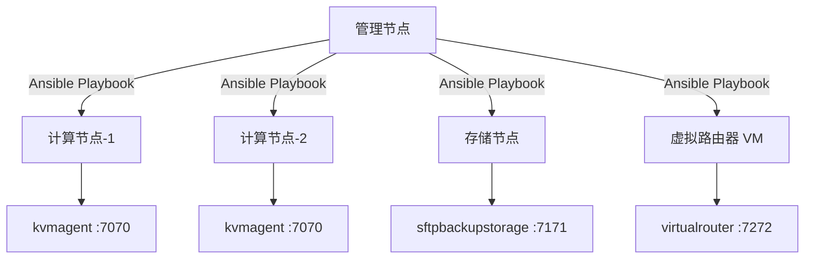
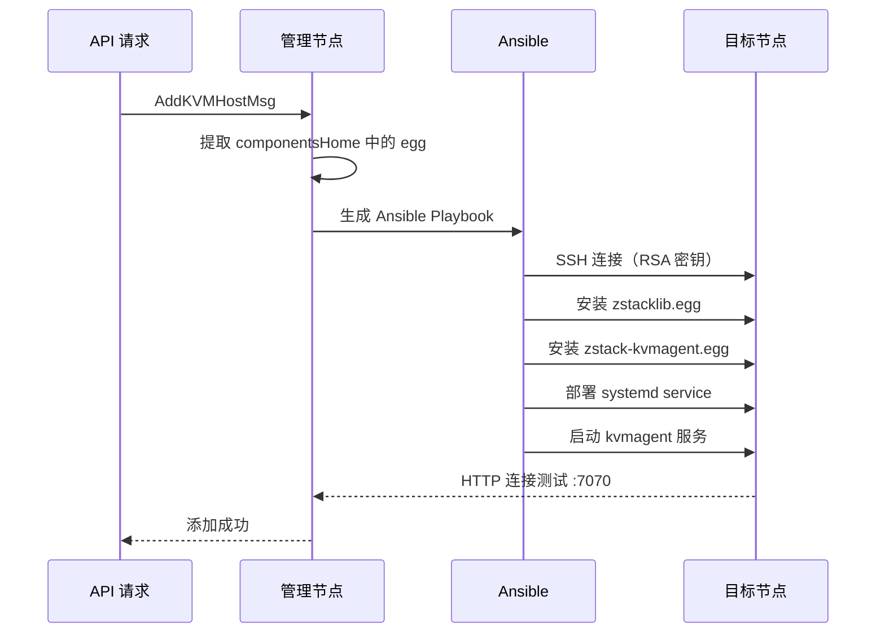

# 54 - Agent 部署与 Ansible

## Agent 部署模型

ZStack 的 Agent 以 Python egg 包形式部署到计算/存储节点，管理节点通过 Ansible 自动化推送和安装：



## Agent 组件清单

| Agent | 端口 | egg 包名 | 源码位置 | 功能 |
|-------|------|----------|----------|------|
| kvmagent | 7070 | zstack-kvmagent.egg | zstack-utility/kvmagent/ | KVM 虚拟化 + 存储管理 |
| virtualrouter | 7272 | zstack-virtualrouter.egg | zstack-utility/virtualrouter/ | 虚拟路由器网络服务 |
| sftpbackupstorage | 7171 | zstack-sftpbackupstorage.egg | zstack-utility/sftpbackupstorage/ | SFTP 备份存储 |
| zstacklib | — | zstacklib.egg | zstack-utility/zstacklib/ | 共享工具库（被所有 Agent 依赖） |

> 端口定义：zstack/conf/zstack.properties 第 7 行 `SftpBackupStorageFactory.agentPort=7171`

## egg 包构建

### 构建流程

每个 Agent 通过 `setup.py bdist_egg` 构建 egg 包：

```python
# 源码位置：zstack-utility/buildsystem/buildsystem/zstackbuild.py 第 217-225 行
def _build_zstack_lib(self):
    def build_from_source():
        (egg_name, egg_path) = tools.build_egg(self.zstack_lib.source)
        self.zstack_lib.dist_egg = egg_path
    build_from_source()
```

`tools.build_egg()` 内部执行：

```bash
cd /path/to/agent/source
python setup.py bdist_egg
# 产出：dist/zstack-kvmagent-<version>-py2.7.egg
```

### egg 嵌入 WAR

构建完成后，egg 包被嵌入 WAR 的 `componentsHome` 目录，供 Ansible 部署时提取：

```python
# 源码位置：zstack-utility/buildsystem/buildsystem/zstackbuild.py 第 79-95 行
# kvmagent 组装到 WAR
install = [
    ('$source/puppet/kvmagent', '$componentsHome/kvmagent/puppet/kvmagent'),
    ('$egg', '$componentsHome/kvmagent/puppet/kvmagent/files/zstack-kvmagent.egg'),
    ('$servicefile', '$componentsHome/kvmagent/puppet/kvmagent/files/'),
]
```

WAR 内部结构：

```
WEB-INF/classes/componentsHome/
├── kvmagent/puppet/kvmagent/
│   ├── files/
│   │   ├── zstack-kvmagent.egg        # kvmagent egg 包
│   │   └── zstack-kvmagent            # systemd service 文件
│   └── ...                            # Puppet 模板
├── virtualrouter/puppet/virtualrouter/
│   ├── files/
│   │   ├── zstack-virtualrouter.egg   # virtualrouter egg 包
│   │   └── zstack-virtualrouter       # systemd service 文件
│   └── ...
├── sftpbackupstorage/puppet/sftpbackupstorage/
│   ├── files/
│   │   ├── zstack-sftpbackupstorage.egg
│   │   └── zstack-sftpbackupstorage
│   └── ...
└── puppet/commonModules/
    ├── zstacklib/                      # zstacklib 共享库
    │   └── files/zstacklib.egg
    └── zstackagentbase/               # Agent 基础模块
```

## Ansible 自动化部署

### 配置

`zstack.properties` 中的 Ansible 配置：

```properties
# 源码位置：zstack/conf/zstack.properties 第 15-19 行
Ansible.cfg.forks=100                  # 并发 fork 数（可同时部署 100 个节点）
Ansible.cfg.host_key_checking=False    # 跳过 SSH 主机密钥检查
Ansible.cfg.pipelining=True            # SSH 管道加速（减少 SSH 往返）
Ansible.keepHostsFileInMemory=false    # 是否缓存 hosts 文件
Ansible.cfg.ssh_connection.ssh_args='-C -o ControlMaster=auto -o ControlPersist=1800s'
```

### SSH 密钥

ZStack 使用预生成的 RSA 密钥对进行免密 SSH 连接：

```
conf/ansible/
├── rsaKeys/
│   ├── id_rsa              # 私钥（用于 SSH 连接目标节点）
│   └── id_rsa.pub          # 公钥（需部署到目标节点的 authorized_keys）
└── rsaKeys_java/
    ├── RSAPrivate          # Java 使用的私钥
    └── RSAPublic           # Java 使用的公钥
```

> 源码位置：zstack/conf/ansible/rsaKeys/ 和 zstack/conf/ansible/rsaKeys_java/

### 部署流程

管理节点添加 Host 时的 Agent 自动部署流程：



### Puppet 模板

每个 Agent 附带 Puppet 模板，用于配置管理：

```
kvmagent/puppet/kvmagent/
├── files/
│   ├── zstack-kvmagent.egg
│   └── zstack-kvmagent           # systemd unit
├── manifests/
│   └── init.pp                   # Puppet 入口
└── templates/
    └── *.erb                     # 配置模板
```

## Agent 安装后验证

### kvmagent

```bash
# 检查服务状态
systemctl status zstack-kvmagent

# 检查端口监听
ss -tlnp | grep 7070

# 查看日志
tail -f /var/log/zstack/zstack-kvmagent.log
```

### virtualrouter

```bash
systemctl status zstack-virtualrouter
ss -tlnp | grep 7272
tail -f /var/log/zstack/zstack-virtualrouter.log
```

### sftpbackupstorage

```bash
systemctl status zstack-sftpbackupstorage
ss -tlnp | grep 7171
```

## Agent 版本管理

ZStack 通过 `AgentVersionVO` 跟踪每个节点上 Agent 的版本：

```xml
<!-- 源码位置：zstack/conf/persistence.xml 第 209 行 -->
<class>org.zstack.core.upgrade.AgentVersionVO</class>
```

管理节点在连接 Agent 时会检查版本一致性，如果 Agent 版本过旧，会触发自动升级流程。

## 手动安装 Agent

在无法使用 Ansible 的环境中，可手动安装：

```bash
# 1. 从 WAR 中提取 egg
unzip -p zstack.war WEB-INF/classes/componentsHome/kvmagent/puppet/kvmagent/files/zstack-kvmagent.egg > /tmp/zstack-kvmagent.egg
unzip -p zstack.war WEB-INF/classes/componentsHome/puppet/commonModules/zstacklib/files/zstacklib.egg > /tmp/zstacklib.egg

# 2. 安装 zstacklib（必须先于 Agent）
easy_install /tmp/zstacklib.egg

# 3. 安装 kvmagent
easy_install /tmp/zstack-kvmagent.egg

# 4. 部署 systemd service
cp zstack-kvmagent /etc/systemd/system/
systemctl daemon-reload
systemctl enable zstack-kvmagent
systemctl start zstack-kvmagent
```

## 防火墙配置

管理节点需要访问 Agent 的 HTTP 端口，目标节点需开放相应端口：

```bash
# kvmagent
iptables -A INPUT -p tcp --dport 7070 -s <MN_IP> -j ACCEPT

# virtualrouter
iptables -A INPUT -p tcp --dport 7272 -s <MN_IP> -j ACCEPT

# sftpbackupstorage
iptables -A INPUT -p tcp --dport 7171 -s <MN_IP> -j ACCEPT
```

`zstack.properties` 支持自定义 iptables 规则：

```properties
# 源码位置：zstack/conf/zstack.properties 第 66-67 行
# KvmHost.iptables.rule.0 = -A INPUT -s 172.20.0.100/32 -d 10.0.0.1/32 -p tcp -m tcp --sport 4000 --dport 500 -j ACCEPT
# KvmHost.iptables.rule.1 = -A INPUT -j REJECT --reject-with icmp-admin-prohibited
```
