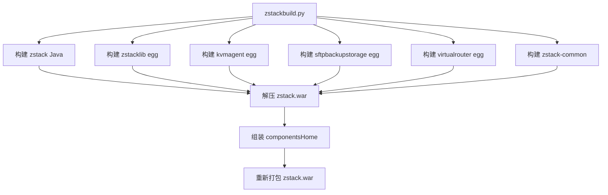

# 51 - 源码构建与打包

## 构建体系概览

ZStack 的构建由 `zstackbuild.py` 编排，它将 Java 核心、Python Agent 和共享库组装为一个完整的 WAR 包：



> 源码位置：zstack-utility/buildsystem/buildsystem/zstackbuild.py（Python 2 语法，使用 `print "..."` 和 `ConfigParser`）

## zstackbuild.py 详解

### 构建入口

```python
# 源码位置：zstack-utility/buildsystem/buildsystem/zstackbuild.py 第 377-389 行
if __name__ == '__main__':
    if len(sys.argv) >= 2:
        config_path = sys.argv[1]
    else:
        config_path = 'zstack-build.cfg'    # 默认配置文件

    config_path = os.path.abspath(config_path)
    if not os.path.exists(config_path):
        usage()
        sys.exit(1)

    Build(sys.argv[1]).main()
    sys.exit(0)
```

### 构建主流程

`Build.main()` 按顺序执行 6 个构建步骤 + 1 个组装步骤：

```python
# 源码位置：zstack-utility/buildsystem/buildsystem/zstackbuild.py 第 204-215 行
def main(self):
    self.confg_parser = tools.Parser()
    self.confg_parser.read(self.config_file_path)
    self._validate_config_file()       # 1. 校验配置
    self._make_build_dir()             # 2. 创建 build/ 目录
    self._build_zstack_java()          # 3. 构建 Java WAR
    self._build_zstack_lib()           # 4. 构建 zstacklib egg
    self._build_zstack_kvmagent()      # 5. 构建 kvmagent egg
    self._build_zstack_sftpbackupstorage()  # 6. 构建 sftpbackupstorage egg
    self._build_zstack_virtualrouter() # 7. 构建 virtualrouter egg
    self._assemble()                   # 8. 组装最终 WAR
```

### Java WAR 构建

支持从本地源码或 Git 仓库两种方式构建：

```python
# 源码位置：zstack-utility/buildsystem/buildsystem/zstackbuild.py 第 260-284 行
def _build_zstack_java(self):
    def build_from_source():
        cmdstr = "mvn -DskipTests clean install"           # 全量构建
        shell.ShellCmd(cmdstr, workdir=self.zstack_java.source, pipe=False)()
        warstr = "mvn war:war"                              # 打 WAR 包
        shell.ShellCmd(warstr, workdir=os.path.join(self.zstack_java.source, 'build'), pipe=False)()
        war = os.path.join(self.zstack_java.source, "build/target/zstack.war")
        tools.copy([(war, self.zstack_java.dist_war)])

    def build_from_repo():
        self.zstack_java.source = tools.git_clone(self.zstack_java.repo, self.build_path)
        build_from_source()

    self.zstack_java.dist_war = os.path.join(self.build_path, 'zstack.war')
    if self.zstack_java.source:
        build_from_source()       # 优先使用本地源码
    else:
        build_from_repo()         # 从 Git 仓库拉取
```

### Agent egg 构建

每个 Agent 通过 `tools.build_egg()` 构建 Python egg 包：

```python
# 源码位置：zstack-utility/buildsystem/buildsystem/zstackbuild.py 第 227-236 行
def _build_zstack_kvmagent(self):
    def build_from_source():
        (egg_name, egg_path) = tools.build_egg(self.zstack_kvmagent.source)
        self.zstack_kvmagent.dist_egg = egg_path
        # 服务文件（systemd unit）
        self.zstack_kvmagent.dist_service_file = os.path.join(
            self.zstack_kvmagent.source, 'zstack-kvmagent')
    build_from_source()
```

### WAR 组装

组装过程将所有 Agent egg 和配置文件嵌入 WAR 包的 `WEB-INF/classes/componentsHome/` 目录：

```python
# 源码位置：zstack-utility/buildsystem/buildsystem/zstackbuild.py 第 191-202 行
def _assemble(self):
    war_path = os.path.join(self.build_path, self.ZSTACK_ASSEMBLE)
    # 1. 解压原始 WAR
    shell.ShellCmd('unzip -d %s %s' % (war_path, self.zstack_java.dist_war))()
    # 2. 将各组件嵌入 componentsHome
    self.zstack_lib.assemble(war_path)
    self.zstack_kvmagent.assemble(war_path)
    self.zstack_sftp.assemble(war_path)
    self.zstack_virtualrouter.assemble(war_path)
    self.zstack_common.assemble(war_path)
    # 3. 重新打包
    shell.ShellCmd('jar -cvf zstack.war *', workdir=war_path)()
    # 注意：源码中此行缺少 () 调用，实际执行时 mv 命令不会运行
    shell.ShellCmd('mv %s/zstack.war %s/zstack.war' % (war_path, self.build_path))
```

kvmagent 的组装细节——将 egg 和 Puppet 模板嵌入 WAR：

```python
# 源码位置：zstack-utility/buildsystem/buildsystem/zstackbuild.py 第 79-95 行
class ZstackKvmAgent(object):
    def assemble(self, war_path):
        thedict = {
            "source": self.source,
            "componentsHome": Build.get_component_home(war_path),
            "egg": self.dist_egg,
            "servicefile": self.dist_service_file,
        }
        install = [
            # Puppet 模板 → componentsHome/kvmagent/puppet/kvmagent
            ('$source/puppet/kvmagent', '$componentsHome/kvmagent/puppet/kvmagent'),
            # egg 包 → puppet 目录下的 files/
            ('$egg', '$componentsHome/kvmagent/puppet/kvmagent/files/zstack-kvmagent.egg'),
            # systemd unit 文件
            ('$servicefile', '$componentsHome/kvmagent/puppet/kvmagent/files/'),
        ]
        tools.substitute_copy(install, thedict)
```

## zstack-build.cfg 配置

构建配置文件采用 INI 格式，定义各组件的源码路径：

```ini
# 源码位置：zstack-utility/buildsystem/test/zstack-build.cfg（示例）
[zstack-java]
source = /path/to/zstack
# 或者从 Git 仓库构建：
# repo = https://github.com/zstackio/zstack.git

[zstacklib]
source = /path/to/zstack-utility/zstacklib

[zstack-kvmagent]
source = /path/to/zstack-utility/kvmagent

[zstack-sftpbackupstorage]
source = /path/to/zstack-utility/sftpbackupstorage

[zstack-virtualrouter]
source = /path/to/zstack-utility/virtualrouter

[zstack-common]
source = /path/to/zstack-utility/zstackagentbase
```

配置校验逻辑确保必要字段存在：

```python
# 源码位置：zstack-utility/buildsystem/buildsystem/zstackbuild.py 第 294-316 行
def _validate_config_file(self):
    # zstack-java 必须提供 source 或 repo
    error_if_missing_section([self.ZSTACK_JAVA_SECTION, self.ZSTACK_KVM_AGENT_SECTION])
    validate_zstack_java()       # source 或 repo 至少一个
    validate_zstack_lib()        # source 必填
    validate_zstack_kvmagent()   # source 必填
    validate_zstack_sftpbackupstorage()  # source 必填
    validate_zstack_virtualrouter()      # source 必填
    validate_zstack_common()     # source 必填
```

## assembly.xml 打包结构

Maven Assembly 插件定义了独立运行模式的目录结构：

```xml
<!-- 源码位置：zstack/build/assembly.xml -->
<assembly>
    <id>zstack</id>
    <formats>
        <format>dir</format>          <!-- 输出为目录（非压缩包） -->
    </formats>
    <baseDirectory>zstack</baseDirectory>
    <dependencySets>
        <dependencySet>
            <outputDirectory>lib</outputDirectory>    <!-- JAR 依赖 → lib/ -->
            <useTransitiveDependencies>true</useTransitiveDependencies>
            <useProjectArtifact>false</useProjectArtifact>
            <useProjectAttachments>false</useProjectAttachments>
            <scope>runtime</scope>
            <excludes>
                <!-- 排除构建时依赖 -->
                <exclude>*maven*:*:*</exclude>
                <exclude>*:*:plexus*</exclude>
                <exclude>*:*:cvsclient*</exclude>
                <exclude>classworlds:classworlds</exclude>
                <exclude>ch.ethz.ganymed:ganymed-ssh2</exclude>
                <exclude>*:*:junit*</exclude>
                <exclude>org.hamcrest:hamcrest-core</exclude>
                <exclude>regexp:regexp</exclude>
                <exclude>jtidy:jtidy</exclude>
                <exclude>*:*:servlet-api*</exclude>
            </excludes>
        </dependencySet>
    </dependencySets>
    <fileSets>
        <fileSet><directory>../bin</directory></fileSet>     <!-- bin/ 脚本 -->
        <fileSet><directory>../conf</directory></fileSet>    <!-- conf/ 配置 -->
    </fileSets>
    <files>
        <!-- 启动脚本，设置可执行权限和 Unix 换行 -->
        <file>
            <source>zstack</source>
            <fileMode>755</fileMode>
            <lineEnding>unix</lineEnding>
        </file>
        <file>
            <source>zstack-debug</source>
            <fileMode>755</fileMode>
            <lineEnding>unix</lineEnding>
        </file>
    </files>
</assembly>
```

## deploy.sh 快速部署脚本

将构建产物部署到 Tomcat：

```bash
# 源码位置：zstack/build/deploy.sh
#!/bin/sh
set -u

if [ x$CATALINA_HOME == "x" ]; then
    echo '$CATALINA_HOME is not set, check tomcat manual'
    exit 1
fi

cd ..
mvn -DskipTests clean install    # 全量构建
cd -

mvn war:war                       # 打 WAR 包
rm -rf $CATALINA_HOME/webapps/zstack
rm -f $CATALINA_HOME/webapps/zstack.war
cp target/zstack.war $CATALINA_HOME/webapps/zstack.war

echo "Deployed zstack.war to $CATALINA_HOME/webapps/zstack.war"
```

## installwar.sh 手动部署

```bash
# 源码位置：zstack-utility/buildsystem/installwar.sh
#!/bin/sh
rm -rf $CATALINA_HOME/webapps/zstack*
cp build/zstack.war $CATALINA_HOME/webapps/
```

## WAR 包内部结构

最终 `zstack.war` 的关键目录：

```
zstack.war
├── WEB-INF/
│   ├── classes/                          # 配置文件（从 conf/ 复制）
│   │   ├── zstack.properties             # 主配置
│   │   ├── persistence.xml               # JPA 实体映射
│   │   ├── springConfigXml/              # Spring Bean 定义（91+ 文件）
│   │   ├── serviceConfig/                # API 消息路由（62 文件）
│   │   ├── globalConfig/                 # 运行时配置定义
│   │   ├── errorCodes/                   # 错误码定义
│   │   ├── db/                           # 数据库 schema + 迁移脚本
│   │   │   ├── V0.6__schema.sql          # 基础 schema
│       │   │   └── upgrade/                  # 版本升级 SQL（174 个文件）
│   │   └── componentsHome/               # Agent 组件（由 zstackbuild 嵌入）
│   │       ├── kvmagent/puppet/          # kvmagent + Puppet 模板
│   │       ├── virtualrouter/puppet/     # virtualrouter + Puppet 模板
│   │       ├── sftpbackupstorage/puppet/ # sftpbackupstorage + Puppet 模板
│   │       └── puppet/commonModules/     # zstacklib + zstackagentbase
│   ├── lib/                              # JAR 依赖
│   └── urlrewrite.xml                    # URL 重写规则
└── META-INF/
    └── context.xml                       # Tomcat Context 配置
```

> 源码位置：zstack/build/pom.xml 第 688-710 行定义了 `webResources` 映射规则

## 构建命令速查

| 场景 | 命令 |
|------|------|
| 全量构建 | `mvn -DskipTests clean install` |
| 打 WAR 包 | `cd build && mvn war:war` |
| 部署到 Tomcat | `build/deploy.sh` |
| 一键构建+组装 | `zstackbuild zstack-build.cfg` |
| Premium 构建 | `mvn -DskipTests clean install -Ppremium` |

> Premium profile 包含企业版模块（VPC、SDN、计费等），见 zstack/build/pom.xml 第 13-655 行
