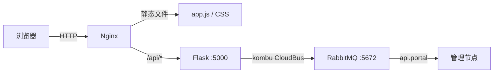
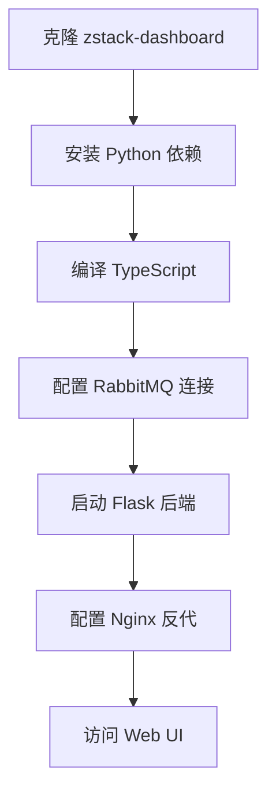

# 55 - Dashboard 部署

## 架构概览

Dashboard 由 Flask 后端 + TypeScript 前端组成，通过 RabbitMQ 与管理节点通信：



> 源码位置：zstack-dashboard/zstack_dashboard/web.py

## 后端部署

### Flask 应用

Dashboard 后端是一个 Flask 应用，入口为 `web.py`：

```python
# 源码位置：zstack-dashboard/zstack_dashboard/web.py
# Flask 应用启动，端口从环境变量读取
app.run(
    host='0.0.0.0',
    port=int(os.environ.get('ZSTACK_DASHBOARD_PORT', 5000))
)
```

### RabbitMQ 连接

Dashboard 通过 `kombu` 库连接 RabbitMQ，发送 API 消息到管理节点：

```python
# 源码位置：zstack-dashboard/zstack_dashboard/utils.py
# CloudBus Python 客户端连接配置
# routing key: zstack.message.api.portal
# 消息体内 serviceId: api.portal
```

关键配置：
- **routing key**：`zstack.message.api.portal`（RabbitMQ 路由键）
- **serviceId**：`api.portal`（消息体内的服务标识）
- 两者不同，routing key 用于 RabbitMQ 路由，serviceId 用于管理节点内部消息分发

### API 路由

Dashboard 后端提供 3 个 HTTP 路由：

| 路由 | 方法 | 说明 |
|------|------|------|
| `/api/sync` | POST | 同步 API 调用（等待管理节点返回结果） |
| `/api/async` | POST | 异步 API 调用（立即返回，轮询结果） |
| `/api/query` | POST | 查询 API 调用（自动生成的查询接口） |

```python
# 源码位置：zstack-dashboard/zstack_dashboard/web.py
@app.route('/api/sync', methods=['POST'])
def sync_api():
    # 同步调用：发送消息 → 等待响应 → 返回 JSON
    pass

@app.route('/api/async', methods=['POST'])
def async_api():
    # 异步调用：发送消息 → 返回 job ID → 前端轮询
    pass

@app.route('/api/query', methods=['POST'])
def query_api():
    # 查询调用：使用 AutoQuery 机制
    pass
```

### 部署步骤

```bash
# 1. 安装 Python 依赖
pip install flask kombu

# 2. 配置环境变量
export ZSTACK_DASHBOARD_PORT=5000
export ZSTACK_RABBITMQ_HOST=localhost
export ZSTACK_RABBITMQ_PORT=5672

# 3. 启动 Flask
cd zstack-dashboard
python -m zstack_dashboard.web
```

生产环境建议使用 Gunicorn 或 uWSGI：

```bash
# Gunicorn（推荐）
gunicorn -w 4 -b 0.0.0.0:5000 zstack_dashboard.web:app
```

## 前端部署

### TypeScript 编译

前端使用 TypeScript 编写，通过 `compilets.sh` 编译为单个 `app.js`：

```bash
# 源码位置：zstack-dashboard/compilets.sh
# 编译所有 TS 文件为单个 app.js
tsc --out zstack_dashboard/static/app/app.js ts/*.ts
```

编译特点：
- **无模块打包器**：使用 `tsc --out` 将所有 TS 文件合并为一个 `app.js`
- **无 Webpack/Vite**：纯 `tsc` 编译，输出单文件
- **全局命名空间**：所有模块通过全局变量交互

### 前端技术栈

| 技术 | 版本 | 用途 |
|------|------|------|
| TypeScript | — | 开发语言（28 个 .ts 文件） |
| AngularJS | 1.x | MVW 框架 |
| Kendo UI | — | UI 组件库（Grid、DropDownList 等） |
| Bootstrap | — | CSS 框架 |

### TS 文件结构

```
ts/
├── api.ts          # API 调用封装
├── app.ts          # AngularJS 应用入口
├── utils.ts        # 工具函数
├── vm.ts           # VM 管理页面
├── host.ts         # 主机管理页面
├── network.ts      # 网络管理页面
├── storage.ts      # 存储管理页面
├── image.ts        # 镜像管理页面
├── security.ts     # 安全组页面
├── ...             # 其他资源页面
└── dashboard.ts    # 仪表盘页面
```

### 静态文件部署

编译后的文件结构：

```
zstack_dashboard/static/
├── app/
│   └── app.js              # 编译后的所有 TS 代码
├── css/
│   └── *.css               # 样式文件
├── lib/
│   ├── angular.min.js      # AngularJS
│   ├── kendo/              # Kendo UI
│   └── bootstrap/          # Bootstrap
└── index.html              # 入口页面
```

## Nginx 反向代理

生产环境推荐使用 Nginx 反代 Dashboard 和管理节点 API：

```nginx
server {
    listen 80;
    server_name zstack.example.com;

    # 静态文件（前端）
    location /static/ {
        alias /opt/zstack/zstack-dashboard/zstack_dashboard/static/;
        expires 30d;
    }

    # Dashboard API
    location /api/ {
        proxy_pass http://127.0.0.1:5000;
        proxy_set_header Host $host;
        proxy_set_header X-Real-IP $remote_addr;
    }

    # 管理节点 REST API
    location /zstack/ {
        proxy_pass http://127.0.0.1:8080;
        proxy_set_header Host $host;
        proxy_set_header X-Real-IP $remote_addr;
    }

    # VNC 控制台代理
    location /console/ {
        proxy_pass http://127.0.0.1:4901;
        proxy_http_version 1.1;
        proxy_set_header Upgrade $http_upgrade;
        proxy_set_header Connection "upgrade";
    }
}
```

## 完整部署流程



### 一键部署脚本

```bash
#!/bin/bash
set -e

# 1. 克隆仓库
git clone https://github.com/zstackio/zstack-dashboard.git
cd zstack-dashboard

# 2. 安装 Python 依赖
pip install -r requirements.txt

# 3. 编译 TypeScript
bash compilets.sh

# 4. 配置环境变量
export ZSTACK_DASHBOARD_PORT=5000

# 5. 启动
gunicorn -w 4 -b 0.0.0.0:5000 zstack_dashboard.web:app
```

## 常见问题

| 问题 | 原因 | 解决方案 |
|------|------|----------|
| `tsc` 命令未找到 | 未安装 TypeScript 编译器 | `npm install -g typescript` |
| RabbitMQ 连接失败 | 网络不通或端口未开放 | 检查 5672 端口和 RabbitMQ 状态 |
| API 返回 404 | routing key 配置错误 | 确认使用 `zstack.message.api.portal` |
| app.js 未更新 | TS 编译缓存 | 删除旧 app.js 后重新编译 |
| VNC 控制台无法连接 | WebSocket 代理未配置 | Nginx 添加 Upgrade 头 |
