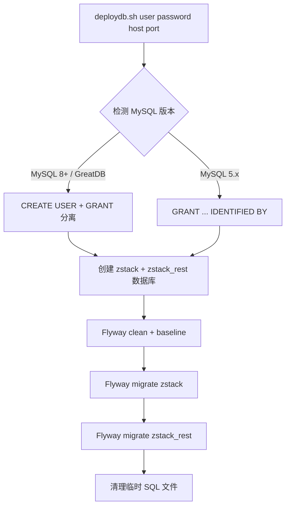
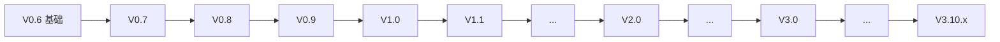

# 52 - 数据库初始化与迁移

## 双库架构

ZStack 使用两个独立的 MySQL 数据库：

| 数据库 | 用途 | Schema 来源 |
|--------|------|-------------|
| `zstack` | 核心业务数据（VM、Host、Network 等） | `V0.6__schema.sql` + `upgrade/` |
| `zstack_rest` | REST API 异步任务追踪 | `V0.6__schema_buildin_httpserver.sql` |

> 源码位置：zstack/conf/persistence.xml 定义了所有 JPA 实体类映射

## deploydb.sh 详解

### 完整执行流程



> 源码位置：zstack/build/deploydb.sh

### 数据库与用户创建

脚本自动检测 MySQL 版本，适配 5.x 和 8.0+ 两种授权语法：

```bash
# 源码位置：zstack/build/deploydb.sh 第 30-62 行
# 检测 MySQL 主版本号
db_version=$(${MYSQL} --version 2>/dev/null | grep -oP '\d+\.\d+\.\d+' | head -1 | cut -d'.' -f1 || echo "5")

# MySQL 8.0+ 和 GreatDB：先 CREATE USER 再 GRANT
if command -v greatdb &> /dev/null || [ "$db_version" -ge 8 ] 2>/dev/null; then
  ${MYSQL} ${loginCmd} << EOF
    set global log_bin_trust_function_creators=1;
    DROP DATABASE IF EXISTS zstack;
    CREATE DATABASE zstack;
    DROP DATABASE IF EXISTS zstack_rest;
    CREATE DATABASE zstack_rest;
    CREATE USER IF NOT EXISTS 'root'@'%' IDENTIFIED BY "${password}";
    CREATE USER IF NOT EXISTS 'root'@'127.0.0.1' IDENTIFIED BY "${password}";
    grant all privileges on zstack.* to root@'%';
    grant all privileges on zstack_rest.* to root@'%';
    grant all privileges on zstack.* to root@'127.0.0.1';
    grant all privileges on zstack_rest.* to root@'127.0.0.1';
EOF
else
  # MySQL 5.x：GRANT 自动创建用户
  ${MYSQL} ${loginCmd} << EOF
    set global log_bin_trust_function_creators=1;
    DROP DATABASE IF EXISTS zstack;
    CREATE DATABASE zstack;
    DROP DATABASE IF EXISTS zstack_rest;
    CREATE DATABASE zstack_rest;
    grant all privileges on zstack.* to root@'%' identified by "${password}";
    grant all privileges on zstack_rest.* to root@'%' identified by "${password}";
    grant all privileges on zstack.* to root@'127.0.0.1' identified by "${password}";
    grant all privileges on zstack_rest.* to root@'127.0.0.1' identified by "${password}";
EOF
fi
```

关键点：
- `log_bin_trust_function_creators=1`：允许创建存储函数（MySQL binlog 要求）
- 同时授权 `%`（任意主机）和 `127.0.0.1`（本地）两个来源
- 支持 GreatDB（国产数据库替代）

### Flyway 迁移

ZStack 使用 Flyway 3.2.1 管理数据库 schema 版本：

```bash
# 源码位置：zstack/build/deploydb.sh 第 64-100 行
# Flyway 版本（可覆盖）
: "${flywayver:=3.2.1}"
flyway="$base/../conf//tools/flyway-$flywayver/flyway"    # 注意：源码中双斜杠 conf//tools
flyway_sql="$base/../conf/tools/flyway-$flywayver/sql/"

mkdir -p ${flyway_sql}
eval "rm -f ${flyway_sql}/*"

# 复制基础 schema + 所有升级脚本到 Flyway SQL 目录
cp ${base}/../conf/db/V0.6__schema.sql ${flyway_sql}
cp ${base}/../conf/db/upgrade/* ${flyway_sql}

# zstack 库迁移
url="jdbc:mysql://$host:$port/zstack"
${flyway} -user=${user} -password=${password} -url=${url} clean
${flyway} -user=${user} -password=${password} -url=${url} baseline
${MYSQL} ${loginCmd} zstack -e "DELETE FROM schema_version"   # 清空基线记录
${flyway} -outOfOrder=true -user=${user} -password=${password} -url=${url} migrate

# zstack_rest 库迁移
eval "rm -f ${flyway_sql}/*"
cp ${base}/../conf/db/V0.6__schema_buildin_httpserver.sql ${flyway_sql}
url="jdbc:mysql://$host:$port/zstack_rest"
${flyway} -user=${user} -password=${password} -url=${url} clean
${flyway} -outOfOrder=true -user=${user} -password=${password} -url=${url} migrate
```

关键步骤解析：

1. **clean**：清除数据库所有对象（危险操作，仅用于初始化）
2. **baseline**：在已有数据库上标记基线版本，避免重复执行
3. **DELETE FROM schema_version**：清空 Flyway 版本记录，使所有迁移脚本重新执行
4. **migrate -outOfOrder=true**：允许乱序执行迁移脚本（版本间可能有间隙）

## Schema 版本演进

### 版本命名规则

Flyway SQL 文件遵循 `V{version}__{description}.sql` 命名规范：

```
conf/db/
├── V0.6__schema.sql                    # 基础 schema（全量建表）
├── V0.6__schema_buildin_httpserver.sql # REST 库 schema
└── upgrade/
    ├── V0.7__schema.sql                # 0.6 → 0.7 增量
    ├── V0.8__schema.sql                # 0.7 → 0.8 增量
    ├── V0.9__schema.sql
    ├── V1.0__schema.sql
    ├── ...
    ├── V3.10.25__schema.sql            # 最新版本
    ├── beforeMigrate.sql               # 迁移前钩子
    └── beforeValidate.sql              # 校验前钩子
```

### 版本链

从 V0.6 到 V3.10.25，共 174 个迁移脚本（含 beforeMigrate/beforeValidate 钩子），覆盖 ZStack 从 0.6 到 5.4.0 的所有 schema 变更：



### outOfOrder 策略

`-outOfOrder=true` 允许 Flyway 执行版本号不连续的迁移脚本。这在以下场景中必要：

- 补丁版本（如 V3.10.0.1、V3.10.0.2）在主版本之后添加
- 不同开发分支合并时产生版本间隙
- 回填遗漏的 schema 变更

## beforeMigrate.sql 与 beforeValidate.sql

### beforeMigrate.sql

在 Flyway migrate 执行前运行，用于数据预处理：

```sql
-- 源码位置：zstack/conf/db/upgrade/beforeMigrate.sql
-- 典型用途：数据类型转换、临时列处理、兼容性修正
```

### beforeValidate.sql

在 Flyway validate 执行前运行，用于修正 schema_version 表中的校验和：

```sql
-- 源码位置：zstack/conf/db/upgrade/beforeValidate.sql
-- 典型用途：修复因手动修改 SQL 导致的校验和不匹配
```

## Maven 集成部署

除了 `deploydb.sh`，也可以通过 Maven 执行数据库部署：

```bash
# 源码位置：zstack/pom.xml 中的 deploydb profile
mvn -Pdeploydb
```

该命令内部调用 `deploydb.sh`，参数从 `zstack.properties` 读取：

```properties
# 源码位置：zstack/conf/zstack.properties 第 1-3 行
DB.url=jdbc:mysql://localhost:3306
DB.user=zstack
DB.password=
```

## JPA 实体映射

`persistence.xml` 声明了所有 JPA 实体类（226 个），Flyway 迁移的 SQL 必须与这些实体保持一致：

```xml
<!-- 源码位置：zstack/conf/persistence.xml -->
<persistence>
    <persistence-unit name="zstack.jpa" transaction-type="RESOURCE_LOCAL">
        <mapping-file>persistence-mapping.xml</mapping-file>
        <class>org.zstack.header.zone.ZoneVO</class>
        <class>org.zstack.header.cluster.ClusterVO</class>
        <class>org.zstack.header.host.HostVO</class>
        <!-- ... 226 个实体类 ... -->
    </persistence-unit>
</persistence>
```

## 常见问题

| 问题 | 原因 | 解决方案 |
|------|------|----------|
| `log_bin_trust_function_creators` 错误 | MySQL binlog 开启但未允许函数创建 | `SET GLOBAL log_bin_trust_function_creators=1` |
| Flyway 校验和不匹配 | 手动修改了已执行的 SQL | 清空 `schema_version` 表后重新 baseline |
| 迁移脚本乱序报错 | 缺少 `-outOfOrder=true` | 始终使用 `outOfOrder=true` |
| GreatDB 兼容性 | 语法差异 | 脚本已自动检测并适配 |
| MySQL 8 认证插件 | `caching_sha2_password` | 使用 `mysql_native_password` 或确保驱动兼容 |
