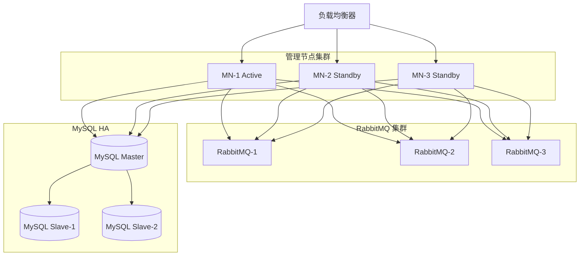
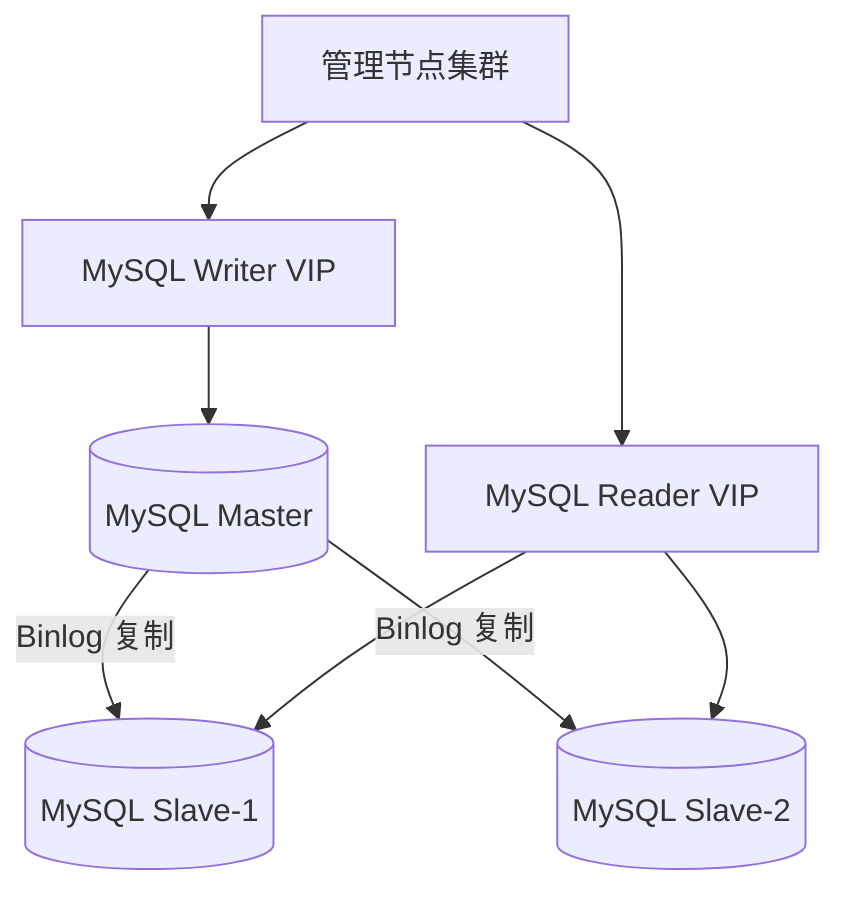
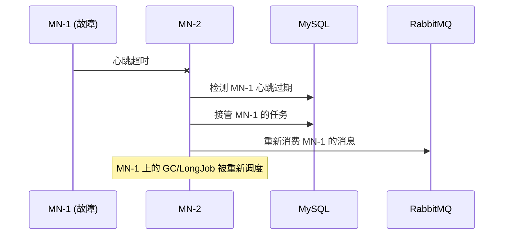

# 56 - 高可用与多管理节点

## 高可用架构

ZStack 支持多管理节点部署，通过 RabbitMQ 镜像队列和数据库主从实现高可用：



## 管理节点发现与注册

### ManagementNodeVO

每个管理节点启动时在数据库中注册自身：

```xml
<!-- 源码位置：zstack/conf/persistence.xml 第 19-20 行 -->
<class>org.zstack.header.managementnode.ManagementNodeVO</class>
<class>org.zstack.header.managementnode.ManagementNodeContextVO</class>
```

`ManagementNodeVO` 记录：
- 管理节点 UUID
- 主机名（`hostName`）
- 端口号
- 加入时间（`joinDate`）
- 心跳时间戳（`heartBeat`）
- 状态（`JOINING` / `RUNNING`）

> 源码位置：zstack/header/src/main/java/org/zstack/header/managementnode/ManagementNodeVO.java
> 状态枚举：zstack/header/src/main/java/org/zstack/header/managementnode/ManagementNodeState.java — 只有 `JOINING` 和 `RUNNING` 两个值

### 心跳机制

管理节点定期更新心跳时间戳（`heartBeat` 字段），其他节点通过心跳判断其存活状态。心跳超时的节点会被标记为 `JOINING`（非 `RUNNING`），其上的任务会被重新分配。

`ManagementNodeContextVO` 是一个单行表（`id=1`），存储管理节点上下文的序列化数据（`byte[] inventory`），用于节点间状态同步。

> 源码位置：zstack/header/src/main/java/org/zstack/header/managementnode/ManagementNodeContextVO.java

### CloudBus 多节点配置

```properties
# 源码位置：zstack/conf/zstack.properties 第 21 行
CloudBus.serverIp.0 = localhost

# 多节点配置示例：
# CloudBus.serverIp.0 = 192.168.1.1
# CloudBus.serverIp.1 = 192.168.1.2
# CloudBus.serverIp.2 = 192.168.1.3
```

所有管理节点必须连接到同一个 RabbitMQ 集群，通过 `CloudBus.serverIp.N` 配置多个 RabbitMQ 地址。

## 管理节点网络隔离

### MN.network 配置

多网卡环境下，需要指定管理节点使用的网段：

```properties
# 源码位置：zstack/conf/zstack.properties 第 62-63 行
# MN.network.0=172.20.16.250/32
# MN.network.1=10.86.4.0/23
```

`MN.network` 的作用：
- 指定管理节点与 Agent 通信时使用的网卡
- 确保管理流量走正确的网络平面
- 未配置时自动选择默认网卡

## RabbitMQ 集群

### 集群模式

ZStack 推荐使用 RabbitMQ 镜像队列（HA Queue）模式：

```mermaid
graph LR
    subgraph "RabbitMQ 集群"
        N1[Node-1] --- N2[Node-2]
        N2 --- N3[Node-3]
        N1 --- N3
    end

    subgraph "镜像队列"
        Q1[Queue@Node-1 Master]
        Q2[Queue@Node-2 Mirror]
        Q3[Queue@Node-3 Mirror]
    end

    N1 --> Q1
    N2 --> Q2
    N3 --> Q3
```

### 镜像队列策略

```bash
# 设置所有队列为镜像队列
rabbitmqctl set_policy ha-all ".*" '{"ha-mode":"all","ha-sync-mode":"automatic"}'
```

### CloudBus 消息路由

管理节点通过 CloudBus 收发消息，每个节点监听自己的队列：

```
RabbitMQ Exchange
├── zstack.message.api.portal        # API 入口
├── zstack.message.management.node.1 # MN-1 专属队列
├── zstack.message.management.node.2 # MN-2 专属队列
└── zstack.message.management.node.3 # MN-3 专属队列
```

API 请求通过 `api.portal` 进入，由某个管理节点处理；节点间通信通过专属队列路由。

## MySQL 高可用

### 主从复制

ZStack 使用 MySQL 主从复制保证数据可用性：



### 数据库连接配置

```properties
# 源码位置：zstack/conf/zstack.properties 第 1-3 行
DB.url=jdbc:mysql://localhost:3306    # 写入 VIP
DB.user=zstack
DB.password=
```

生产环境将 `DB.url` 指向 MySQL Writer VIP，实现故障自动切换。

### 双库注意事项

ZStack 使用 `zstack` 和 `zstack_rest` 两个数据库，主从复制需要同时配置：

```bash
# 在 Slave 上配置复制
CHANGE MASTER TO
    MASTER_HOST='master-vip',
    MASTER_USER='replication',
    MASTER_PASSWORD='password';

# 两个数据库都需要复制
START SLAVE;
```

## 管理节点选举

### 任务分配

ZStack 使用分布式任务分配机制，确保同一任务只由一个管理节点执行：

- **GarbageCollector**：每个 GC 任务由一个节点执行
- **LongJob**：异步任务由接收请求的节点跟踪
- **定时任务**：通过数据库锁确保单节点执行

### 节点故障处理



## 负载均衡

### API 请求分发

多管理节点前部署负载均衡器（HAProxy/Nginx），API 请求可分发到任意节点：

```nginx
# Nginx 负载均衡配置
upstream zstack_api {
    server 192.168.1.1:8080;
    server 192.168.1.2:8080;
    server 192.168.1.3:8080;
}

server {
    listen 80;
    location /zstack/ {
        proxy_pass http://zstack_api;
    }
}
```

### Session 一致性

ZStack 的 Session 存储在数据库中（`SessionVO`），任意管理节点均可验证 Session，无需 Session 亲和性：

```xml
<!-- 源码位置：zstack/conf/persistence.xml 第 90 行 -->
<class>org.zstack.header.identity.SessionVO</class>
```

## 部署检查清单

| 检查项 | 命令 |
|--------|------|
| RabbitMQ 集群状态 | `rabbitmqctl cluster_status` |
| 镜像队列策略 | `rabbitmqctl list_policies` |
| MySQL 主从状态 | `SHOW SLAVE STATUS\G` |
| 管理节点心跳 | 查询 `ManagementNodeVO` 表 |
| CloudBus 连接 | 检查 5672 端口连通性 |
| 负载均衡健康检查 | `curl http://lb-vip:8080/zstack/static` |

## 最小 HA 部署

3 节点最小高可用部署：

| 节点 | 角色 | 组件 |
|------|------|------|
| Node-1 | MN + RabbitMQ + MySQL Master | Tomcat + RabbitMQ + MySQL |
| Node-2 | MN + RabbitMQ + MySQL Slave | Tomcat + RabbitMQ + MySQL |
| Node-3 | RabbitMQ + MySQL Slave | RabbitMQ + MySQL |

> 注意：至少 2 个管理节点 + 3 个 RabbitMQ 节点才能保证仲裁多数
