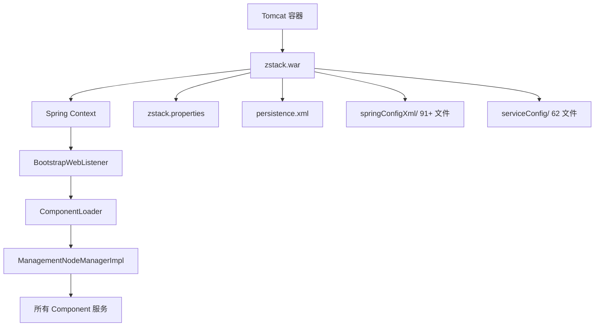
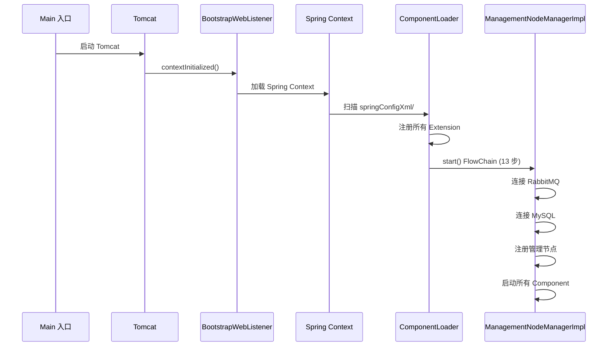

# 53 - 管理节点部署

## 部署架构

管理节点是 ZStack 的核心，以 WAR 包形式运行在 Tomcat 中：



## Tomcat 部署

### WAR 部署方式

```bash
# 方式一：deploy.sh 自动部署
# 源码位置：zstack/build/deploy.sh
cd zstack && mvn -DskipTests clean install
cd build && mvn war:war
cp target/zstack.war $CATALINA_HOME/webapps/zstack.war

# 方式二：installwar.sh 手动部署
# 源码位置：zstack-utility/buildsystem/installwar.sh
rm -rf $CATALINA_HOME/webapps/zstack*
cp build/zstack.war $CATALINA_HOME/webapps/
```

### Context 配置

Tomcat Context 允许符号链接（用于配置文件外置）：

```xml
<!-- 源码位置：zstack/build/context.xml -->
<Context path="/zstack/static" allowLinking="true">
</Context>
```

## 启动脚本

### 正常启动

`zstack` 脚本构建 classpath 并启动管理节点：

```bash
# 源码位置：zstack/build/zstack
#!/bin/bash

baseDir=`dirname $0`
libDir=$baseDir/lib       # JAR 依赖目录
confDir=$baseDir/conf     # 配置文件目录

buildClassPath() {
    jarList=`ls $libDir`
    for jar in $jarList
    do
        jarPath=$libDir/$jar
        classPath=$jarPath:$classPath
    done
    classPath=$classPath:$confDir    # conf/ 也加入 classpath
}

run() {
    # 入口类：org.zstack.portal.main.Main
    java -cp $classPath org.zstack.portal.main.Main "$@"
}

main() {
    buildClassPath
    run "$@"
}

main "$@"
```

关键点：
- 入口类是 `org.zstack.portal.main.Main`（非 Spring Boot，无 `main()` 在源码中）
- `conf/` 目录加入 classpath，使 `zstack.properties` 等配置文件可被自动加载

### 调试启动

ZStack 提供两个调试脚本，入口类不同：

**zstack-debug**（独立运行模式，入口类 `org.zstack.portal.main.Main`）：

```bash
# 源码位置：zstack/build/zstack-debug
# 默认 suspend=y（等待调试器连接）
javaOptitons="-Xdebug -Xms256m -Xmx512m -XX:+HeapDumpOnOutOfMemoryError \
  -Xrunjdwp:transport=dt_socket,address=8787,server=y,suspend=y"
java $javaOptions -cp $classPath org.zstack.portal.main.Main "$@"
```

**debug.sh**（Maven 构建后调试，入口类 `com.zstack.server.Main`）：

```bash
# 源码位置：zstack/build/debug.sh
# 参数控制 suspend：debug.sh true / debug.sh false
if [ x"$is_suspend" == x"true" ]; then
    java_optitons="-Xdebug -Xms256m -Xmx512m -XX:+HeapDumpOnOutOfMemoryError \
      -Xrunjdwp:transport=dt_socket,address=8787,server=y,suspend=y"
else
    java_optitons="-Xdebug -Xms256m -Xmx512m -XX:+HeapDumpOnOutOfMemoryError \
      -Xrunjdwp:transport=dt_socket,address=8787,server=y,suspend=n"
fi

java $java_optitons -cp $classpath com.zstack.server.Main
```

> 注意：`zstack-debug` 和 `debug.sh` 使用不同的入口类。`zstack-debug` 使用 `org.zstack.portal.main.Main`（与正常启动相同），`debug.sh` 使用 `com.zstack.server.Main`（Maven 构建产物中的类）

| 参数 | 说明 |
|------|------|
| `-Xms256m -Xmx512m` | 堆内存 256-512MB（生产环境需调大） |
| `-XX:+HeapDumpOnOutOfMemoryError` | OOM 时自动 dump |
| `address=8787` | JDWP 调试端口 |
| `suspend=y/n` | 是否等待调试器连接后再启动 |

### Maven 调试启动

```bash
# 非挂起调试
mvn -pl build -P debug exec:exec -Ddebug

# 挂起调试（等待调试器连接）
mvn -pl build -P debug-suspend exec:exec -Ddebug-suspend
```

## zstack.properties 配置详解

### 数据库连接

```properties
# 源码位置：zstack/conf/zstack.properties 第 1-3 行
DB.url=jdbc:mysql://localhost:3306     # MySQL 连接 URL
DB.user=zstack                         # 数据库用户
DB.password=                           # 数据库密码（空表示无密码）
```

### CloudBus 配置

```properties
# 源码位置：zstack/conf/zstack.properties 第 21 行
CloudBus.serverIp.0 = localhost        # RabbitMQ 服务器地址
# 多节点时添加更多：
# CloudBus.serverIp.1 = 192.168.1.2
# CloudBus.serverIp.2 = 192.168.1.3
```

### REST API 配置

```properties
# 源码位置：zstack/conf/zstack.properties 第 5 行
RESTFacade.hostname=AUTO               # REST 服务主机名，AUTO 自动检测

# 源码位置：zstack/conf/zstack.properties 第 9 行
ApiMediator.apiWorkerNum=50            # API 工作线程数
```

### Agent 端口

```properties
# 源码位置：zstack/conf/zstack.properties 第 7 行
SftpBackupStorageFactory.agentPort=7171  # SFTP 备份存储 Agent 端口
```

### 控制台代理

```properties
# 源码位置：zstack/conf/zstack.properties 第 27-30 行
consoleProxyCertFile =                 # VNC 代理证书文件
consoleProxyOverriddenIp =             # VNC 代理覆盖 IP
consoleProxyPort=4900                  # TCP VNC 代理端口
httpConsoleProxyPort=4901              # HTTP VNC 代理端口
```

### Ansible 自动化

```properties
# 源码位置：zstack/conf/zstack.properties 第 15-19 行
Ansible.cfg.forks=100                  # Ansible 并发 fork 数
Ansible.cfg.host_key_checking=False    # 跳过 SSH 主机密钥检查
Ansible.cfg.pipelining=True            # 启用 SSH 管道加速
Ansible.keepHostsFileInMemory=false    # 是否缓存 hosts 文件
Ansible.cfg.ssh_connection.ssh_args='-C -o ControlMaster=auto -o ControlPersist=1800s'
```

### API 超时

```properties
# 源码位置：zstack/conf/zstack.properties 第 41-50 行
# 可按 API 消息类型设置超时：
# ApiTimeout.org.zstack.header.image.APIAddImageMsg = timeout::3h
# ApiTimeout.org.zstack.header.vm.APICreateVmInstanceMsg = timeout::3h
# ApiTimeout.org.zstack.header.volume.APICreateVolumeSnapshotMsg = timeout::3h
```

### 管理节点网络

```properties
# 源码位置：zstack/conf/zstack.properties 第 62-63 行
# 多网卡环境下指定管理网络：
# MN.network.0=172.20.16.250/32
# MN.network.1=10.86.4.0/23
```

### 监控集成

```properties
# 源码位置：zstack/conf/zstack.properties 第 57-59 行
Prometheus.versionMode=2.x             # Prometheus 版本模式
InfluxDB.metadata.version=v2           # InfluxDB 版本（v1/v2）
```

### HTTP 连接池

```properties
# 源码位置：zstack/conf/zstack.properties 第 53-54 行
http.keepAlive=true                    # 启用 HTTP Keep-Alive
http.maxConnections=1024               # 最大连接数
```

## JPA 配置

### persistence.xml

定义 JPA 持久化单元和所有实体类映射：

```xml
<!-- 源码位置：zstack/conf/persistence.xml -->
<persistence>
    <persistence-unit name="zstack.jpa" transaction-type="RESOURCE_LOCAL">
        <mapping-file>persistence-mapping.xml</mapping-file>
        <!-- 226 个实体类声明 -->
        <class>org.zstack.header.zone.ZoneVO</class>
        <class>org.zstack.header.host.HostVO</class>
        <!-- ... -->
    </persistence-unit>
</persistence>
```

### 数据源配置

```properties
# 源码位置：zstack/conf/zstack.properties 第 25 行
DbFacadeDataSource.testConnectionOnCheckout = true   # 连接池检出时测试
```

## 启动流程

管理节点启动序列（详见 [02 - 启动流程详解](/guide/boot-sequence)）：



## 生产环境建议

| 配置项 | 开发环境 | 生产环境 |
|--------|----------|----------|
| JVM 堆内存 | 256-512MB | 4-8GB |
| API 工作线程 | 50 | 100-200 |
| HTTP 最大连接 | 1024 | 4096+ |
| MySQL 连接池 | 默认 | 100-200 |
| RabbitMQ | 单节点 | 镜像队列集群 |
| 日志级别 | DEBUG | INFO |
