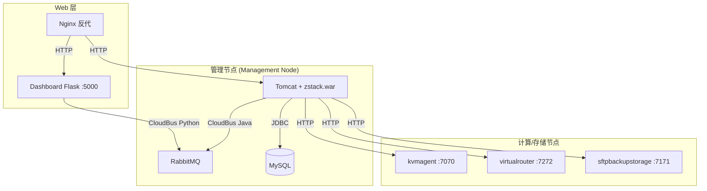
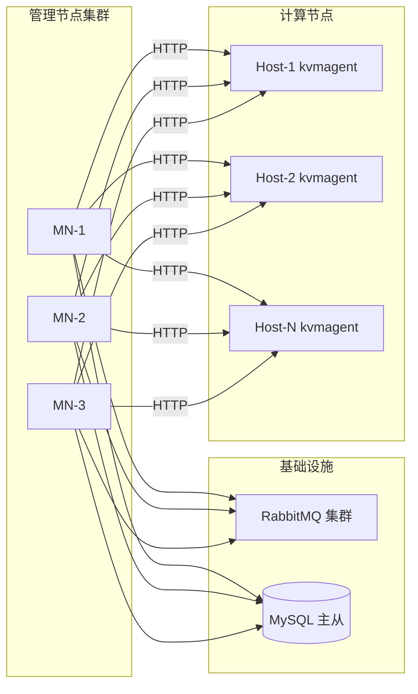
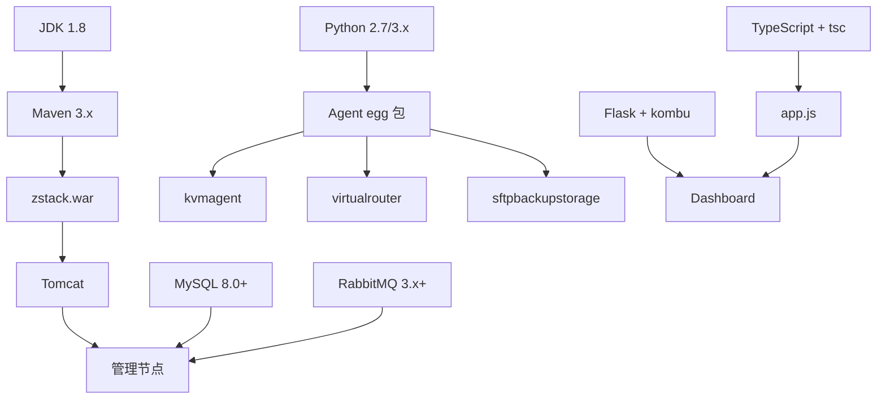

# 50 - 部署架构总览

## 三层部署模型

ZStack 采用管理节点 → Agent → Dashboard 三层部署架构，各层通过 RabbitMQ 或 HTTP 通信：



> 源码位置：zstack/conf/zstack.properties 定义了所有连接配置

## 部署拓扑

### 单节点（All-in-One）

所有组件部署在一台物理机/虚拟机上，适合开发测试：

```
┌─────────────────────────────────────┐
│           单节点服务器               │
│  ┌──────────┐  ┌──────────┐        │
│  │ Tomcat   │  │ RabbitMQ │        │
│  │ zstack   │  │  :5672   │        │
│  └──────────┘  └──────────┘        │
│  ┌──────────┐  ┌──────────┐        │
│  │ MySQL    │  │Dashboard │        │
│  │ :3306    │  │ :5000    │        │
│  └──────────┘  └──────────┘        │
│  ┌──────────┐                      │
│  │ kvmagent │                      │
│  │ :7070    │                      │
│  └──────────┘                      │
└─────────────────────────────────────┘
```

### 多节点（生产推荐）

管理节点与计算节点分离，支持水平扩展：



### 高可用（HA）

多管理节点 + RabbitMQ 镜像队列 + MySQL 主从，任一管理节点故障不影响服务。

## 端口矩阵

| 端口 | 组件 | 协议 | 说明 |
|------|------|------|------|
| 3306 | MySQL | TCP | 元数据库，双库 `zstack` + `zstack_rest` |
| 5672 | RabbitMQ | AMQP | CloudBus 消息通信 |
| 15672 | RabbitMQ | HTTP | RabbitMQ 管理界面 |
| 8080 | Tomcat | HTTP | 管理节点 REST API（zstack.war） |
| 5000 | Dashboard | HTTP | Flask Web 后端 |
| 7070 | kvmagent | HTTP | KVM 计算/存储代理 |
| 7171 | sftpbackupstorage | HTTP | SFTP 备份存储代理 |
| 7272 | virtualrouter | HTTP | 虚拟路由器代理 |
| 4900 | ConsoleProxy | TCP | VNC 控制台代理 |
| 4901 | ConsoleProxy | HTTP | HTTP 控制台代理 |
| 8787 | JDWP | TCP | 远程调试端口（debug 模式） |

> 源码位置：
> - zstack/conf/zstack.properties 第 7 行：`SftpBackupStorageFactory.agentPort=7171`
> - zstack/conf/zstack.properties 第 21 行：`CloudBus.serverIp.0 = localhost`
> - zstack/conf/zstack.properties 第 29-30 行：`consoleProxyPort=4900` / `httpConsoleProxyPort=4901`

## 组件依赖关系



## 网络规划要点

管理节点需要与所有计算/存储节点网络互通。`zstack.properties` 中可配置管理节点网络白名单：

```properties
# 源码位置：zstack/conf/zstack.properties 第 62-63 行
# MN.network.0=172.20.16.250/32
# MN.network.1=10.86.4.0/23
```

`MN.network` 配置项用于多网卡环境下指定管理节点使用的网段，未配置时自动选择。

## 目录结构总览

部署完成后的典型目录布局：

```
/opt/zstack/
├── apache-tomcat/          # Tomcat 容器
│   └── webapps/
│       └── zstack.war      # 管理节点 WAR 包
├── zstack-utility/         # Agent 仓库
│   ├── kvmagent/           # kvmagent 源码 + egg
│   ├── virtualrouter/      # virtualrouter 源码 + egg
│   └── zstacklib/          # 共享库 egg
├── zstack-dashboard/       # Dashboard
│   └── zstack_dashboard/
│       └── static/app/
│           └── app.js      # 编译后的前端
└── conf/
    ├── zstack.properties   # 管理节点配置
    └── springConfigXml/    # Spring Bean 定义
```

## 下一步

- [51 - 源码构建与打包](/deployment/build-package)：了解如何从源码构建可部署的 WAR 和 Agent 包
- [52 - 数据库初始化与迁移](/deployment/database-setup)：了解 Flyway 数据库迁移机制
