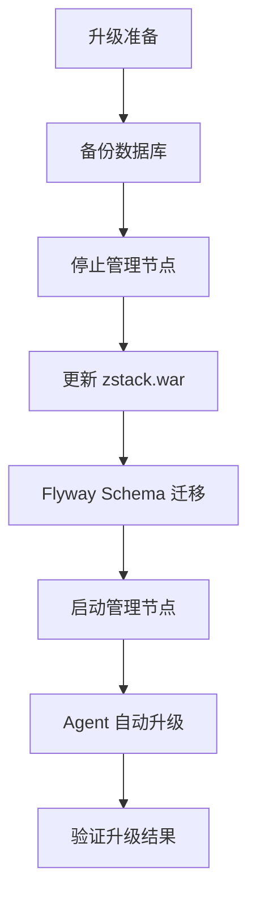
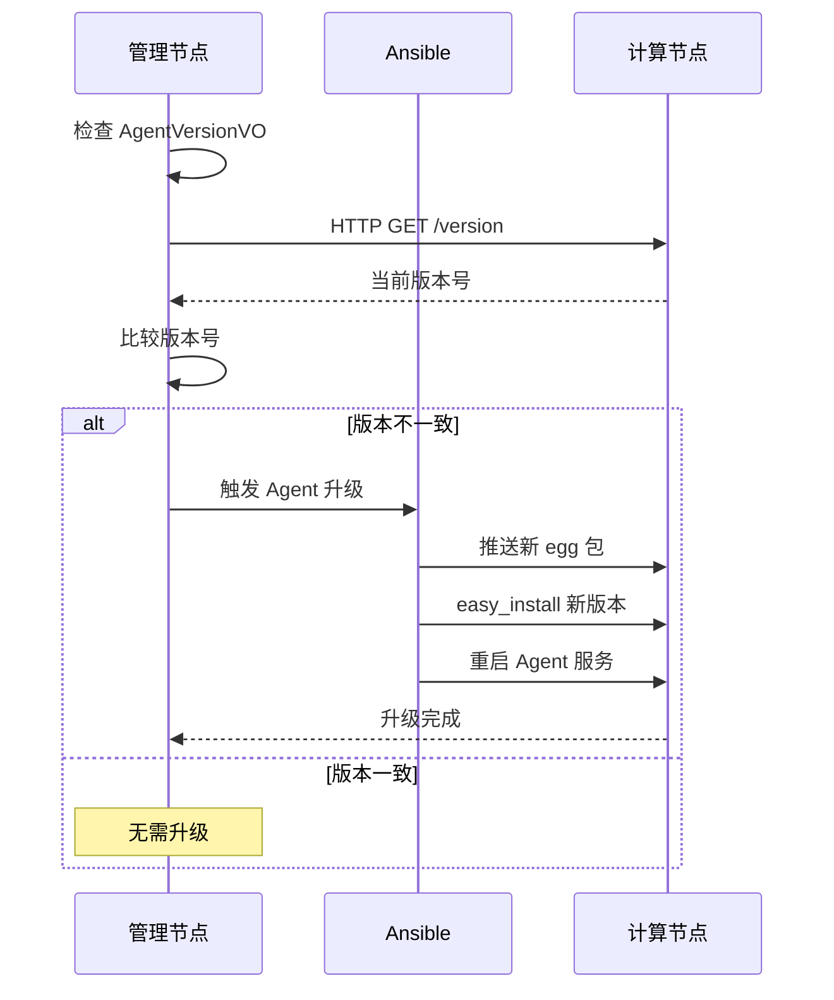
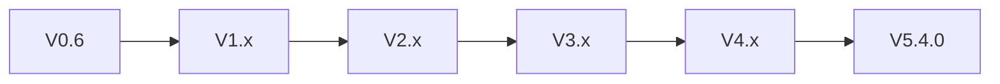

# 57 - 版本升级与数据迁移

## 升级体系概览

ZStack 的版本升级涉及三个层面：数据库 schema 迁移、管理节点 WAR 更新、Agent 版本升级：



## Flyway 迁移机制

### 版本命名与排序

Flyway SQL 文件遵循语义化版本命名，按版本号顺序执行：

```
conf/db/upgrade/
├── V0.7__schema.sql          # 0.6 → 0.7
├── V0.8__schema.sql          # 0.7 → 0.8
├── V0.9__schema.sql
├── V1.0__schema.sql
├── V1.1__schema.sql
├── V1.2__schema.sql
├── V1.3__schema.sql
├── V1.3.1__schema.sql        # 补丁版本
├── V1.4__schema.sql
├── V1.5__schema.sql
├── ...
├── V3.10.0__schema.sql
├── V3.10.0.1__schema.sql     # 微补丁
├── V3.10.0.2__schema.sql
├── V3.10.1__schema.sql
├── ...
└── V3.10.25__schema.sql      # 最新版本
```

> 源码位置：zstack/conf/db/upgrade/ 目录，共 174 个迁移脚本（含 beforeMigrate/beforeValidate 钩子）

### outOfOrder 策略

ZStack 始终使用 `-outOfOrder=true` 执行迁移，允许版本间隙：

```bash
# 源码位置：zstack/build/deploydb.sh 第 86 行
${flyway} -outOfOrder=true -user=${user} -password=${password} -url=${url} migrate
```

为什么需要 outOfOrder：
- 补丁版本（如 V3.10.0.1）在主版本之后添加
- 不同开发分支合并时产生版本间隙
- 回填遗漏的 schema 变更

### 迁移前钩子

#### beforeMigrate.sql

在 Flyway migrate 之前执行，用于数据预处理：

```sql
-- 源码位置：zstack/conf/db/upgrade/beforeMigrate.sql
-- 典型用途：
-- 1. 数据类型转换（如 VARCHAR 长度调整前的数据清洗）
-- 2. 临时列处理
-- 3. 兼容性修正
```

#### beforeValidate.sql

在 Flyway validate 之前执行，修正 schema_version 表中的校验和：

```sql
-- 源码位置：zstack/conf/db/upgrade/beforeValidate.sql
-- 典型用途：
-- 修复因手动修改 SQL 导致的校验和不匹配
-- UPDATE schema_version SET checksum = NULL WHERE ...
```

### schema_version 表

Flyway 使用 `schema_version` 表跟踪已执行的迁移：

| 列 | 说明 |
|----|------|
| `installed_rank` | 执行顺序 |
| `version` | 迁移版本号 |
| `description` | 描述 |
| `type` | 类型（SQL） |
| `script` | 脚本文件名 |
| `checksum` | 校验和（用于检测 SQL 被修改） |
| `installed_on` | 执行时间 |
| `execution_time` | 执行耗时（毫秒） |
| `success` | 是否成功 |

## 升级流程详解

### 1. 数据库备份

```bash
# 全量备份
mysqldump -u root -p --databases zstack zstack_rest > zstack_backup_$(date +%Y%m%d).sql

# 仅 schema 备份（用于验证）
mysqldump -u root -p --no-data --databases zstack zstack_rest > schema_backup.sql
```

### 2. 停止管理节点

```bash
# 停止 Tomcat
$CATALINA_HOME/bin/shutdown.sh

# 确认进程已停止
ps aux | grep zstack
```

### 3. 更新 WAR 包

```bash
# 方式一：从源码构建
cd zstack
git pull
git checkout <target-version>
mvn -DskipTests clean install
cd build && mvn war:war
cp target/zstack.war $CATALINA_HOME/webapps/zstack.war

# 方式二：使用 zstackbuild
zstackbuild zstack-build.cfg
cp build/zstack.war $CATALINA_HOME/webapps/zstack.war
```

### 4. Schema 迁移

管理节点启动时，Flyway 会自动检测并执行未执行的迁移脚本。也可以手动执行：

```bash
# 手动执行迁移（与 deploydb.sh 类似）
flyway_ver=3.2.1
flyway="conf/tools/flyway-$flyway_ver/flyway"
flyway_sql="conf/tools/flyway-$flyway_ver/sql/"

# 复制迁移脚本
cp conf/db/V0.6__schema.sql $flyway_sql
cp conf/db/upgrade/* $flyway_sql

# 执行迁移
$flyway -user=root -password=xxx -url=jdbc:mysql://localhost:3306/zstack \
    -outOfOrder=true migrate
```

### 5. 启动管理节点

```bash
$CATALINA_HOME/bin/startup.sh

# 观察启动日志，确认 Flyway 迁移成功
tail -f $CATALINA_HOME/logs/catalina.out | grep -i flyway
```

## Agent 版本管理

### AgentVersionVO

ZStack 通过 `AgentVersionVO` 跟踪每个节点上 Agent 的版本：

```java
// 源码位置：zstack/core/src/main/java/org/zstack/core/upgrade/AgentVersionVO.java
@Entity
@Table
public class AgentVersionVO {
    @Id
    private String uuid;
    private String agentType;        // Agent 类型（如 kvmagent、virtualrouter）
    private String currentVersion;   // 当前已安装版本
    private String expectVersion;    // 期望版本（管理节点 WAR 中的版本）
    private Date createDate;
    private Date lastOpDate;
}
```

```xml
<!-- 源码位置：zstack/conf/persistence.xml 第 209 行 -->
<class>org.zstack.core.upgrade.AgentVersionVO</class>
```

### 自动升级流程

管理节点启动后，会检查所有已连接 Agent 的版本：



### 灰度升级（Grayscale Upgrade）

ZStack 支持灰度升级机制，允许逐步升级 Agent 而非一次性全量升级：

```java
// 源码位置：zstack/core/src/main/java/org/zstack/core/upgrade/UpgradeChecker.java
public class UpgradeChecker implements Component {
    // 初始 Agent 版本号，低于此版本视为需要升级
    private static final String INITIAL_AGENT_VERSION = "3.10.38";
}
```

灰度升级通过全局配置控制：

```java
// 源码位置：zstack/core/src/main/java/org/zstack/core/upgrade/UpgradeGlobalConfig.java
public class UpgradeGlobalConfig {
    // 是否启用灰度升级
    static GlobalConfig grayscaleUpgrade;
    // 灰度升级期间允许的 API 列表
    static GlobalConfig allowedApiListGrayscaleUpgrading;
}
```

灰度升级流程：

1. 启用 `grayscaleUpgrade` 后，管理节点进入灰度升级模式
2. 仅 `allowedApiListGrayscaleUpgrading` 中列出的 API 可被调用
3. Agent 按批次逐步升级，每批升级后验证功能正常
4. 全部 Agent 升级完成后，关闭灰度模式恢复正常 API 访问

### upgrade-hack 模块

`upgrade-hack` 是 premium profile 下的企业版模块，开源代码中不包含其 Java 源码：

```xml
<!-- 源码位置：zstack/build/pom.xml 第 455-458 行（premium profile 内） -->
<dependency>
    <groupId>org.zstack</groupId>
    <artifactId>upgrade-hack</artifactId>
    <version>${project.version}</version>
</dependency>
```

该模块在升级时执行一次性数据修正逻辑，如：
- 修正旧版本的数据格式
- 迁移已废弃的配置项
- 修复已知的 schema 不一致

> 注意：`upgrade-hack` 仅在 `-Ppremium` 构建时包含，社区版不涉及此模块

## 版本号管理

### bump_version.py

ZStack 使用 Python 脚本统一管理版本号：

```bash
# 源码位置：zstack/build/bump_version.py
# 更新所有 pom.xml 中的版本号
python bump_version.py <new_version>
```

### 版本号规则

ZStack 采用三段式版本号：`MAJOR.MINOR.PATCH`

- **MAJOR**：重大架构变更（如 3.x → 4.x → 5.x）
- **MINOR**：功能版本（如 3.10.x）
- **PATCH**：补丁版本（如 3.10.0.1）

当前源码版本：**5.4.0**

```xml
<!-- 源码位置：zstack/build/pom.xml 第 8 行 -->
<version>5.4.0</version>
```

## 升级矩阵

### 支持的升级路径



### 跨大版本升级注意事项

| 升级路径 | 注意事项 |
|----------|----------|
| 2.x → 3.x | 数据库 schema 大幅变更，需完整备份 |
| 3.x → 4.x | Agent 协议变更，需同时升级所有 Agent |
| 4.x → 5.x | RabbitMQ 消息格式变更，需滚动升级 |

## 回滚方案

### 数据库回滚

```bash
# 1. 停止管理节点
$CATALINA_HOME/bin/shutdown.sh

# 2. 恢复数据库
mysql -u root -p < zstack_backup_YYYYMMDD.sql

# 3. 恢复旧版本 WAR
cp zstack_old.war $CATALINA_HOME/webapps/zstack.war

# 4. 启动管理节点
$CATALINA_HOME/bin/startup.sh
```

### Agent 回滚

```bash
# 在目标节点上回滚 Agent 版本
easy_install /path/to/zstack-kvmagent-old.egg
systemctl restart zstack-kvmagent
```

## 升级检查清单

| 步骤 | 检查项 | 命令/方法 |
|------|--------|-----------|
| 升级前 | 数据库完整备份 | `mysqldump --databases zstack zstack_rest` |
| 升级前 | 记录当前版本号 | 查询 `schema_version` 表最新记录 |
| 升级前 | 确认磁盘空间 | `df -h` |
| 升级中 | Flyway 迁移成功 | 检查 `schema_version` 表无失败记录 |
| 升级中 | 管理节点启动成功 | 检查 Tomcat 日志无 ERROR |
| 升级后 | Agent 版本一致 | 查询 `AgentVersionVO` |
| 升级后 | 功能验证 | 创建测试 VM / 查询资源列表 |
| 升级后 | 性能验证 | 检查 API 响应时间 |
