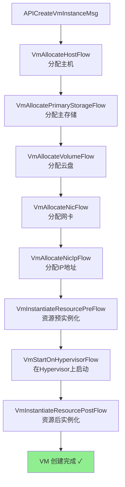
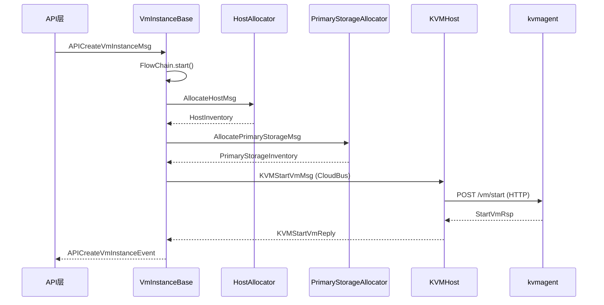

# 17 - VM 创建全流程

VM 创建是 ZStack 中最复杂的操作之一，涉及主机分配、云盘创建、网卡分配、网络服务应用、Hypervisor 启动等多个步骤。整个流程通过 FlowChain 编排，支持自动回滚。

## 创建流程总览



## 入口方法：instantiateVmFromNewCreate()

VM 创建的核心入口是 `VmInstanceBase.instantiateVmFromNewCreate()`：

```java
protected void instantiateVmFromNewCreate(InstantiateVmFromNewCreatedStruct struct, Completion completion) {
    VmInstanceSpec spec = buildVmInstanceSpecFromStruct(struct);

    changeVmStateInDb(VmInstanceStateEvent.starting);

    CollectionUtils.safeForEach(pluginRgty.getExtensionList(BeforeStartNewCreatedVmExtensionPoint.class),
            new ForEachFunction<BeforeStartNewCreatedVmExtensionPoint>() {
                @Override
                public void run(BeforeStartNewCreatedVmExtensionPoint ext) {
                    ext.beforeStartNewCreatedVm(spec);
                }
            });

    extEmitter.beforeStartNewCreatedVm(VmInstanceInventory.valueOf(self));
    FlowChain chain = getCreateVmWorkFlowChain(getSelfInventory());
    setFlowMarshaller(chain);

    chain.setName(String.format("create-vm-%s", self.getUuid()));
    chain.getData().put(VmInstanceConstant.Params.VmInstanceSpec.toString(), spec);
    chain.then(new NoRollbackFlow() {
        String __name__ = "after-started-vm-" + self.getUuid();

        @Override
        public void run(FlowTrigger trigger, Map data) {
            VmInstanceSpec spec = (VmInstanceSpec) data.get(VmInstanceConstant.Params.VmInstanceSpec.toString());
            changeVmStateInDb(struct.getStrategy() == VmCreationStrategy.InstantStart ?
                    VmInstanceStateEvent.running : VmInstanceStateEvent.paused, () -> {
                self.setLastHostUuid(spec.getDestHost().getUuid());
                self.setHostUuid(spec.getDestHost().getUuid());
                self.setClusterUuid(spec.getDestHost().getClusterUuid());
                self.setZoneUuid(spec.getDestHost().getZoneUuid());
                self.setHypervisorType(spec.getDestHost().getHypervisorType());
                self.setRootVolumeUuid(spec.getDestRootVolume().getUuid());
            });
            logger.debug(String.format("vm[uuid:%s] is started ..", self.getUuid()));
            VmInstanceInventory inv = VmInstanceInventory.valueOf(self);
            extEmitter.afterStartNewCreatedVm(inv);
            trigger.next();
        }
    });

    // 如果创建策略是 CreateStopped，则启动后立即停止
    if (struct.getStrategy() == VmCreationStrategy.CreateStopped) {
        chain.then(new NoRollbackFlow() {
            String __name__ = "stop-vm-" + self.getUuid();

            @Override
            public void run(FlowTrigger trigger, Map data) {
                StopVmInstanceMsg smsg = new StopVmInstanceMsg();
                smsg.setVmInstanceUuid(self.getUuid());
                smsg.setGcOnFailure(true);
                smsg.setType(StopVmType.cold.toString());
                stopVm(smsg, new Completion(trigger) {
                    @Override
                    public void success() {
                        trigger.next();
                    }

                    @Override
                    public void fail(ErrorCode errorCode) {
                        trigger.fail(errorCode);
                    }
                });
            }
        });
    }

    chain.done(new FlowDoneHandler(completion) {
        @Override
        public void handle(final Map data) {
            logger.debug(String.format("vm[uuid:%s] is created ..", self.getUuid()));
            completion.success();
        }
    }).error(new FlowErrorHandler(completion) {
        @Override
        public void handle(final ErrorCode errCode, Map data) {
            extEmitter.failedToStartNewCreatedVm(VmInstanceInventory.valueOf(self), errCode);
            dbf.remove(self);
            try {
                dbf.eoCleanup(VmInstanceVO.class, self.getUuid());
            } catch (Exception e) {
                logger.warn(e.getMessage());
            }
            completion.fail(operr(errCode, errCode.getDetails()));
        }
    }).start();
}
```

> 源码位置：zstack/compute/src/main/java/org/zstack/compute/vm/VmInstanceBase.java:7462-7550

> **注意**：本文中的代码片段为简化版本，省略了部分细节，实际源码可能包含更多逻辑。

### 流程概览

```
instantiateVmFromNewCreate()
  │
  ├── 1. buildVmInstanceSpecFromStruct() — 构建 VmInstanceSpec
  ├── 2. changeVmStateInDb(starting) — 状态变更为 Starting
  ├── 3. BeforeStartNewCreatedVmExtensionPoint — 前置扩展
  ├── 4. getCreateVmWorkFlowChain() — 获取创建 FlowChain
  │     ├── VmAllocateHostFlow — 分配主机
  │     ├── VmAllocateVolumeFlow — 创建云盘
  │     ├── VmAllocateNicFlow — 创建网卡
  │     ├── [网络服务 Flow] — EIP/SecurityGroup/PortForwarding 等
  │     └── VmStartOnHypervisorFlow — 在 Hypervisor 上启动
  ├── 5. after-started-vm — 更新 VM 状态和主机信息
  ├── 6. [可选] stop-vm — 如果策略是 CreateStopped
  └── 7. done/error — 成功或失败处理
```

## VmInstanceSpec — 贯穿全流程的数据对象

`VmInstanceSpec` 是 VM 创建流程中最重要的数据对象，它在 Flow 之间传递所有必要信息：

```java
public class VmInstanceSpec {
    private VmInstanceInventory vmInventory;        // VM 基本信息
    private HostInventory destHost;                  // 目标主机
    private VolumeInventory destRootVolume;          // 根云盘
    private List<VolumeInventory> destDataVolumes;   // 数据云盘列表
    private List<VmNicInventory> destNics;           // 网卡列表
    private ImageSpec imageSpec;                     // 镜像规格
    private List<VmNicSpec> l3Networks;              // L3 网络规格
    private VmOperation currentVmOperation;          // 当前操作类型
    private List<DiskOfferingInventory> dataDiskOfferings; // 数据云盘规格
    private DiskOfferingInventory rootDiskOffering;  // 根云盘规格
    // ... 更多字段
}
```

> 源码位置：zstack/header/src/main/java/org/zstack/header/vm/VmInstanceSpec.java

## Flow 1：VmAllocateHostFlow — 分配目标主机

`VmAllocateHostFlow` 是创建流程的第一个 Flow，负责根据 CPU、内存、磁盘等需求分配目标主机。

### run() 方法

```java
@Override
public void run(final FlowTrigger chain, Map data) {
    taskProgress("allocate candidate hosts");

    final VmInstanceSpec spec = (VmInstanceSpec) data.get(VmInstanceConstant.Params.VmInstanceSpec.toString());

    if (VmOperation.NewCreate != spec.getCurrentVmOperation()
            && VmOperation.ChangeImage != spec.getCurrentVmOperation()) {
        throw new CloudRuntimeException("VmAllocateHostFlow is only for creating new VM or changing image");
    }

    // 如果是换镜像且已有目标主机，跳过分配
    if (VmOperation.ChangeImage == spec.getCurrentVmOperation() && spec.getDestHost() != null) {
        chain.next();
        return;
    }

    AllocateHostMsg msg = this.prepareMsg(spec);

    bus.send(msg, new CloudBusCallBack(chain) {
        @Override
        public void run(MessageReply reply) {
            if (reply.isSuccess()) {
                AllocateHostReply areply = (AllocateHostReply) reply;
                spec.setDestHost(areply.getHost());

                // 更新 VM 的主机信息
                String oldHostUuid = spec.getVmInventory().getHostUuid() != null ?
                        spec.getVmInventory().getHostUuid() : spec.getVmInventory().getLastHostUuid();
                oldHostUuid = dbf.isExist(oldHostUuid, HostVO.class) ? oldHostUuid : null;
                SQL.New(VmInstanceVO.class).eq(VmInstanceVO_.uuid, spec.getVmInventory().getUuid())
                        .set(VmInstanceVO_.clusterUuid, spec.getDestHost().getClusterUuid())
                        .set(VmInstanceVO_.lastHostUuid, oldHostUuid)
                        .set(VmInstanceVO_.hostUuid, spec.getDestHost().getUuid())
                        .set(VmInstanceVO_.hypervisorType, spec.getDestHost().getHypervisorType())
                        .update();
                chain.next();
            } else {
                chain.fail(reply.getError());
            }
        }
    });
}
```

> 源码位置：zstack/compute/src/main/java/org/zstack/compute/vm/VmAllocateHostFlow.java:142-199

### prepareMsg() — 构建分配消息

`prepareMsg()` 方法构建 `DesignatedAllocateHostMsg`，包含所有分配条件：

```java
protected AllocateHostMsg prepareMsg(VmInstanceSpec spec) {
    DesignatedAllocateHostMsg msg = new DesignatedAllocateHostMsg();

    // 设置 CPU 和内存需求
    msg.setCpuCapacity(spec.getVmInventory().getCpuNum());
    msg.setMemoryCapacity(spec.getVmInventory().getMemorySize());

    // 设置磁盘需求
    msg.setDiskSize(diskSize);
    msg.setDiskOfferings(diskOfferings);

    // 设置 L3 网络需求
    msg.setL3NetworkUuids(l3NetworkUuids);

    // 设置集群和可用区约束
    msg.setClusterUuids(spec.getRequiredClusterUuids());
    msg.setZoneUuid(spec.getVmInventory().getZoneUuid());

    // 设置主存储约束
    if (spec.getCandidatePrimaryStorageUuidsForRootVolume().size() == 1) {
        msg.addRequiredPrimaryStorageUuid(spec.getCandidatePrimaryStorageUuidsForRootVolume().get(0));
    }

    // 设置分配策略
    if (spec.getHostAllocatorStrategy() != null) {
        msg.setAllocatorStrategy(spec.getHostAllocatorStrategy());
    } else {
        msg.setAllocatorStrategy(spec.getVmInventory().getAllocatorStrategy());
    }

    return msg;
}
```

> 源码位置：zstack/compute/src/main/java/org/zstack/compute/vm/VmAllocateHostFlow.java:66-140

### rollback() — 释放主机容量

```java
@Override
public void rollback(FlowRollback chain, Map data) {
    VmInstanceSpec spec = (VmInstanceSpec) data.get(VmInstanceConstant.Params.VmInstanceSpec.toString());
    HostInventory host = spec.getDestHost();

    if (host != null) {
        ReturnHostCapacityMsg msg = new ReturnHostCapacityMsg();
        msg.setCpuCapacity(spec.getVmInventory().getCpuNum());
        msg.setMemoryCapacity(spec.getVmInventory().getMemorySize());
        msg.setHostUuid(host.getUuid());
        msg.setServiceId(bus.makeLocalServiceId(HostAllocatorConstant.SERVICE_ID));
        bus.send(msg);
    }

    extEmitter.cleanUpAfterVmFailedToStart(spec.getVmInventory());
    chain.rollback();
}
```

> 源码位置：zstack/compute/src/main/java/org/zstack/compute/vm/VmAllocateHostFlow.java:201-224

## Flow 2：VmAllocateVolumeFlow — 创建云盘

`VmAllocateVolumeFlow` 负责创建 VM 的根云盘和数据云盘。

### run() 方法

```java
@Override
public void run(final FlowTrigger trigger, final Map data) {
    final VmInstanceSpec spec = (VmInstanceSpec) data.get(VmInstanceConstant.Params.VmInstanceSpec.toString());
    List<CreateVolumeMsg> msgs = prepareMsg(data);
    bus.send(msgs, 1, new CloudBusListCallBack(trigger) {
        @Override
        public void run(List<MessageReply> replies) {
            ErrorCode err = null;
            for (MessageReply r : replies) {
                VolumeSpec vspec = spec.getVolumeSpecs().get(replies.indexOf(r));

                if (r.isSuccess()) {
                    CreateVolumeReply cr = r.castReply();
                    VolumeInventory inv = cr.getInventory();
                    if (inv.getType().equals(VolumeType.Root.toString())) {
                        spec.setDestRootVolume(inv);
                        UpdateQuery.New(VmInstanceVO.class)
                                .isNull(VmInstanceVO_.rootVolumeUuid)
                                .set(VmInstanceVO_.rootVolumeUuid, inv.getUuid())
                                .condAnd(VmInstanceVO_.uuid, Op.EQ, spec.getVmInventory().getUuid())
                                .update();
                    } else {
                        spec.getDestDataVolumes().add(inv);
                    }

                    vspec.setAssociatedVolumeUuid(inv.getUuid());
                    vspec.setIsVolumeCreated(true);
                } else {
                    err = r.getError();
                    vspec.setIsVolumeCreated(false);
                }
            }

            if (err != null) {
                trigger.fail(err);
            } else {
                trigger.next();
            }
        }
    });
}
```

> 源码位置：zstack/compute/src/main/java/org/zstack/compute/vm/VmAllocateVolumeFlow.java:135-175

### prepareMsg() — 构建云盘创建消息

`prepareMsg()` 为每个 VolumeSpec 创建对应的 `CreateVolumeMsg`：

```java
protected List<CreateVolumeMsg> prepareMsg(Map<String, Object> ctx) {
    VmInstanceSpec spec = (VmInstanceSpec) ctx.get(VmInstanceConstant.Params.VmInstanceSpec.toString());

    List<VolumeSpec> volumeSpecs = spec.getVolumeSpecs();
    List<CreateVolumeMsg> msgs = new ArrayList<>(volumeSpecs.size());
    for (VolumeSpec vspec : volumeSpecs) {
        CreateVolumeMsg msg = new CreateVolumeMsg();

        if (VolumeType.Root.toString().equals(vspec.getType())) {
            msg.setResourceUuid((String) ctx.get("uuid"));
            msg.setName("ROOT-for-" + spec.getVmInventory().getName());
            msg.setDescription(String.format("Root volume for VM[uuid:%s]", spec.getVmInventory().getUuid()));

            if (spec.getImageSpec().relayOnImage()) {
                msg.setRootImageUuid(spec.getImageSpec().getInventory().getUuid());
            }
            msg.setFormat(spec.getVolumeFormatFromImage());
        } else if (VolumeType.Data.toString().equals(vspec.getType())) {
            msg.setName(String.format("DATA-for-%s", spec.getVmInventory().getName()));
            msg.setFormat(VolumeFormat.getVolumeFormatByMasterHypervisorType(
                    spec.getDestHost().getHypervisorType()).toString());
        }

        msg.setDiskOfferingUuid(vspec.getDiskOfferingUuid());
        msg.setSize(vspec.getSize());
        msg.setPrimaryStorageUuid(vspec.getPrimaryStorageInventory().getUuid());
        msg.setVmInstanceUuid(spec.getVmInventory().getUuid());
        msg.setVolumeType(vspec.getType());
        msg.setAccountUuid(accountUuid);

        bus.makeLocalServiceId(msg, VolumeConstant.SERVICE_ID);
        msgs.add(msg);
    }

    return msgs;
}
```

> 源码位置：zstack/compute/src/main/java/org/zstack/compute/vm/VmAllocateVolumeFlow.java:58-133

### rollback() — 删除已创建的云盘

```java
@Override
public void rollback(final FlowRollback chain, Map data) {
    VmInstanceSpec spec = (VmInstanceSpec) data.get(VmInstanceConstant.Params.VmInstanceSpec.toString());
    List<VolumeInventory> destVolumes = new ArrayList<>(spec.getDestDataVolumes().size() + 1);
    if (spec.getDestRootVolume() != null) {
        destVolumes.add(spec.getDestRootVolume());
    }
    destVolumes.addAll(spec.getDestDataVolumes());

    final List<DeleteVolumeMsg> msgs = CollectionUtils.transformToList(destVolumes,
            arg -> {
                DeleteVolumeMsg msg = new DeleteVolumeMsg();
                msg.setDeletionPolicy(VolumeDeletionPolicy.Direct.toString());
                msg.setUuid(arg.getUuid());
                msg.setDetachBeforeDeleting(false);
                bus.makeTargetServiceIdByResourceUuid(msg, VolumeConstant.SERVICE_ID, arg.getUuid());
                return msg;
            });

    // 逐个删除，失败则提交 GC 任务
    new While<>(msgs).each((msg, compl) -> {
        bus.send(msg, new CloudBusCallBack(compl) {
            @Override
            public void run(MessageReply reply) {
                if (reply.isSuccess()) {
                    compl.done();
                    return;
                }

                // 删除失败，提交 GC 任务 8 小时后重试
                DeleteVolumeGC gc = new DeleteVolumeGC();
                gc.NAME = String.format("gc-volume-%s", msg.getVolumeUuid());
                gc.deletionPolicy = VolumeDeletionPolicy.Direct.toString();
                gc.volumeUuid = msg.getVolumeUuid();
                gc.submit(TimeUnit.HOURS.toSeconds(8), TimeUnit.SECONDS);

                compl.done();
            }
        });
    }).run(new WhileDoneCompletion(chain) {
        @Override
        public void done(ErrorCodeList errorCodeList) {
            chain.rollback();
        }
    });
}
```

> 源码位置：zstack/compute/src/main/java/org/zstack/compute/vm/VmAllocateVolumeFlow.java:177-235

注意回滚时的容错设计：如果云盘删除失败，不会阻塞回滚流程，而是提交一个 GC（Garbage Collection）任务，8 小时后重试删除。

## Flow 3：VmAllocateNicFlow — 创建网卡

`VmAllocateNicFlow` 负责为 VM 创建网卡，分配 MAC 地址和 IP 地址。

### run() 方法核心逻辑

```java
@Override
public void run(final FlowTrigger trigger, final Map data) {
    taskProgress("create nics");

    final VmInstanceSpec spec = (VmInstanceSpec) data.get(VmInstanceConstant.Params.VmInstanceSpec.toString());
    List<VmNicSpec> l3Networks = spec.getL3Networks();

    // 调用 VmPreAttachL3NetworkExtensionPoint 扩展
    for (VmNicSpec l3Network : l3Networks) {
        for (VmPreAttachL3NetworkExtensionPoint ext : pluginRgty.getExtensionList(VmPreAttachL3NetworkExtensionPoint.class)) {
            for (L3NetworkInventory l3Inv : l3Network.getL3Invs()) {
                ext.vmPreAttachL3Network(spec.getVmInventory(), l3Inv);
            }
        }
    }

    // 设备 ID 位图，避免冲突
    final BitSet deviceIdBitmap = new BitSet(512);
    for (VmNicInventory nic : spec.getVmInventory().getVmNics()) {
        deviceIdBitmap.set(nic.getDeviceId());
    }

    List<VmNicInventory> nics = new ArrayList<>();
    List<ErrorCode> errs = new ArrayList<>();

    new While<>(VmNicSpec.getFirstL3NetworkInventoryOfSpec(spec.getL3Networks())).each((nicSpec, wcomp) -> {
        L3NetworkInventory nw = nicSpec.getL3Invs().get(0);
        int deviceId = deviceIdBitmap.nextClearBit(0);
        deviceIdBitmap.set(deviceId);

        // MAC 地址分配
        MacOperator mo = new MacOperator();
        String customMac = mo.getMac(spec.getVmInventory().getUuid(), nw.getUuid());
        if (customMac != null) {
            mo.deleteCustomMacSystemTag(spec.getVmInventory().getUuid(), nw.getUuid(), customMac);
            customMac = customMac.toLowerCase();
        } else {
            customMac = MacOperator.generateMacWithDeviceId((short) deviceId);
        }
        final String mac = customMac;

        // 网卡类型选择（普通/SRIOV/VhostUser）
        VmNicType type = nicManager.getVmNicType(spec.getVmInventory().getUuid(), nw);
        VmInstanceNicFactory vnicFactory = vmMgr.getVmInstanceNicFactory(type);

        // 创建网卡 VO
        VmNicInventory nic = new VmNicInventory();
        nic.setVmInstanceUuid(spec.getVmInventory().getUuid());
        nic.setL3NetworkUuid(nw.getUuid());
        nic.setMac(mac);
        nic.setDeviceId(deviceId);
        nic.setInternalName(VmNicVO.generateNicInternalName(
                spec.getVmInventory().getInternalId(), nic.getDeviceId()));

        // 通过 VmInstanceNicFactory 创建具体类型的网卡
        VmNicVO nicVO = vnicFactory.createVmNic(nic, spec);

        // IP 地址分配（IPv4/IPv6 双栈支持）
        // ...

        nics.add(nic);
        wcomp.done();
    }).run(new WhileDoneCompletion(trigger) {
        @Override
        public void done(ErrorCodeList errorCodeList) {
            if (errs.size() > 0) {
                trigger.fail(errs.get(0));
            } else {
                trigger.next();
            }
        }
    });
}
```

> 源码位置：zstack/compute/src/main/java/org/zstack/compute/vm/VmAllocateNicFlow.java:61-211

### rollback() — 释放网卡资源

```java
@Override
public void rollback(final FlowRollback chain, Map data) {
    final VmInstanceSpec spec = (VmInstanceSpec) data.get(VmInstanceConstant.Params.VmInstanceSpec.toString());
    final List<VmNicInventory> destNics = spec.getDestNics();
    if (destNics == null || destNics.isEmpty()) {
        chain.rollback();
        return;
    }

    for (VmNicInventory vmNic : destNics) {
        // 通知扩展点
        for (VmDetachNicExtensionPoint ext : pluginRgty.getExtensionList(VmDetachNicExtensionPoint.class)) {
            ext.afterDetachNic(vmNic);
        }

        // 通过 Factory 释放网卡资源
        VmNicType type = VmNicType.valueOf(vmNic.getType());
        VmInstanceNicFactory vnicFactory = vmMgr.getVmInstanceNicFactory(type);
        vnicFactory.releaseVmNic(vmNic);
    }

    // 从数据库删除网卡记录
    dbf.removeByPrimaryKeys(destNics.stream()
            .map(VmNicInventory::getUuid)
            .collect(Collectors.toList()), VmNicVO.class);
    chain.rollback();
}
```

> 源码位置：zstack/compute/src/main/java/org/zstack/compute/vm/VmAllocateNicFlow.java:239-260

## Flow 4：VmStartOnHypervisorFlow — 在 Hypervisor 上启动

`VmStartOnHypervisorFlow` 是创建流程的最后一个核心 Flow，负责将 VM 启动到 Hypervisor 上。

### run() 方法

```java
@Override
public void run(final FlowTrigger chain, final Map data) {
    final VmInstanceSpec spec = (VmInstanceSpec) data.get(VmInstanceConstant.Params.VmInstanceSpec.toString());

    // 触发前置扩展点
    fireExtensions(spec);

    // 发送 StartVmOnHypervisorMsg 到 Host 服务
    StartVmOnHypervisorMsg msg = new StartVmOnHypervisorMsg();
    msg.setVmSpec(spec);
    bus.makeTargetServiceIdByResourceUuid(msg, HostConstant.SERVICE_ID, spec.getDestHost().getUuid());
    bus.send(msg, new CloudBusCallBack(chain) {
        @Override
        public void run(MessageReply reply) {
            if (reply.isSuccess()) {
                data.put(VmStartOnHypervisorFlow.class.getName(), true);
                chain.next();
            } else {
                chain.fail(reply.getError());
            }
        }
    });
}
```

> 源码位置：zstack/compute/src/main/java/org/zstack/compute/vm/VmStartOnHypervisorFlow.java:37-57

### rollback() — 停止已启动的 VM

```java
@Override
public void rollback(final FlowRollback chain, Map data) {
    // 只有 VM 已经成功启动才需要回滚
    if (!data.containsKey(VmStartOnHypervisorFlow.class.getName())) {
        chain.rollback();
        return;
    }

    final VmInstanceSpec spec = (VmInstanceSpec) data.get(VmInstanceConstant.Params.VmInstanceSpec.toString());
    StopVmOnHypervisorMsg msg = new StopVmOnHypervisorMsg();
    msg.setVmInventory(spec.getVmInventory());
    msg.getVmInventory().setHostUuid(spec.getDestHost().getUuid());
    bus.makeTargetServiceIdByResourceUuid(msg, HostConstant.SERVICE_ID, spec.getDestHost().getUuid());
    bus.send(msg, new CloudBusCallBack(chain) {
        @Override
        public void run(MessageReply reply) {
            if (!reply.isSuccess()) {
                logger.warn(String.format("failed to stop vm[uuid:%s] on host[uuid:%s], %s",
                        spec.getVmInventory().getUuid(), spec.getDestHost().getUuid(), reply.getError()));
            }
            chain.rollback();
        }
    });
}
```

> 源码位置：zstack/compute/src/main/java/org/zstack/compute/vm/VmStartOnHypervisorFlow.java:59-80

注意 `data.put(VmStartOnHypervisorFlow.class.getName(), true)` 这个标记：它用于在回滚时判断 VM 是否已经成功启动。如果启动消息发送失败，则不需要发送停止消息。

## 网络服务的应用

在 VmAllocateNicFlow 和 VmStartOnHypervisorFlow 之间，网络服务（如 EIP、SecurityGroup、PortForwarding、VirtualRouter 等）通过 Flow 注入到创建流程中。这些 Flow 由各网络插件通过 `setFlowMarshaller()` 机制注入。



`setFlowMarshaller()` 允许扩展点在 FlowChain 中插入自定义 Flow：

```java
// VmInstanceBase 中的 FlowMarshaller 机制
protected void setFlowMarshaller(FlowChain chain) {
    for (VmInstanceFlowMarshalExtensionPoint ext : pluginRgty.getExtensionList(VmInstanceFlowMarshalExtensionPoint.class)) {
        ext.marshalFlow(getSelfInventory(), chain);
    }
}
```

典型的网络服务 Flow 注入顺序：

```
VmAllocateHostFlow
VmAllocateVolumeFlow
VmAllocateNicFlow
[NetworkService Flow: EIP 分配]
[NetworkService Flow: SecurityGroup 规则应用]
[NetworkService Flow: VirtualRouter 启动]
VmStartOnHypervisorFlow
```

## 错误处理与回滚

### FlowChain 的自动回滚机制

当 FlowChain 中某个 Flow 失败时，会自动触发之前所有 Flow 的 rollback 方法，回滚顺序与执行顺序相反：

```
执行顺序：Flow1 → Flow2 → Flow3 → Flow4 (失败)
回滚顺序：Flow3.rollback ← Flow2.rollback ← Flow1.rollback
```

### 创建失败的处理

在 `instantiateVmFromNewCreate()` 的 error handler 中：

```java
.error(new FlowErrorHandler(completion) {
    @Override
    public void handle(final ErrorCode errCode, Map data) {
        extEmitter.failedToStartNewCreatedVm(VmInstanceInventory.valueOf(self), errCode);
        dbf.remove(self);
        try {
            dbf.eoCleanup(VmInstanceVO.class, self.getUuid());
        } catch (Exception e) {
            logger.warn(e.getMessage());
        }
        completion.fail(operr(errCode, errCode.getDetails()));
    }
})
```

> 源码位置：zstack/compute/src/main/java/org/zstack/compute/vm/VmInstanceBase.java:7534-7549

创建失败时：
1. 通知扩展点创建失败
2. 从数据库删除 VmInstanceVO 记录
3. 清理 EO（Ephemeral Object）记录，避免 UUID 冲突

### GC 机制

对于回滚中无法立即清理的资源（如云盘删除失败），ZStack 使用 GC（Garbage Collection）机制：

```java
DeleteVolumeGC gc = new DeleteVolumeGC();
gc.NAME = String.format("gc-volume-%s", msg.getVolumeUuid());
gc.deletionPolicy = VolumeDeletionPolicy.Direct.toString();
gc.volumeUuid = msg.getVolumeUuid();
gc.submit(TimeUnit.HOURS.toSeconds(8), TimeUnit.SECONDS);
```

> 源码位置：zstack/compute/src/main/java/org/zstack/compute/vm/VmAllocateVolumeFlow.java:213-217

GC 任务会在指定时间后重试，确保资源最终被清理。

## VmCreationStrategy — 创建策略

ZStack 支持四种 VM 创建策略：

| 策略 | 说明 | 行为 |
|------|------|------|
| InstantStart | 立即启动 | 创建后 VM 状态为 Running |
| JustCreate | 仅创建 | 创建数据库记录，不实例化资源 |
| CreateStopped | 创建但不启动 | 创建后 VM 状态为 Stopped（先启动再停止） |
| CreatedPaused | 创建后暂停 | 创建后 VM 状态为 Paused |

在 `instantiateVmFromNewCreate()` 中，策略影响最终状态：

```java
changeVmStateInDb(struct.getStrategy() == VmCreationStrategy.InstantStart ?
        VmInstanceStateEvent.running : VmInstanceStateEvent.paused, () -> {
    // 更新主机信息
});
```

> 源码位置：zstack/compute/src/main/java/org/zstack/compute/vm/VmInstanceBase.java:7487-7488

对于 `CreateStopped` 策略，FlowChain 会额外添加一个停止 VM 的 Flow：

```java
if (struct.getStrategy() == VmCreationStrategy.CreateStopped) {
    chain.then(new NoRollbackFlow() {
        String __name__ = "stop-vm-" + self.getUuid();
        @Override
        public void run(FlowTrigger trigger, Map data) {
            StopVmInstanceMsg smsg = new StopVmInstanceMsg();
            smsg.setVmInstanceUuid(self.getUuid());
            smsg.setGcOnFailure(true);
            smsg.setType(StopVmType.cold.toString());
            stopVm(smsg, new Completion(trigger) { ... });
        }
    });
}
```

> 源码位置：zstack/compute/src/main/java/org/zstack/compute/vm/VmInstanceBase.java:7503-7526

## 总结

VM 创建全流程的核心设计要点：

1. **FlowChain 编排**：四个核心 Flow 按顺序执行，每个 Flow 职责单一
2. **自动回滚**：任何 Flow 失败都会触发前面所有 Flow 的 rollback
3. **GC 容错**：回滚失败时提交 GC 任务，保证资源最终一致性
4. **VmInstanceSpec 传递**：所有 Flow 通过共享的 VmInstanceSpec 传递数据
5. **Extension 扩展**：网络服务等通过 FlowMarshaller 机制注入自定义 Flow
6. **同步保证**：通过 ThreadFacade 的 ChainTask 保证同一 VM 操作串行
