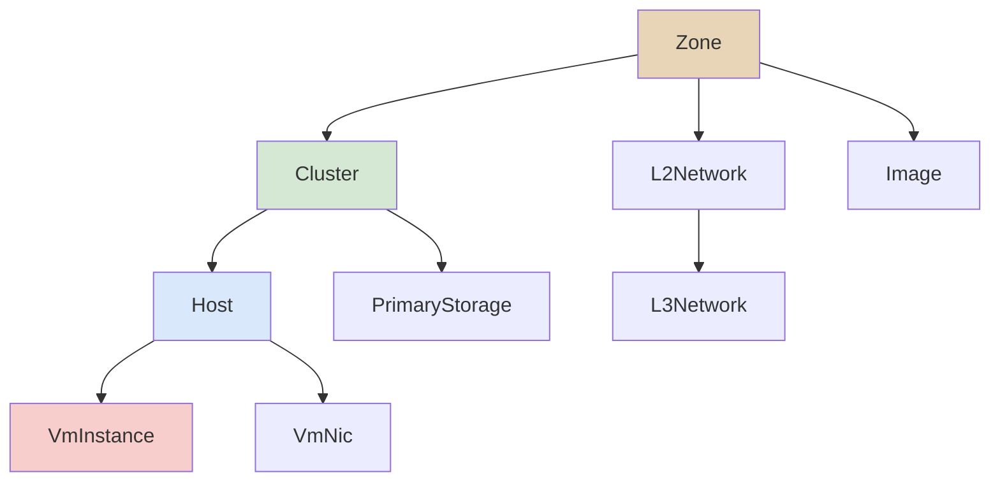
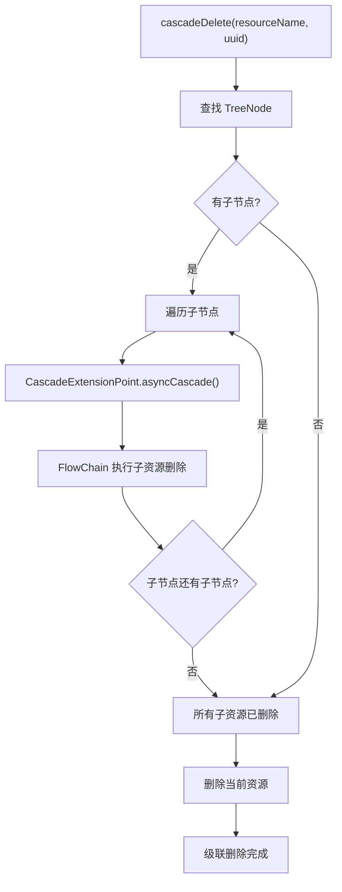

# 07 - 级联删除机制

在 IaaS 系统中，资源之间存在严格的层级依赖关系：Zone 包含 Cluster，Cluster 包含 Host，Host 上运行着 VM。删除 Zone 时，必须依次删除其下所有 Cluster、Host 和 VM——这就是级联删除。ZStack 通过 `CascadeFacadeImpl` 实现了一套基于 `CascadeExtensionPoint` 扩展点 + 树遍历的级联框架，让开发者只需声明"我的上游是谁"，框架自动构建依赖树并按正确顺序执行级联操作。

## 核心思想

级联删除的本质是一个**有向无环图（DAG）**的遍历问题。每个资源类型通过 `CascadeExtensionPoint` 声明自己的上游资源（`getEdgeNames()`），`CascadeFacade` 据此构建完整的依赖树，然后按从叶子到根的顺序执行级联操作。

## 级联删除图



## @EntityGraph 注解

> 源码位置：zstack/header/src/main/java/org/zstack/header/vo/EntityGraph.java

`@EntityGraph` 注解用于声明 VO 之间的实体关系，供数据库查询和级联分析使用：

```java
@Target(ElementType.TYPE)
@Retention(RetentionPolicy.RUNTIME)
public @interface EntityGraph {
    @Target({ElementType.TYPE})
    @Retention(RetentionPolicy.RUNTIME)
    @interface Neighbour {
        Class type();
        String myField();
        String targetField();
        int weight() default -1;
    }

    Neighbour[] parents() default {};
    Neighbour[] friends() default {};
}
```

> **注意**：`@EntityGraph` 描述的是 VO 之间的实体关系（parent/friend），而非级联删除的依赖方向。级联删除的依赖关系由 `CascadeExtensionPoint.getEdgeNames()` 声明，两者方向相反——`@EntityGraph.parents()` 表示"我的父实体是谁"，而 `getEdgeNames()` 表示"谁是我的上游（删除上游时会级联到我）"。

## CascadeExtensionPoint 接口

> 源码位置：zstack/core/src/main/java/org/zstack/core/cascade/CascadeExtensionPoint.java

级联框架的核心扩展点，每个参与级联的资源类型必须实现此接口：

```java
public interface CascadeExtensionPoint {
    void syncCascade(CascadeAction action) throws CascadeException;

    void asyncCascade(CascadeAction action, Completion completion);

    List<String> getEdgeNames();

    String getCascadeResourceName();

    CascadeAction createActionForChildResource(CascadeAction action);
}
```

各方法含义：

| 方法 | 说明 |
|------|------|
| `syncCascade()` | 同步级联操作，在树遍历过程中被调用 |
| `asyncCascade()` | 异步级联操作，通过 `FlowChain` 串联执行 |
| `getEdgeNames()` | 返回上游资源名称列表，声明"谁删除时会级联到我" |
| `getCascadeResourceName()` | 返回本扩展点负责的资源名称（通常为 VO 的 SimpleName） |
| `createActionForChildResource()` | 根据父级 action 创建传递给子资源的 action，返回 null 表示不继续级联 |

## CascadeAction

> 源码位置：zstack/core/src/main/java/org/zstack/core/cascade/CascadeAction.java

级联操作的动作载体，在树遍历过程中逐层传递：

```java
public class CascadeAction implements Cloneable {
    private String parentIssuer;
    private String rootIssuer;
    private Object parentIssuerContext;
    private Object rootIssuerContext;
    private String actionCode;
    private boolean fullTraverse;
}
```

| 字段 | 说明 |
|------|------|
| `parentIssuer` | 直接上游资源名称 |
| `rootIssuer` | 最初触发级联的根资源名称 |
| `parentIssuerContext` | 上游传递的上下文（如 ZoneInventory 列表） |
| `rootIssuerContext` | 根资源传递的上下文 |
| `actionCode` | 操作码，如 `deletion.delete`、`deletion.check` |
| `fullTraverse` | 是否全量遍历（即使 action 为 null 也继续） |

## CascadeConstant

> 源码位置：zstack/core/src/main/java/org/zstack/core/cascade/CascadeConstant.java

定义级联操作的标准 actionCode：

```java
public interface CascadeConstant {
    String DELETION_CHECK_CODE = "deletion.check";
    String DELETION_DELETE_CODE = "deletion.delete";
    String DELETION_FORCE_DELETE_CODE = "deletion.forceDelete";
    String DELETION_CLEANUP_CODE = "deletion.cleanup";

    List<String> DELETION_CODES = Arrays.asList(
        DELETION_CHECK_CODE, DELETION_DELETE_CODE, DELETION_FORCE_DELETE_CODE);
}
```

级联删除分三个阶段执行：check（预检查）→ delete（删除）→ cleanup（清理残留数据）。

## AbstractAsyncCascadeExtension

> 源码位置：zstack/core/src/main/java/org/zstack/core/cascade/AbstractAsyncCascadeExtension.java

大多数级联扩展只需要异步操作，此基类提供了 `syncCascade()` 的空实现：

```java
public abstract class AbstractAsyncCascadeExtension implements CascadeExtensionPoint {
    @Override
    public void syncCascade(CascadeAction action) throws CascadeException {
    }
}
```

## 典型实现示例

### ZoneCascadeExtension

> 源码位置：zstack/compute/src/main/java/org/zstack/compute/zone/ZoneCascadeExtension.java

Zone 是级联树的根节点，没有上游，因此 `getEdgeNames()` 返回空列表：

```java
public class ZoneCascadeExtension extends AbstractAsyncCascadeExtension {
    private static final String NAME = ZoneVO.class.getSimpleName();

    @Override
    public void asyncCascade(CascadeAction action, Completion completion) {
        if (action.isActionCode(CascadeConstant.DELETION_CHECK_CODE)) {
            handleDeletionCheck(action, completion);
        } else if (action.isActionCode(CascadeConstant.DELETION_DELETE_CODE,
                CascadeConstant.DELETION_FORCE_DELETE_CODE)) {
            handleDeletion(action, completion);
        } else if (action.isActionCode(CascadeConstant.DELETION_CLEANUP_CODE)) {
            handleDeletionCleanup(action, completion);
        } else {
            completion.success();
        }
    }

    @Override
    public List<String> getEdgeNames() {
        return Arrays.asList();
    }

    @Override
    public String getCascadeResourceName() {
        return NAME;
    }

    @Override
    public CascadeAction createActionForChildResource(CascadeAction action) {
        if (CascadeConstant.DELETION_CODES.contains(action.getActionCode())) {
            return action;
        }
        return null;
    }
}
```

### ClusterCascadeExtension

> 源码位置：zstack/compute/src/main/java/org/zstack/compute/cluster/ClusterCascadeExtension.java

Cluster 声明 Zone 为上游，当 Zone 被删除时会级联到 Cluster：

```java
public class ClusterCascadeExtension extends AbstractAsyncCascadeExtension {
    private static final String NAME = ClusterVO.class.getSimpleName();

    @Override
    public List<String> getEdgeNames() {
        return Arrays.asList(ZoneVO.class.getSimpleName());
    }

    @Override
    public String getCascadeResourceName() {
        return NAME;
    }

    @Override
    public CascadeAction createActionForChildResource(CascadeAction action) {
        if (CascadeConstant.DELETION_CODES.contains(action.getActionCode())) {
            List<ClusterInventory> ctx = clusterFromAction(action);
            if (ctx != null) {
                return action.copy().setParentIssuer(NAME)
                    .setParentIssuerContext(ctx);
            }
        }
        return null;
    }

    private List<ClusterInventory> clusterFromAction(CascadeAction action) {
        List<ClusterInventory> ret = null;
        if (ZoneVO.class.getSimpleName().equals(action.getParentIssuer())) {
            List<ZoneInventory> zones = action.getParentIssuerContext();
            List<String> zuuids = CollectionUtils.transformToList(zones,
                new Function<String, ZoneInventory>() {
                    @Override
                    public String call(ZoneInventory arg) {
                        return arg.getUuid();
                    }
                });

            SimpleQuery<ClusterVO> q = dbf.createQuery(ClusterVO.class);
            q.add(ClusterVO_.zoneUuid, SimpleQuery.Op.IN, zuuids);
            List<ClusterVO> cvos = q.list();
            if (!cvos.isEmpty()) {
                ret = ClusterInventory.valueOf(cvos);
            }
        } else if (NAME.equals(action.getParentIssuer())) {
            ret = action.getParentIssuerContext();
        }
        return ret;
    }
}
```

### HostCascadeExtension

> 源码位置：zstack/compute/src/main/java/org/zstack/compute/host/HostCascadeExtension.java

Host 声明 Cluster 为上游：

```java
public class HostCascadeExtension extends AbstractAsyncCascadeExtension {
    private static final String NAME = HostVO.class.getSimpleName();

    @Override
    public List<String> getEdgeNames() {
        return Arrays.asList(ClusterVO.class.getSimpleName());
    }

    @Override
    public String getCascadeResourceName() {
        return NAME;
    }

    @Override
    public CascadeAction createActionForChildResource(CascadeAction action) {
        if (CascadeConstant.DELETION_CODES.contains(action.getActionCode())) {
            List<HostInventory> invs = hostFromAction(action);
            if (invs != null) {
                return action.copy().setParentIssuer(NAME)
                    .setParentIssuerContext(invs);
            }
        }
        return null;
    }
}
```

由此构建的依赖关系为：`Zone ← Cluster ← Host`（箭头表示"删除上游时级联到下游"），即删除 Zone 时会级联到 Cluster，删除 Cluster 时会级联到 Host。

## CascadeFacadeImpl 源码分析

> 源码位置：zstack/core/src/main/java/org/zstack/core/cascade/CascadeFacadeImpl.java

### 核心数据结构

```java
public class CascadeFacadeImpl implements CascadeFacade, Component {
    @Autowired
    private PluginRegistry pluginRgty;

    private Map<String, Node> nodes = new HashMap<>();
    private Map<String, TreeNode> cascadeTree = new HashMap<>();
    private Map<String, List<AsyncBranchCascadeExtensionPoint>>
        asyncBranchCascadeExtensionPoints = new HashMap<>();
}
```

| 字段 | 说明 |
|------|------|
| `nodes` | 资源名称 → `Node`，存储 `CascadeExtensionPoint` 及其边关系 |
| `cascadeTree` | 资源名称 → `TreeNode`，存储遍历树，用于级联操作时按路径执行 |
| `asyncBranchCascadeExtensionPoints` | 资源名称 → `AsyncBranchCascadeExtensionPoint` 列表，用于异步分支扩展 |

### 内部类 Node 和 TreeNode

```java
private class Node implements Comparable<Node> {
    private CascadeExtensionPoint extension;
    private TreeSet<Node> edges;
    private String name;
}

private static class TreeNode implements Comparable<TreeNode> {
    private Node node;
    private TreeSet<TreeNode> leafs;
}
```

- **Node**：表示依赖图中的一个节点，`edges` 指向下游资源（即"删除我时需要级联删除的资源"）
- **TreeNode**：表示遍历树中的一个节点，`leafs` 指向子节点

### 启动：构建依赖图和遍历树

```java
@Override
public boolean start() {
    populateNodes();
    populateTree();
    return true;
}
```

#### populateNodes()

从 PluginRegistry 收集所有 `CascadeExtensionPoint` 实现，构建 Node 图：

```java
private void populateNodes() {
    Map<String, CascadeExtensionPoint> exts = new HashMap<>();
    for (CascadeExtensionPoint extp :
            pluginRgty.getExtensionList(CascadeExtensionPoint.class)) {
        CascadeExtensionPoint oext = exts.get(extp.getCascadeResourceName());
        if (oext != null) {
            throw new CloudRuntimeException(String.format(
                "duplicate CascadeExtensionPoint[%s, %s] for type[%s]",
                extp.getClass().getName(), oext.getClass().getName(),
                extp.getCascadeResourceName()));
        }
        exts.put(extp.getCascadeResourceName(), new CascadeWrapper(extp));
    }

    for (CascadeExtensionPoint e : exts.values()) {
        CascadeWrapper w = (CascadeWrapper) e;
        for (CascadeAddOnExtensionPoint a :
                pluginRgty.getExtensionList(CascadeAddOnExtensionPoint.class)) {
            CascadeExtensionPoint c = a.cascadeAddOn(e.getCascadeResourceName());
            if (c != null) {
                w.addons.add(c);
            }
        }
    }

    populateCascadeNodes(exts);

    pluginRgty.getExtensionList(AsyncBranchCascadeExtensionPoint.class)
        .forEach(ab -> {
            List<AsyncBranchCascadeExtensionPoint> lst =
                asyncBranchCascadeExtensionPoints
                    .computeIfAbsent(ab.getCascadeResourceName(),
                        k -> new ArrayList<>());
            lst.add(ab);
        });
}
```

#### populateCascadeNodes()

根据 `getEdgeNames()` 构建 Node 之间的边关系：

```java
private void populateCascadeNodes(Map<String, CascadeExtensionPoint> exts) {
    for (CascadeExtensionPoint ext : exts.values()) {
        Node n = nodes.get(ext.getCascadeResourceName());
        if (n == null) {
            n = new Node();
            n.setName(ext.getCascadeResourceName());
            n.setExtension(ext);
            n.setEdges(new TreeSet<>());
            nodes.put(n.getName(), n);
        }

        for (String parent : ext.getEdgeNames()) {
            Node p = nodes.get(parent);
            if (p == null) {
                p = new Node();
                p.setName(parent);
                p.setEdges(new TreeSet<>());
                CascadeExtensionPoint dext = exts.get(parent);
                if (dext == null) {
                    throw new CloudRuntimeException(String.format(
                        "cannot find parent CascadeExtensionPoint[%s] "
                        + "for CascadeExtensionPoint[name: %s, class: %s]",
                        parent, ext.getCascadeResourceName(),
                        ext.getClass().getName()));
                }
                p.setExtension(dext);
                nodes.put(parent, p);
            }
            p.getEdges().add(n);
        }
    }
}
```

> **关键**：`ext.getEdgeNames()` 返回的是上游资源名称，代码中 `p.getEdges().add(n)` 将当前节点加到上游节点的 edges 中。因此 edges 的方向是"上游 → 下游"，即删除上游时会级联到 edges 中的所有下游。

#### populateTree()

为每个 Node 构建遍历树（TreeNode），将图中的所有路径合并为一棵树以消除重复：

```java
private void populateTree() {
    for (Node n : nodes.values()) {
        TreeNode tn = createTraversingTree(n.getName());
        cascadeTree.put(n.getName(), tn);
    }
}
```

`createTraversingTree()` 通过 `traverse()` 递归收集从指定节点出发的所有路径，然后通过 `makeTree()` 将路径合并为一棵树。

### 同步级联：syncCascade()

```java
@Override
public void syncCascade(String actionCode, String issuer, Object context)
        throws CascadeException {
    CascadeAction action = new CascadeAction()
        .setRootIssuer(issuer)
        .setRootIssuerContext(context)
        .setParentIssuer(issuer)
        .setParentIssuerContext(context)
        .setActionCode(actionCode);
    syncCascade(action);
}

@Override
public void syncCascade(CascadeAction action) throws CascadeException {
    TreeNode root = cascadeTree.get(action.getRootIssuer());
    doSyncCascade(root, true, action);
}

private void doSyncCascade(TreeNode treeNode, boolean init,
                           CascadeAction action) throws CascadeException {
    CascadeAction currentAction;
    Node node = treeNode.node;
    if (!init) {
        currentAction = node.getExtension()
            .createActionForChildResource(action);
    } else {
        currentAction = action;
    }

    if (currentAction != null) {
        for (TreeNode tn : treeNode.leafs) {
            doSyncCascade(tn, false, currentAction);
        }
    }

    node.getExtension().syncCascade(action);
}
```

同步级联采用**深度优先**遍历：先递归处理所有子节点，再处理当前节点。这保证了叶子节点先于父节点执行。

### 异步级联：asyncCascade()

```java
@Override
public void asyncCascade(CascadeAction action, final Completion completion) {
    TreeNode root = cascadeTree.get(action.getRootIssuer());
    List<Bucket> paths = new ArrayList<>();
    collectPathsForAsyncCascade(root, true, action.isFullTraverse(),
        action, paths, new HashSet<>());

    FlowChain chain = FlowChainBuilder.newSimpleFlowChain();
    for (Bucket path : paths) {
        final Node node = path.get(0);
        final CascadeAction caction = path.get(1);
        chain.then(new NoRollbackFlow() {
            String __name__ = String.format("async-cascade(%s)[%s --> %s]",
                caction.getActionCode(), caction.getParentIssuer(),
                node.getName());
            @Override
            public void run(final FlowTrigger trigger, Map data) {
                runNode(node, caction, new Completion(trigger) {
                    @Override
                    public void success() {
                        trigger.next();
                    }

                    @Override
                    public void fail(ErrorCode errorCode) {
                        trigger.fail(errorCode);
                    }
                });
            }
        });
    }

    chain.done(new FlowDoneHandler(completion) {
        @Override
        public void handle(Map data) {
            completion.success();
        }
    }).error(new FlowErrorHandler(completion) {
        @Override
        public void handle(ErrorCode errCode, Map data) {
            completion.fail(errCode);
        }
    }).start();
}
```

异步级联的核心流程：

1. **收集路径**：`collectPathsForAsyncCascade()` 将遍历树展平为 `(Node, CascadeAction)` 对的列表，每对代表一个需要执行的级联步骤
2. **构建 FlowChain**：将每个步骤包装为 `NoRollbackFlow`，按顺序串联
3. **执行**：FlowChain 依次执行每个步骤，通过 `runNode()` 调用扩展点的 `asyncCascade()`

### runNode()：异步分支扩展

```java
private void runNode(Node node, CascadeAction caction, Completion completion) {
    List<AsyncBranchCascadeExtensionPoint> branches =
        asyncBranchCascadeExtensionPoints.get(node.getName());
    boolean skipNode = false;
    if (branches != null) {
        for (AsyncBranchCascadeExtensionPoint branch : branches) {
            skipNode = branch.skipOriginCascadeExtension(caction);
            if (skipNode) {
                logger.debug(String.format(
                    "the AsyncCascadeExtension[%s, resourceName:%s] "
                    + "is skipped by %s",
                    ((CascadeWrapper)node.getExtension()).origin.getClass(),
                    node.getName(), branch.getClass()));
            }
        }
    }

    if (!skipNode) {
        node.getExtension().asyncCascade(caction, completion);
        return;
    }

    FlowChain chain = FlowChainBuilder.newSimpleFlowChain();
    branches.forEach(b -> chain.then(new NoRollbackFlow() {
        @Override
        public void run(FlowTrigger trigger, Map data) {
            b.asyncCascade(caction, new Completion(trigger) {
                @Override
                public void success() {
                    trigger.next();
                }

                @Override
                public void fail(ErrorCode errorCode) {
                    trigger.fail(errorCode);
                }
            });
        }
    }));

    CascadeWrapper wrapper = (CascadeWrapper) node.getExtension();
    CascadeExtensionPoint addon = wrapper.findAddon(caction.getParentIssuer());
    if (addon != null) {
        chain.then(new NoRollbackFlow() {
            @Override
            public void run(FlowTrigger trigger, Map data) {
                addon.asyncCascade(caction, new Completion(trigger) {
                    @Override
                    public void success() {
                        trigger.next();
                    }

                    @Override
                    public void fail(ErrorCode errorCode) {
                        trigger.fail(errorCode);
                    }
                });
            }
        });
    }

    chain.done(new FlowDoneHandler(completion) {
        @Override
        public void handle(Map data) {
            completion.success();
        }
    }).error(new FlowErrorHandler(completion) {
        @Override
        public void handle(ErrorCode errCode, Map data) {
            completion.fail(errCode);
        }
    }).start();
}
```

当 `AsyncBranchCascadeExtensionPoint.skipOriginCascadeExtension()` 返回 `true` 时，原始扩展点被跳过，改为执行所有分支扩展点和 addon 扩展点。

### CascadeWrapper

`CascadeWrapper` 是对 `CascadeExtensionPoint` 的包装，支持 `CascadeAddOnExtensionPoint` 为同一资源追加额外的级联逻辑：

```java
private class CascadeWrapper implements CascadeExtensionPoint {
    CascadeExtensionPoint origin;
    List<CascadeExtensionPoint> addons = new ArrayList<>();

    @Override
    public void syncCascade(CascadeAction action) throws CascadeException {
        findExtensionPointByParent(action.getParentIssuer())
            .syncCascade(action);
    }

    @Override
    public void asyncCascade(CascadeAction action, Completion completion) {
        findExtensionPointByParent(action.getParentIssuer())
            .asyncCascade(action, completion);
    }

    @Override
    public List<String> getEdgeNames() {
        List<String> es = new ArrayList<>();
        es.addAll(origin.getEdgeNames());
        for (CascadeExtensionPoint a : addons) {
            es.addAll(a.getEdgeNames());
        }
        return es;
    }

    @Override
    public String getCascadeResourceName() {
        return origin.getCascadeResourceName();
    }

    @Override
    public CascadeAction createActionForChildResource(CascadeAction action) {
        return findExtensionPointByParent(action.getParentIssuer())
            .createActionForChildResource(action);
    }
}
```

Wrapper 根据 `action.getParentIssuer()` 选择原始扩展点或 addon 扩展点来处理请求。

## AsyncBranchCascadeExtensionPoint

> 源码位置：zstack/core/src/main/java/org/zstack/core/cascade/AsyncBranchCascadeExtensionPoint.java

异步分支扩展点，允许替换原始级联扩展的执行逻辑：

```java
public interface AsyncBranchCascadeExtensionPoint {
    void asyncCascade(CascadeAction action, Completion completion);

    String getCascadeResourceName();

    boolean skipOriginCascadeExtension(CascadeAction action);
}
```

| 方法 | 说明 |
|------|------|
| `asyncCascade()` | 异步执行级联操作 |
| `getCascadeResourceName()` | 返回此扩展点关联的资源名称 |
| `skipOriginCascadeExtension()` | 是否跳过原始的 `CascadeExtensionPoint`，返回 `true` 则用分支扩展替代原始扩展 |

## CascadeAddOnExtensionPoint

> 源码位置：zstack/core/src/main/java/org/zstack/core/cascade/CascadeAddOnExtensionPoint.java

允许为已有资源追加额外的级联边关系：

```java
public interface CascadeAddOnExtensionPoint {
    CascadeExtensionPoint cascadeAddOn(String resourceName);
}
```

如果 `cascadeAddOn()` 返回非 null 的 `CascadeExtensionPoint`，其 `getEdgeNames()` 会被合并到原始扩展点的边关系中。

## Spring XML 配置

> 源码位置：zstack/conf/springConfigXml/CascadeFacade.xml

```xml
<bean id="CascadeFacade" class="org.zstack.core.cascade.CascadeFacadeImpl">
    <zstack:plugin>
        <zstack:extension interface="org.zstack.header.Component" />
    </zstack:plugin>
</bean>
```

## 完整的级联删除流程



以删除 Zone 为例，完整流程如下：

```
1. 用户调用 APIDeleteZoneMsg
2. ZoneManager 调用 CascadeFacade.asyncCascade("deletion.delete", "ZoneVO", context, completion)
3. CascadeFacade 从 cascadeTree 中获取 ZoneVO 对应的遍历树
4. collectPathsForAsyncCascade() 展平遍历树为路径列表：
   - (ZoneVO, action)
   - (ClusterVO, action)
   - (HostVO, action)
   - ... 其他下游资源
5. 构建 FlowChain，依次执行每个路径的 runNode()
6. 每个 runNode() 调用对应 CascadeExtensionPoint.asyncCascade()
7. 在 asyncCascade() 中，根据 actionCode 分阶段处理：
   a. deletion.check  → 预检查（extpEmitter.preDelete）
   b. deletion.delete → 发送删除消息（通过 CloudBus）
   c. deletion.cleanup → 清理残留数据（dbf.eoCleanup）
8. createActionForChildResource() 在遍历过程中为子资源构建带上下文的 action
   （如 ClusterCascadeExtension 根据 Zone UUID 查询出 ClusterInventory 列表，
   设置为子 action 的 parentIssuerContext）
9. 所有路径执行完成，FlowChain 回调 completion.success()
```

## 设计总结

| 设计决策 | 实现方式 | 优势 |
|---------|---------|------|
| 扩展点声明依赖 | `CascadeExtensionPoint.getEdgeNames()` | 声明"我的上游是谁"，框架自动构建依赖图 |
| 树遍历 | `TreeNode` + 深度优先递归 | 保证叶子节点先于父节点执行 |
| 异步执行 | `FlowChain` 串联所有级联路径 | 支持异步操作，可等待远程服务响应 |
| 分阶段操作 | `CascadeConstant` 定义 check/delete/cleanup | 删除前可预检查，删除后可清理残留 |
| Wrapper 模式 | `CascadeWrapper` 包装原始扩展点 | 支持 AddOn 追加额外边关系 |
| 异步分支 | `AsyncBranchCascadeExtensionPoint` | 允许替换原始级联逻辑 |
| 插件化注册 | Spring XML + PluginRegistry | 新资源类型可扩展级联操作 |
