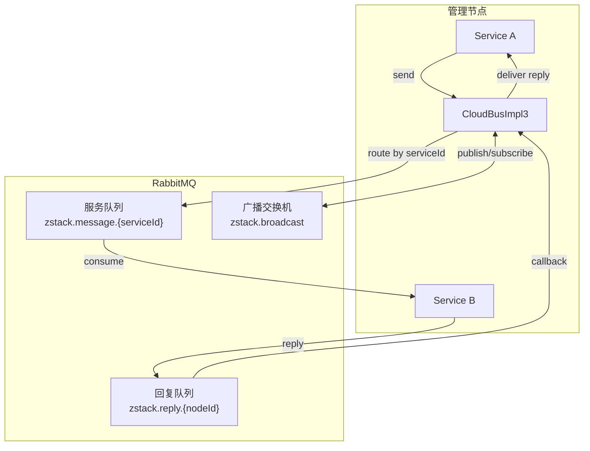
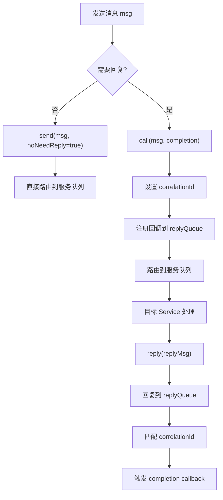

# 04 - CloudBus 消息总线

CloudBus 是 ZStack 管理节点内部及跨节点通信的核心基础设施。所有服务间调用——无论是创建虚拟机、查询主机状态，还是发布 API 事件——都通过 CloudBus 完成。它不是传统意义上的消息队列中间件，而是一个基于 HTTP + 本地分发的混合消息路由系统，支持同步/异步调用、事件广播、超时管理和拦截器链。

## 整体架构



CloudBus 的设计围绕一个核心问题：**消息如何从发送方到达接收方？** 答案取决于两个因素：

1. **接收方是否在同一个管理节点？** —— 本地调用直接走 Java 方法，跨节点走 HTTP
2. **消息是否需要回复？** —— 需要回复的消息通过 Envelope 机制跟踪，不需要的则 fire-and-forget

```
┌─────────────────────────────────────────────────────────┐
│                   Management Node A                      │
│                                                          │
│  Service1 ──send──▶ CloudBus ──localSend──▶ Service2     │
│                          │                               │
│                          │ httpSend                      │
│                          ▼                               │
│                    HTTP POST /cloudbus                    │
└──────────────────────────┬──────────────────────────────┘
                           │
                    ┌──────▼──────┐
                    │   Network   │
                    └──────┬──────┘
                           │
┌──────────────────────────▼──────────────────────────────┐
│                   Management Node B                      │
│                                                          │
│  handleHttpRequest() ──▶ localSend() ──▶ Service3        │
│                                                          │
└─────────────────────────────────────────────────────────┘
```

## 接口体系

CloudBus 的接口分为三层：

> 源码位置：zstack/core/src/main/java/org/zstack/core/cloudbus/CloudBus.java

```java
public interface CloudBus extends Component {
    FutureCompletion send(Message msg);
    FutureCompletion send(NeedReplyMessage msg, CloudBusCallBack callback);
    void route(Message msg);
    void reply(Message request, MessageReply reply);
    void publish(Event event);
    MessageReply call(NeedReplyMessage msg);
    void registerService(Service serv);
    EventSubscriberReceipt subscribeEvent(CloudBusEventListener listener, Event...events);
    String makeLocalServiceId(String serviceId);
    String makeTargetServiceIdByResourceUuid(String serviceId, String resourceUuid);
    // ... 拦截器安装方法
}
```

`CloudBusIN` 在 `CloudBus` 基础上增加了服务激活/停用的管理接口：

> 源码位置：zstack/core/src/main/java/org/zstack/core/cloudbus/CloudBusIN.java

```java
public interface CloudBusIN extends CloudBus {
    void activeService(Service serv);
    void activeService(String id);
    void deActiveService(Service serv);
    void deActiveService(String id);
}
```

实现类是 `CloudBusImpl3`（1327 行），注意版本号 3——ZStack 经历了从 RabbitMQ 到 HTTP 的架构演进，`CloudBusImpl3` 是当前使用的版本。

## ServiceId 路由机制

### ServiceId 格式

每条消息都有一个 `serviceId`，格式为 `{managementNodeId}:::{servicePath}`。例如：

```
a1b2c3d4e5f6:::host.manager
```

其中 `:::` 是分隔符常量 `SERVICE_ID_SPLITTER`。`managementNodeId` 标识消息目标所在的管理节点，`servicePath` 标识目标服务。

> 源码位置：zstack/core/src/main/java/org/zstack/core/cloudbus/CloudBusImpl3.java:76-78

```java
final static String SERVICE_ID_SPLITTER = ":::";
private final String SERVICE_ID = makeLocalServiceId("cloudbus.messages");
private final String EVENT_ID = makeLocalServiceId("cloudbus.events");
```

### ServiceId 构造方法

CloudBus 提供了三种构造 serviceId 的方法：

> 源码位置：zstack/core/src/main/java/org/zstack/core/cloudbus/CloudBusImpl3.java:1026-1058

```java
// 构造本节点的 serviceId
@Override
public String makeLocalServiceId(String serviceId) {
    return toServiceId(serviceId, Platform.getManagementServerId());
}

// 构造指定管理节点的 serviceId
@Override
public String makeServiceIdByManagementNodeId(String serviceId, String managementNodeId) {
    return toServiceId(serviceId, managementNodeId);
}

// 根据资源 UUID 通过一致性哈希确定目标节点
@Override
public String makeTargetServiceIdByResourceUuid(String serviceId, String resourceUuid) {
    String mgmtUuid = destMaker.makeDestination(resourceUuid);
    return toServiceId(serviceId, mgmtUuid);
}
```

第三种方法最为关键——它通过 `ResourceDestinationMaker` 的一致性哈希算法，根据资源 UUID 自动确定消息应该发送到哪个管理节点。这保证了同一个资源始终由同一个管理节点处理。

### 从 ServiceId 提取管理节点 ID

> 源码位置：zstack/core/src/main/java/org/zstack/core/cloudbus/CloudBusImpl3.java:122-129

```java
public static String getManagementNodeUUIDFromServiceID(String serviceID) {
    String[] ss = serviceID.split(SERVICE_ID_SPLITTER);
    if (ss.length != 2) {
        throw new CloudRuntimeException(String.format("%s is not a valid message ID", serviceID));
    }
    return ss[0];
}
```

## 消息发送流程



### send() —— 异步发送

`send()` 是最基础的发送方法。对于不需要回复的消息（`Message`），直接发送；对于需要回复的消息（`NeedReplyMessage`），创建 Envelope 跟踪：

> 源码位置：zstack/core/src/main/java/org/zstack/core/cloudbus/CloudBusImpl3.java:1260-1277

```java
private FutureCompletion send(Message msg, Boolean noNeedReply) {
    if (msg.getServiceId() == null) {
        throw new IllegalArgumentException(
            String.format("service id cannot be null: %s", msg.getClass().getName()));
    }

    msg.putHeaderEntry(CORRELATION_ID, msg.getId());
    msg.putHeaderEntry(REPLY_TO, SERVICE_ID);
    if (msg instanceof APIMessage) {
        msg.putHeaderEntry(NO_NEED_REPLY_MSG, Boolean.FALSE.toString());
    } else if (msg instanceof NeedReplyMessage) {
        msg.putHeaderEntry(NO_NEED_REPLY_MSG, noNeedReply.toString());
    }

    return doSendAndCallExtensions(msg);
}
```

关键步骤：
1. 设置 `correlationId` 为消息自身 ID，用于关联请求和回复
2. 设置 `replyTo` 为 CloudBus 自身的 serviceId，告诉接收方回复发到哪里
3. 根据消息类型决定是否需要回复

### call() —— 同步调用

`call()` 在 `send()` 基础上增加了同步等待：

> 源码位置：zstack/core/src/main/java/org/zstack/core/cloudbus/CloudBusImpl3.java:693-710

```java
@Override
public MessageReply call(NeedReplyMessage msg) {
    FutureReturnValueCompletion future = new FutureReturnValueCompletion(msg);
    send(msg, new CloudBusCallBack(future) {
        @Override
        public void run(MessageReply reply) {
            future.success(reply);
        }
    });

    future.await(SYNC_CALL_TIMEOUT);
    if (!future.isSuccess()) {
        MessageReply reply = new MessageReply();
        reply.setError(future.getErrorCode());
        return reply;
    }
    return future.getResult();
}
```

`SYNC_CALL_TIMEOUT` 默认值为 900000 毫秒（15 分钟），可通过 `Cloudbus.syncCallTimeout` 全局配置调整。

### route() —— 直接投递

`route()` 跳过 Envelope 机制，直接将消息投递到目标服务。它不跟踪回复，适用于不需要确认的命令式消息：

> 源码位置：zstack/core/src/main/java/org/zstack/core/cloudbus/CloudBusImpl3.java:410-421

```java
@Override
public void route(Message msg) {
    if (msg.getServiceId() == null) {
        throw new IllegalArgumentException(
            String.format("service id cannot be null: %s", msg.getClass().getName()));
    }

    if (msg instanceof NeedReplyMessage) {
        evaluateMessageTimeout((NeedReplyMessage) msg);
    }

    doSendAndCallExtensions(msg);
}
```

## MessageSender —— 本地与远程分发

`MessageSender` 是 CloudBus 的核心内部类，负责决定消息走本地还是 HTTP：

> 源码位置：zstack/core/src/main/java/org/zstack/core/cloudbus/CloudBusImpl3.java:523-680

```java
class MessageSender {
    private final Message msg;
    private final String managementNodeId;
    private final String serviceId;
    private final boolean localSend;

    public MessageSender(Message msg) {
        this.msg = msg;
        serviceId = msg instanceof Event ? EVENT_ID : msg.getServiceId();
        String[] ids = serviceId.split(SERVICE_ID_SPLITTER, 2);
        managementNodeId = ids.length == 1
            ? Platform.getManagementServerId() : ids[0];
        localSend = !CloudBusGlobalProperty.HTTP_ALWAYS
            && managementNodeId.equals(Platform.getManagementServerId());
    }

    FutureCompletion send() {
        try {
            return doSend();
        } catch (Throwable th) {
            ErrorCode err = operr(th.getMessage());
            replyErrorIfNeeded(err);
            FutureCompletion c = new FutureCompletion(null);
            c.fail(err);
            return c;
        }
    }

    private FutureCompletion doSend() {
        if (msg instanceof Event) {
            eventSend();
            return SEND_CONFIRMED;
        }
        if (localSend) {
            localSend();
            return SEND_CONFIRMED;
        } else {
            return httpSend();
        }
    }
}
```

判断逻辑：
1. 从 `serviceId` 中解析出 `managementNodeId`
2. 如果目标节点就是本节点，且 `HTTP_ALWAYS` 为 false，走 `localSend()`
3. 否则走 `httpSend()`
4. Event 类型消息特殊处理——先本地发送，再广播到所有其他节点

### localSend() —— 本地投递

> 源码位置：zstack/core/src/main/java/org/zstack/core/cloudbus/CloudBusImpl3.java:672-679

```java
private void localSend() {
    Consumer consumer = messageConsumers.get(serviceId);
    if (consumer != null) {
        consumer.accept(msg);
    } else {
        dealWithUnknownMessage(msg);
    }
}
```

本地投递非常简单：从 `messageConsumers` Map 中查找注册的 Consumer，直接调用 `accept()`。如果找不到对应 Consumer，则调用 `dealWithUnknownMessage()` 处理未知消息。

### httpSend() —— 跨节点 HTTP 投递

> 源码位置：zstack/core/src/main/java/org/zstack/core/cloudbus/CloudBusImpl3.java:593-643

```java
private FutureCompletion httpSend() {
    buildSchema(msg);
    String ip;
    try {
        ip = destMaker.getNodeInfo(managementNodeId).getNodeIP();
    } catch (ManagementNodeNotFoundException e) {
        boolean errorHandled = msg instanceof MessageReply &&
            deadMessageManager.handleManagementNodeNotFoundError(
                managementNodeId, msg, () -> {
                    String otherIp = destMaker.getNodeInfo(managementNodeId).getNodeIP();
                    httpSendInQueue(otherIp);
                });
        if (errorHandled) {
            return SEND_CONFIRMED;
        } else {
            throw e;
        }
    }
    return httpSendInQueue(ip);
}
```

跨节点发送的关键步骤：
1. `buildSchema()` 构建消息的 JSON Schema，用于接收端反序列化时恢复多态类型
2. 通过 `ResourceDestinationMaker` 获取目标节点的 IP 地址
3. 如果目标节点不可达，交给 `DeadMessageManager` 处理（可能延迟重发）
4. 通过 `httpSendInQueue()` 在线程队列中执行 HTTP 请求

HTTP 请求本身使用 Spring 的 `RestTemplate`，并内置重试机制：

> 源码位置：zstack/core/src/main/java/org/zstack/core/cloudbus/CloudBusImpl3.java:615-643

```java
private void httpSend(String ip) {
    String url = CloudBusGlobalProperty.HTTP_CONTEXT_PATH.isEmpty()
        ? String.format("http://%s:%s%s", ip, CloudBusGlobalProperty.HTTP_PORT, HTTP_BASE_URL)
        : String.format("http://%s:%s/%s/%s",
            ip, CloudBusGlobalProperty.HTTP_PORT,
            CloudBusGlobalProperty.HTTP_CONTEXT_PATH, HTTP_BASE_URL);

    HttpHeaders headers = new HttpHeaders();
    HttpEntity<String> req = new HttpEntity<>(CloudBusGson.toJson(msg), headers);
    try {
        ResponseEntity<String> rsp = new Retry<ResponseEntity<String>>() {
            { interval = 2; }
            @Override
            @RetryCondition(onExceptions = {
                IOException.class, RestClientException.class,
                HttpClientErrorException.class
            })
            protected ResponseEntity<String> call() {
                return http.exchange(url, HttpMethod.POST, req, String.class);
            }
        }.run();
        // ...
    } catch (OperationFailureException e) {
        replyErrorIfNeeded(e.getErrorCode());
    } catch (Throwable e) {
        replyErrorIfNeeded(operr(e.getMessage()));
    }
}
```

默认 URL 为 `http://{ip}:8080/zstack/cloudbus`，重试间隔 2 秒，对 IO 和 HTTP 异常自动重试。

### HTTP 请求接收端

> 源码位置：zstack/core/src/main/java/org/zstack/core/cloudbus/CloudBusImpl3.java:1305-1321

```java
@AsyncThread
public void handleHttpRequest(HttpEntity<String> e, HttpServletResponse rsp) {
    try {
        Message msg = CloudBusGson.fromJson(e.getBody());
        Map raw = JSONObjectUtil.toObject(e.getBody(), LinkedHashMap.class);
        try {
            restoreFromSchema(msg, raw);
        } catch (ClassNotFoundException e1) {
            throw new CloudRuntimeException(e1);
        }

        new MessageSender(msg).localSend();
        rsp.setStatus(HttpStatus.OK.value());
    } catch (Throwable t) {
        logger.warn(String.format(
            "unable to deliver a message received from HTTP. HTTP body: %s",
            e.getBody()), t);
    }
}
```

接收端做了两件关键的事：
1. `restoreFromSchema()` —— 利用发送端附带的 JSON Schema 恢复多态类型信息（因为 JSON 反序列化会丢失子类信息）
2. 构造 `MessageSender` 并调用 `localSend()` —— 将消息投递到本地 Consumer

## Envelope 机制 —— 回复跟踪

当发送需要回复的消息时，CloudBus 创建一个 `Envelope`（信封）来跟踪回复状态：

> 源码位置：zstack/core/src/main/java/org/zstack/core/cloudbus/CloudBusImpl3.java:137-163

```java
private abstract class Envelope {
    long startTime;

    { if (CloudBusGlobalConfig.STATISTICS_ON.value(Boolean.class)) {
        startTime = System.currentTimeMillis();
    } }

    void count(Message msg) { /* 统计耗时 */ }

    abstract void ack(MessageReply reply);
    abstract void cancel(String error);
    abstract void timeout();
}
```

Envelope 有三个状态转换方法：
- `ack()` —— 收到正常回复
- `cancel()` —— 消息被取消
- `timeout()` —— 等待超时

以 `send(NeedReplyMessage, CloudBusCallBack)` 为例，看 Envelope 的完整生命周期：

> 源码位置：zstack/core/src/main/java/org/zstack/core/cloudbus/CloudBusImpl3.java:302-359

```java
@Override
public FutureCompletion send(NeedReplyMessage msg, CloudBusCallBack callback) {
    evaluateMessageTimeout(msg);
    if (msg.getTimeout() <= 1) {
        callback.run(createTimeoutReply(msg));
        return SEND_CONFIRMED;
    }

    Envelope e = new Envelope() {
        final AtomicBoolean called = new AtomicBoolean(false);
        final Envelope self = this;
        final ThreadFacadeImpl.TimeoutTaskReceipt timeoutTaskReceipt =
            thdf.submitTimeoutTask(self::timeout,
                TimeUnit.MILLISECONDS, msg.getTimeout());

        @Override
        public void ack(MessageReply reply) {
            count(msg);
            envelopes.remove(msg.getId());
            if (!called.compareAndSet(false, true)) { return; }
            timeoutTaskReceipt.cancel();
            callback.run(reply);
        }

        @Override
        void cancel(String error) {
            envelopes.remove(msg.getId());
            if (!called.compareAndSet(false, true)) { return; }
            timeoutTaskReceipt.cancel();
            callback.run(createErrorReply(msg, canerr(error)));
        }

        @Override
        public void timeout() {
            envelopes.remove(msg.getId());
            if (!called.compareAndSet(false, true)) { return; }
            callback.run(createTimeoutReply(msg));
        }
    };

    envelopes.put(msg.getId(), e);
    msgExts.forEach(m -> m.afterAddEnvelopes(msg.getId()));
    return send(msg, false);
}
```

关键设计：
1. **AtomicBoolean 防重入** —— `ack`、`cancel`、`timeout` 三者只有一个会生效，通过 `compareAndSet(false, true)` 保证
2. **超时任务** —— 通过 `ThreadFacade` 提交一个延迟任务，超时后调用 `Envelope.timeout()`
3. **Envelope 注册** —— 放入 `envelopes` Map，key 为消息 ID，当回复到达时通过 correlationId 查找

### 回复的接收

当回复消息到达时，`messageConsumer` 处理它：

> 源码位置：zstack/core/src/main/java/org/zstack/core/cloudbus/CloudBusImpl3.java:199-227

```java
private final Consumer<Message> messageConsumer = new Consumer<Message>() {
    @Override
    @AsyncThread
    public void accept(Message msg) {
        setThreadLoggingContext(msg);

        if (msg instanceof MessageReply) {
            beforeDeliverMessage(msg);
            MessageReply r = (MessageReply) msg;
            String correlationId = r.getHeaderEntry(CORRELATION_ID);
            Envelope e = envelopes.get(correlationId);
            if (e == null) {
                logger.warn(String.format(
                    "received a message reply but no envelope found, "
                    + "maybe the message request has been timeout. drop it."));
                return;
            }
            e.ack(r);
        } else {
            dealWithUnknownMessage(msg);
        }
    }
};
```

## Service 注册与消息分发

### registerService()

每个 `Service` 实现类在启动时通过 `registerService()` 注册到 CloudBus：

> 源码位置：zstack/core/src/main/java/org/zstack/core/cloudbus/CloudBusImpl3.java:790-868

```java
@Override
public void registerService(Service serv) throws CloudConfigureFailException {
    int syncLevel = serv.getSyncLevel();

    EndPoint endPoint = new EndPoint() {
        ConsumerReceipt registration;
        final Consumer<Message> consumer = msg -> {
            try {
                SyncTask<Void> task = new SyncTask<Void>() {
                    @Override
                    public String getSyncSignature() { return serv.getId(); }

                    @Override
                    public int getSyncLevel() { return syncLevel; }

                    @Override
                    public String getName() {
                        return String.format("CloudBus EndPoint[%s]", serv.getId());
                    }

                    @Override
                    public Void call() {
                        setThreadLoggingContext(msg);
                        try {
                            beforeDeliverMessage(msg);
                            serv.handleMessage(msg);
                        } catch (Throwable t) {
                            logExceptionWithMessageDump(msg, t);
                            if (t instanceof OperationFailureException) {
                                replyErrorByMessageType(msg,
                                    ((OperationFailureException) t).getErrorCode());
                            } else {
                                replyErrorByMessageType(msg, inerr(t.getMessage()));
                            }
                        }
                        return null;
                    }
                };

                if (syncLevel == 0) {
                    thdf.submit(task);
                } else {
                    thdf.syncSubmit(task);
                }
            } catch (Throwable t) {
                logger.warn("unhandled throwable", t);
            }
        };

        @Override
        public void active() {
            registration = on(serv.getId(), consumer);
        }

        @Override
        public void inactive() {
            if (registration != null) { registration.cancel(); }
        }
    };

    DebugUtils.Assert(!endPoints.containsKey(serv.getId()),
        String.format("duplicate services[id:%s]", serv.getId()));
    endPoints.put(serv.getId(), endPoint);
    endPoint.active();
}
```

注册流程：
1. 获取 Service 的 `syncLevel`（同步级别）
2. 创建 `EndPoint`，其中包含一个 `Consumer<Message>`
3. Consumer 收到消息后，根据 `syncLevel` 决定提交方式：
   - `syncLevel == 0`：异步提交（`thdf.submit()`），消息处理在不同线程并发执行
   - `syncLevel > 0`：同步提交（`thdf.syncSubmit()`），同一 serviceId 的消息串行执行
4. 调用 `on(serv.getId(), consumer)` 将 Consumer 注册到 `messageConsumers` Map
5. 将 EndPoint 存入 `endPoints` Map，支持后续的 active/inactive 切换

### syncLevel 的含义

`syncLevel` 是 ZStack 并发控制的核心机制：

| syncLevel | 行为 | 适用场景 |
|-----------|------|----------|
| 0 | 完全异步，消息并发处理 | 无状态查询、事件通知 |
| 1 | 同步串行，同一 Service 的消息排队处理 | 有状态修改操作 |
| >1 | 限制并发度，最多 N 个消息同时处理 | 有限资源访问 |

**重要提示**：`syncLevel` 默认值为 0（`AbstractService.getSyncLevel()` 返回 0）。如果将 syncLevel 设为 1，且 Service 在处理消息时又向自己发送消息，会导致死锁。

## 事件发布与订阅

### publish() —— 事件广播

> 源码位置：zstack/core/src/main/java/org/zstack/core/cloudbus/CloudBusImpl3.java:488-521

```java
@Override
public void publish(Event event) {
    if (event instanceof APIEvent) {
        APIEvent aevt = (APIEvent) event;
        DebugUtils.Assert(aevt.getApiId() != null,
            String.format("apiId of %s cannot be null", aevt.getClass().getName()));
    }

    callReplyPreSendingExtensions(event, null);

    BeforePublishEventInterceptor c = null;
    try {
        List<BeforePublishEventInterceptor> is =
            beforeEventPublishInterceptors.get(event.getClass());
        if (is != null) {
            for (BeforePublishEventInterceptor i : is) {
                c = i;
                i.beforePublishEvent(event);
            }
        }
        for (BeforePublishEventInterceptor i : beforeEventPublishInterceptorsForAll) {
            c = i;
            i.beforePublishEvent(event);
        }
    } catch (StopRoutingException e) {
        return;
    }

    doPublish(event);
}
```

事件发布流程：
1. 对 `APIEvent` 校验 `apiId` 不为空
2. 调用 `MarshalReplyMessageExtensionPoint` 扩展
3. 调用 `BeforePublishEventInterceptor` 拦截器链，任何拦截器抛出 `StopRoutingException` 可阻止事件发布
4. 调用 `doPublish()` 执行实际发布

`doPublish()` 内部调用 `MessageSender.eventSend()`：

> 源码位置：zstack/core/src/main/java/org/zstack/core/cloudbus/CloudBusImpl3.java:662-670

```java
private void eventSend() {
    buildSchema(msg);
    localSend();
    destMaker.getAllNodeInfo().forEach(node -> {
        if (!node.getNodeUuid().equals(Platform.getManagementServerId())) {
            httpSendInQueue(node.getNodeIP());
        }
    });
}
```

事件广播的策略：**先本地投递，再向所有其他管理节点 HTTP 广播**。这保证了事件在集群中全局可见。

### subscribeEvent() —— 事件订阅

> 源码位置：zstack/core/src/main/java/org/zstack/core/cloudbus/CloudBusImpl3.java:880-902

```java
@Override
public EventSubscriberReceipt subscribeEvent(
        CloudBusEventListener listener, Event... events) {
    String key = Platform.getUuid();

    for (Event event : events) {
        Map m = eventListeners.computeIfAbsent(
            event.getType().toString(), k -> new ConcurrentHashMap<>());
        m.put(key, listener);
    }

    return new EventSubscriberReceipt() {
        @Override
        public void unsubscribe(Event e) {
            Map m = eventListeners.get(e.getType().toString());
            m.remove(key);
        }

        @Override
        public void unsubscribeAll() {
            for (Event event : events) { unsubscribe(event); }
        }
    };
}
```

事件订阅基于 `eventListeners` Map，key 为事件类型字符串，value 为 `Map<subscriptionKey, CloudBusEventListener>`。返回的 `EventSubscriberReceipt` 支持取消订阅。

事件到达时由 `eventConsumer` 处理：

> 源码位置：zstack/core/src/main/java/org/zstack/core/cloudbus/CloudBusImpl3.java:179-197

```java
private final Consumer<Event> eventConsumer = new Consumer<Event>() {
    @Override
    @AsyncThread
    public void accept(Event evt) {
        Map<String, CloudBusEventListener> ls =
            eventListeners.get(evt.getType().toString());
        if (ls == null) { return; }
        ls.values().forEach(l -> callListener(evt, l));
    }
};
```

## ResourceDestinationMaker —— 一致性哈希

`ResourceDestinationMaker` 是多管理节点场景下的关键组件，它通过一致性哈希算法决定每个资源由哪个管理节点负责处理。

> 源码位置：zstack/core/src/main/java/org/zstack/core/cloudbus/ResourceDestinationMakerImpl.java

```java
public class ResourceDestinationMakerImpl
        implements ManagementNodeChangeListener, ResourceDestinationMaker {
    private final ConsistentHash<String> nodeHash =
        new ConsistentHash<>(new ApacheHash(), 500, new ArrayList<String>());
    private final Map<String, NodeInfo> nodes = new HashMap<>();

    @Override
    public void nodeJoin(ManagementNodeInventory inv) {
        nodeHash.add(inv.getUuid());
        nodes.put(inv.getUuid(), new NodeInfo(inv));
    }

    @Override
    public void nodeLeft(ManagementNodeInventory inv) {
        nodeHash.remove(inv.getUuid());
        nodes.remove(inv.getUuid());
    }

    @Override
    public String makeDestination(String resourceUuid) {
        String nodeUuid = nodeHash.get(resourceUuid);
        if (nodeUuid == null) {
            throw new CloudRuntimeException(
                "Cannot find any available management node to send message");
        }
        return nodeUuid;
    }

    @Override
    public boolean isManagedByUs(String resourceUuid) {
        String nodeUuid = makeDestination(resourceUuid);
        return nodeUuid.equals(Platform.getManagementServerId());
    }
}
```

关键设计：
- 使用 `ConsistentHash` 算法，虚拟节点数 500，保证节点增减时最小化数据迁移
- 实现 `ManagementNodeChangeListener`，当管理节点上下线时自动更新哈希环
- `makeDestination(resourceUuid)` 以资源 UUID 为 key 在哈希环上查找对应的管理节点
- `isManagedByUs(resourceUuid)` 判断某个资源是否由当前管理节点负责

## 拦截器机制

CloudBus 提供了三种拦截器，分别在消息生命周期的不同阶段介入：

### BeforeSendMessageInterceptor —— 发送前拦截

在消息发送前调用，可以修改消息内容或阻止发送：

```java
void installBeforeSendMessageInterceptor(
    BeforeSendMessageInterceptor interceptor,
    Class<? extends Message>... classes);
```

### BeforeDeliveryMessageInterceptor —— 投递前拦截

在消息投递到 Service 前调用：

```java
void installBeforeDeliveryMessageInterceptor(
    BeforeDeliveryMessageInterceptor interceptor,
    Class<? extends Message>... classes);
```

### BeforePublishEventInterceptor —— 事件发布前拦截

在事件发布前调用，抛出 `StopRoutingException` 可阻止事件发布：

```java
void installBeforePublishEventInterceptor(
    BeforePublishEventInterceptor interceptor,
    Class<? extends Event>... classes);
```

每种拦截器都支持两种注册方式：
1. **指定消息类型** —— 只拦截特定类型的消息
2. **不指定类型** —— 拦截所有消息（`ForAll` 列表）

拦截器按 `order` 值排序，order 值越小优先级越高。

## reply() —— 回复消息

> 源码位置：zstack/core/src/main/java/org/zstack/core/cloudbus/CloudBusImpl3.java:442-471

```java
@Override
public void reply(Message request, MessageReply reply) {
    if (Boolean.parseBoolean(request.getHeaderEntry(NO_NEED_REPLY_MSG))) {
        if (request instanceof NeedReplyMessage) {
            callReplyBeforeDropExtensions(reply, (NeedReplyMessage) request);
        }
        return;
    }

    reply.getHeaders().put(IS_MESSAGE_REPLY, Boolean.TRUE.toString());
    reply.putHeaderEntry(CORRELATION_ID, request.getId());
    reply.setServiceId(request.getHeaderEntry(REPLY_TO));

    if (request instanceof NeedReplyMessage) {
        try {
            callReplyPreSendingExtensions(reply, (NeedReplyMessage) request);
        } catch (Exception e) {
            reply.setError(operr(e.getMessage()));
        }
    }

    doSend(reply);
}
```

回复流程：
1. 检查请求是否标记了 `noReply`，如果是则丢弃回复
2. 设置回复的 `isReply` 标记、`correlationId`（关联请求 ID）和 `serviceId`（发送到请求方的 `replyTo` 地址）
3. 调用 `MarshalReplyMessageExtensionPoint` 扩展
4. 通过 `doSend()` 发送回复

## 启动流程

> 源码位置：zstack/core/src/main/java/org/zstack/core/cloudbus/CloudBusImpl3.java:1201-1208

```java
@Override
public boolean start() {
    on(SERVICE_ID, messageConsumer);
    on(EVENT_ID, eventConsumer);

    populateExtension();
    return true;
}
```

`start()` 方法做了三件事：
1. 注册 CloudBus 自身的消息 Consumer（处理回复消息）
2. 注册事件 Consumer（处理事件分发）
3. 调用 `populateExtension()` 加载所有扩展

`populateExtension()` 的详细逻辑：

> 源码位置：zstack/core/src/main/java/org/zstack/core/cloudbus/CloudBusImpl3.java:1174-1198

```java
private void populateExtension() {
    services.addAll(pluginRgty.getExtensionList(Service.class));
    apiExts.addAll(pluginRgty.getExtensionList(RestAPIExtensionPoint.class));
    msgExts.addAll(pluginRgty.getExtensionList(CloudBusExtensionPoint.class));
    services.forEach(serv -> {
        assert serv.getId() != null :
            String.format("service id can not be null[%s]", serv.getClass().getName());
        registerService(serv);
    });

    for (MarshalReplyMessageExtensionPoint extp :
            pluginRgty.getExtensionList(MarshalReplyMessageExtensionPoint.class)) {
        List<Class> clazzs = extp.getReplyMessageClassForMarshalExtensionPoint();
        if (clazzs == null || clazzs.isEmpty()) { continue; }

        for (Class clz : clazzs) {
            if (!(APIEvent.class.isAssignableFrom(clz))
                    && !(MessageReply.class.isAssignableFrom(clz))) {
                throw new CloudRuntimeException(
                    String.format("ReplyMessagePreSendingExtensionPoint can only "
                        + "marshal APIEvent or MessageReply. %s is neither", clz.getName()));
            }
            List<MarshalReplyMessageExtensionPoint> exts =
                replyMessageMarshaller.computeIfAbsent(clz, k -> new ArrayList<>());
            exts.add(extp);
        }
    }
}
```

加载的扩展类型：
- **Service** —— 所有服务实现，逐一调用 `registerService()` 注册
- **RestAPIExtensionPoint** —— REST API 扩展
- **CloudBusExtensionPoint** —— 消息总线扩展（如 Envelope 创建后的回调）
- **MarshalReplyMessageExtensionPoint** —— 回复消息编组扩展

## 全局配置

CloudBus 的行为可通过全局配置调整：

> 源码位置：zstack/core/src/main/java/org/zstack/core/cloudbus/CloudBusGlobalProperty.java

| 配置项 | 默认值 | 说明 |
|-------|--------|------|
| `CloudBus.httpPort` / `HTTP_PORT` | 8080 | HTTP 通信端口 |
| `CloudBus.httpMaxConnection` / `HTTP_MAX_CONN` | 50 | HTTP 最大并发连接数 |
| `CloudBus.alwaysUseHttp` / `HTTP_ALWAYS` | false | 是否强制使用 HTTP（即使本地消息） |
| `CloudBus.httpContextPath` / `HTTP_CONTEXT_PATH` | /zstack | HTTP 上下文路径 |
| `Cloudbus.syncCallTimeout` / `SYNC_CALL_TIMEOUT` | 900000 | 同步调用超时（毫秒） |
| `CloudBus.messageLogFilterAll` / `MESSAGE_LOG_FILTER_ALL` | true | 消息日志过滤模式 |
| `CloudBus.messageTTL` / `MESSAGE_TTL` | 300 | 消息存活时间（秒） |

## 线程上下文传递

CloudBus 在消息发送时自动保存当前线程的日志上下文，在接收端恢复：

> 源码位置：zstack/core/src/main/java/org/zstack/core/cloudbus/CloudBusImpl3.java:1215-1230

```java
private void evalThreadContextToMessage(Message msg) {
    Map<String, String> ctx = ThreadContext.getImmutableContext();
    if (ctx != null) {
        msg.putHeaderEntry(THREAD_CONTEXT, new HashMap<>(ctx));
    }

    List<String> list = ThreadContext.getImmutableStack().asList();
    if (list != null && !list.isEmpty()) {
        msg.putHeaderEntry(THREAD_CONTEXT_STACK, new ArrayList<>(list));
    }

    Map<Object, Object> tctx = TaskContext.getTaskContext();
    if (tctx != null) {
        msg.putHeaderEntry(TASK_CONTEXT, tctx);
    }
}
```

这保证了跨节点调用时，日志中的 API ID、任务名称等追踪信息不会丢失，是分布式链路追踪的基础。

## 总结

CloudBus 的核心设计可以归纳为以下几点：

1. **混合传输** —— 本地消息走 Java 方法调用，跨节点走 HTTP，对调用方透明
2. **ServiceId 路由** —— `{nodeId}:::{servicePath}` 格式统一了本地和远程寻址
3. **一致性哈希** —— `ResourceDestinationMaker` 保证资源与节点的稳定映射
4. **Envelope 跟踪** —— 原子状态机保证 ack/cancel/timeout 三者互斥
5. **syncLevel 并发控制** —— 从完全异步到严格串行的灵活控制
6. **拦截器链** —— 发送前、投递前、发布前三个拦截点，支持 AOP 式扩展
7. **线程上下文传递** —— 跨节点保持日志追踪信息

值得注意的是，尽管 ZStack 的 pom.xml 中包含 RabbitMQ 依赖，`CloudBusImpl3` 并不使用 RabbitMQ——它是从早期版本（`CloudBusImpl`/`CloudBusImpl2`）演进过来的，当前版本完全基于 HTTP + 本地调用。RabbitMQ 相关的全局配置（如 `rabbitmqUsername`、`rabbitmqPassword`）仍然保留在 `CloudBusGlobalProperty` 中，但 `CloudBusImpl3` 不再使用它们。
