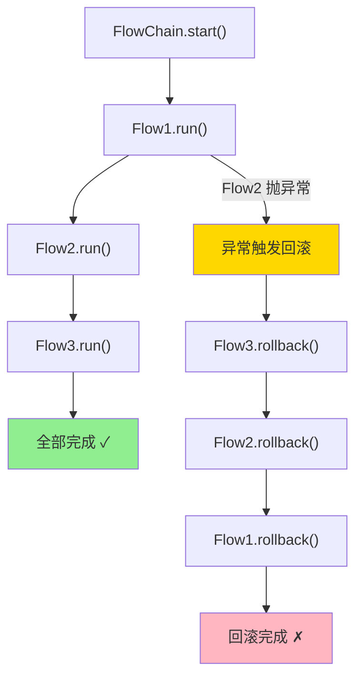

# 05 - FlowChain 工作流引擎

FlowChain 是 ZStack 中最核心的流程编排引擎。从创建虚拟机、挂载云盘，到连接主机、删除集群——几乎所有多步骤操作都通过 FlowChain 编排。它的核心特性是**自动回滚**：当流程中某个步骤失败时，已完成的步骤会按逆序自动回滚，保证系统状态的一致性。

## 核心机制



## 核心接口

### Flow —— 流程步骤

> 源码位置：zstack/header/src/main/java/org/zstack/header/core/workflow/Flow.java

```java
public interface Flow {
    void run(FlowTrigger trigger, Map data);
    void rollback(FlowRollback trigger, Map data);
    default boolean skip(Map data) { return false; }
}
```

每个 Flow 有三个方法：
- `run()` —— 执行步骤。完成后必须调用 `trigger.next()` 进入下一步，或 `trigger.fail()` 报告失败
- `rollback()` —— 回滚步骤。完成后必须调用 `trigger.rollback()` 继续回滚上一步
- `skip()` —— 可选，返回 true 时跳过此步骤（也不回滚）

### FlowTrigger —— 正向推进

> 源码位置：zstack/header/src/main/java/org/zstack/header/core/workflow/FlowTrigger.java

```java
public interface FlowTrigger extends AsyncBackup {
    void fail(ErrorCode errorCode);
    void next();
    void setError(ErrorCode error);
}
```

- `next()` —— 当前步骤成功，推进到下一个 Flow
- `fail()` —— 当前步骤失败，触发回滚
- `setError()` —— 设置错误但不触发回滚（链继续执行，但最终走 error 路径）

### FlowRollback —— 回滚控制

> 源码位置：zstack/header/src/main/java/org/zstack/header/core/workflow/FlowRollback.java

```java
public interface FlowRollback extends AsyncBackup {
    void rollback();
    void skipRestRollbacks();
    ErrorCode getErrorCode();
}
```

- `rollback()` —— 当前步骤回滚完成，继续回滚上一个 Flow
- `skipRestRollbacks()` —— 跳过剩余所有回滚
- `getErrorCode()` —— 获取导致回滚的错误码

### FlowChain —— 链构建器

> 源码位置：zstack/header/src/main/java/org/zstack/header/core/workflow/FlowChain.java

```java
public interface FlowChain {
    FlowChain then(Flow flow);
    FlowChain done(FlowDoneHandler handler);
    FlowChain error(FlowErrorHandler handler);
    FlowChain Finally(FlowFinallyHandler handler);
    FlowChain ctxHandler(FlowContextHandler handler);
    FlowChain setName(String name);
    FlowChain noRollback(boolean no);
    FlowChain allowEmptyFlow();
    FlowChain setFlowMarshaller(FlowMarshaller marshaller);
    FlowChain preCheck(Function<Map, ErrorCode> checker);
    void start();
}
```

## SimpleFlowChain —— 核心实现

`SimpleFlowChain` 是 FlowChain 的主要实现，它同时实现了 `FlowTrigger` 和 `FlowRollback`，充当流程的调度器。

> 源码位置：zstack/core/src/main/java/org/zstack/core/workflow/SimpleFlowChain.java

### 数据结构

```java
public class SimpleFlowChain implements FlowTrigger, FlowRollback, FlowChain, FlowChainMutable {
    private String id;
    private List<Flow> flows = new ArrayList<>();
    private final Stack<Flow> rollBackFlows = new Stack<>();
    private final List<Flow> skippedFlows = new ArrayList<>();
    private Map data = new HashMap();
    private int currentLoop = 0;
    private Iterator<Flow> it;
    private boolean isStart = false;
    private boolean isRollbackStart = false;
    private Flow currentFlow;
    private ErrorCode errorCode;
    // ... handlers
}
```

关键数据结构：
- `flows` —— 按顺序存储所有 Flow
- `rollBackFlows` —— 栈结构，存储已成功执行的 Flow（用于逆序回滚）
- `skippedFlows` —— 被跳过的 Flow（回滚时也跳过）
- `data` —— 共享数据 Map，所有 Flow 通过它传递数据
- `it` —— Flow 迭代器，驱动正向执行

### 正向执行流程

```
start()
  │
  ▼
runFlowOrComplete()
  │
  ├── it.hasNext() ──▶ runFlow(flow)
  │                        │
  │                        ├── flow.skip() == true ──▶ skippedFlows.add() ──▶ next()
  │                        │
  │                        └── flow.run(trigger, data)
  │                              │
  │                              ├── trigger.next() ──▶ rollBackFlows.push() ──▶ runFlowOrComplete()
  │                              │
  │                              └── trigger.fail(err) ──▶ rollBackFlows.push() ──▶ rollback()
  │
  └── !it.hasNext() ──▶ callDoneHandler() ──▶ callFinallyHandler()
```

#### start() 方法

> 源码位置：zstack/core/src/main/java/org/zstack/core/workflow/SimpleFlowChain.java:653-692

```java
@Override
public void start() {
    if (processors != null) {
        for (FlowChainProcessor p : processors) {
            p.processFlowChain(this);
        }
    }

    if (flows.isEmpty() && allowEmptyFlow) {
        callDoneHandler();
        return;
    }

    if (flows.isEmpty()) {
        throw new CloudRuntimeException(
            "you must call then() to add flow before calling start()");
    }

    isStart = true;
    if (name == null) { name = "anonymous-chain"; }

    it = flows.iterator();
    runFlowOrComplete();
}
```

#### next() 方法

> 源码位置：zstack/core/src/main/java/org/zstack/core/workflow/SimpleFlowChain.java:632-650

```java
@Override
public void next() {
    if (!isStart) {
        throw new CloudRuntimeException("you must call start() first");
    }
    if (isRollbackStart) {
        throw new CloudRuntimeException("rollback has started, you can't call next()");
    }

    rollBackFlows.push(currentFlow);
    runFlowOrComplete();
}
```

`next()` 将当前 Flow 压入回滚栈，然后推进到下一个 Flow。

#### runFlow() 方法

> 源码位置：zstack/core/src/main/java/org/zstack/core/workflow/SimpleFlowChain.java:313-390

```java
private void runFlow(Flow flow) {
    try {
        // 检查是否有未关闭的事务
        if (TransactionSynchronizationManager.isActualTransactionActive()) {
            throw new CloudRuntimeException(
                String.format("flow[%s] opened a transaction but forgot closing it",
                    currentFlow.getClass().getName()));
        }

        // FlowMarshaller 可以替换下一个 Flow
        Flow toRun = null;
        if (flowMarshaller != null) {
            toRun = flowMarshaller.marshalTheNextFlow(
                currentFlow == null ? null : currentFlow.getClass().getName(),
                flow.getClass().getName(), this, data);
        }
        if (toRun == null) { toRun = flow; }

        currentFlow = toRun;
        collectAfterRunnable(toRun);

        // preCheck 前置检查
        if (preCheck != null) {
            ErrorCode err = preCheck.apply(data);
            if (err != null) { this.fail(err); return; }
        }

        // 跳过检查
        if (isSkipFlow(toRun)) {
            skippedFlows.add(toRun);
            this.next();
        } else {
            if (contextHandler != null) {
                contextHandler.saveContext(toRun);
                if (contextHandler.cancelled()) {
                    this.fail(contextHandler.getCancelError());
                    return;
                }
            }
            toRun.run(this, data);
        }
    } catch (OperationFailureException oe) {
        fail(oe.getErrorCode());
    } catch (FlowException fe) {
        fail(fe.getErrorCode());
    } catch (Throwable t) {
        fail(inerr(t.getMessage()));
    }
}
```

关键检查：
1. **事务泄漏检测** —— 如果上一个 Flow 打开了数据库事务但未关闭，立即报错
2. **FlowMarshaller** —— 允许动态替换下一个要执行的 Flow
3. **preCheck** —— 每个 Flow 执行前的前置检查
4. **skip** —— Flow 可以通过 `skip()` 方法跳过自身

### 回滚流程

```
fail(errorCode)
  │
  ▼
rollBackFlows.push(currentFlow)
  │
  ▼
rollback()
  │
  ├── rollBackFlows.empty() ──▶ callErrorHandler() ──▶ callFinallyHandler()
  │
  ├── skipRestRollbacks ──▶ callErrorHandler() ──▶ callFinallyHandler()
  │
  └── flow = rollBackFlows.pop()
         │
         ▼
     rollbackFlow(flow)
         │
         ├── skippedFlows.contains(flow) ──▶ rollback() (跳过)
         │
         └── flow.rollback(trigger, data)
               │
               └── trigger.rollback() ──▶ rollback() (继续回滚)
```

#### fail() 方法

> 源码位置：zstack/core/src/main/java/org/zstack/core/workflow/SimpleFlowChain.java:603-608

```java
@Override
public void fail(ErrorCode errorCode) {
    isFailCalled = true;
    setErrorCode(errorCode);
    rollBackFlows.push(currentFlow);
    rollback();
}
```

`fail()` 将当前失败的 Flow 压入回滚栈（因为它可能已经做了部分工作需要回滚），然后启动回滚。

#### rollback() 方法

> 源码位置：zstack/core/src/main/java/org/zstack/core/workflow/SimpleFlowChain.java:489-524

```java
@Override
public void rollback() {
    if (!isFailCalled) {
        throw new CloudRuntimeException("rollback() cannot be called before fail() is called");
    }

    isRollbackStart = true;
    if (rollBackFlows.empty()) {
        callErrorHandler(true);
        return;
    }

    if (skipRestRollbacks) {
        callErrorHandler(true);
        return;
    }

    Flow flow = rollBackFlows.pop();
    currentRollbackFlow = flow;
    rollbackFlow(flow);
}
```

回滚从栈顶开始，按**后进先出**的顺序执行。最后执行的 Flow 最先回滚，保证依赖关系的正确性。

#### rollbackFlow() 方法

> 源码位置：zstack/core/src/main/java/org/zstack/core/workflow/SimpleFlowChain.java:392-419

```java
private void rollbackFlow(Flow flow) {
    try {
        currentLoop--;

        if (contextHandler != null) {
            if (contextHandler.skipRollback(this.getErrorCode())) {
                this.skipRestRollbacks();
                this.rollback();
                return;
            }
        }

        if (skippedFlows.contains(flow)) {
            rollback();
        } else {
            flow.rollback(this, data);
        }
    } catch (Throwable t) {
        logger.warn(String.format("unhandled exception when rollback flow[%s],"
            + " continue to next rollback", flow.getClass().getSimpleName()), t);
        rollback();
    }
}
```

重要特性：**回滚中的异常不会中断回滚过程**。即使某个 Flow 的 rollback() 抛出异常，FlowChain 也会继续回滚上一个 Flow，保证尽可能多的清理工作被执行。

## ShareFlowChain —— 共享上下文链

`ShareFlowChain` 是 `SimpleFlowChain` 的子类，配合 `ShareFlow` 使用，提供了一种更优雅的 FlowChain 构建方式。

> 源码位置：zstack/core/src/main/java/org/zstack/core/workflow/ShareFlowChain.java

```java
public class ShareFlowChain extends SimpleFlowChain {
    private final List<ShareFlow> shareFlows = new ArrayList<>();

    @Override
    public ShareFlowChain then(Flow flow) {
        if (!(flow instanceof ShareFlow)) {
            throw new IllegalArgumentException(
                "ShareFlowChain only receives ShareFlow in then()");
        }
        shareFlows.add((ShareFlow) flow);
        return this;
    }

    void install(Flow flow) {
        super.then(flow);
    }

    @Override
    public void start() {
        for (ShareFlow shareFlow : shareFlows) {
            shareFlow.setChain(this);
            shareFlow.setup();
        }
        super.start();
    }
}
```

### ShareFlow

> 源码位置：zstack/core/src/main/java/org/zstack/core/workflow/ShareFlow.java

```java
public abstract class ShareFlow implements Flow {
    private ShareFlowChain chain;

    void setChain(ShareFlowChain chain) { this.chain = chain; }

    protected void flow(Flow flow) { chain.install(flow); }
    protected void done(FlowDoneHandler handler) { chain.done(handler); }
    protected void error(FlowErrorHandler handler) { chain.error(handler); }
    protected void Finally(FlowFinallyHandler handler) { chain.Finally(handler); }

    @Override
    public final void run(FlowTrigger trigger, Map data) { trigger.next(); }

    @Override
    public final void rollback(FlowRollback trigger, Map data) { trigger.rollback(); }

    public abstract void setup();
}
```

ShareFlow 的巧妙之处：
- `ShareFlow` 本身是一个"空壳" Flow——它的 `run()` 直接调用 `next()`，`rollback()` 直接调用 `rollback()`
- 真正的逻辑在 `setup()` 方法中，通过 `flow()` 调用向链中安装真正的 Flow
- `setup()` 在 `start()` 之前被调用，此时可以向链中动态添加 Flow 和注册 handler
- 由于 `setup()` 是匿名内部类的方法，它可以访问外部类的局部变量（Java 闭包），实现上下文共享

### ShareFlow vs SimpleFlowChain 对比

**SimpleFlowChain 方式**（传统）：

```java
FlowChain chain = FlowChainBuilder.newSimpleFlowChain();
chain.then(new Flow() {
    @Override
    public void run(FlowTrigger trigger, Map data) {
        // 步骤1
        trigger.next();
    }
    @Override
    public void rollback(FlowRollback trigger, Map data) {
        // 回滚1
        trigger.rollback();
    }
});
chain.then(new Flow() { /* 步骤2 */ });
chain.done(new FlowDoneHandler(null) {
    @Override
    public void handle(Map data) { /* 完成 */ }
});
chain.start();
```

**ShareFlowChain 方式**（推荐）：

```java
FlowChain chain = FlowChainBuilder.newShareFlowChain();
chain.then(new ShareFlow() {
    @Override
    public void setup() {
        flow(new Flow() {
            @Override
            public void run(FlowTrigger trigger, Map data) {
                // 步骤1
                trigger.next();
            }
            @Override
            public void rollback(FlowRollback trigger, Map data) {
                // 回滚1
                trigger.rollback();
            }
        });

        flow(new Flow() { /* 步骤2 */ });

        done(new FlowDoneHandler(null) {
            @Override
            public void handle(Map data) { /* 完成 */ }
        });
    }
});
chain.start();
```

ShareFlowChain 的优势：所有 Flow 定义和 handler 注册都在同一个 `setup()` 方法中，共享同一个闭包上下文，变量传递更自然。

## 实战示例：虚拟机变更 IP

以下是从 `VmInstanceBase` 中提取的真实案例，展示 ShareFlowChain 如何编排"变更虚拟机网卡 IP"这个多步骤操作：

> 源码位置：zstack/compute/src/main/java/org/zstack/compute/vm/VmInstanceBase.java:1085

```java
final FlowChain chain = FlowChainBuilder.newShareFlowChain();
chain.setName(String.format("change-vm-ip-l3-%s-vm-%s", l3Uuid, self.getUuid()));
final VmInstanceSpec spec = buildSpecFromInventory(getSelfInventory(),
    VmOperation.ChangeNicIp);
chain.getData().put(VmInstanceConstant.Params.VmInstanceSpec.toString(), spec);
chain.then(new ShareFlow() {
    @Override
    public void setup() {
        flow(new Flow() {
            String __name__ = "acquire-new-ip";

            @Override
            public void run(final FlowTrigger trigger, Map data) {
                // 分配新 IP
                AllocateIpMsg amsg = new AllocateIpMsg();
                amsg.setL3NetworkUuid(l3Uuid);
                amsg.setRequiredIp(entry.getValue());
                bus.makeTargetServiceIdByResourceUuid(amsg,
                    L3NetworkConstant.SERVICE_ID, l3Uuid);
                bus.send(amsg, new CloudBusCallBack(trigger) {
                    @Override
                    public void run(MessageReply reply) {
                        if (!reply.isSuccess()) {
                            trigger.fail(reply.getError());
                        } else {
                            newIpMap.put(entry.getKey(),
                                reply.castReply().getIpInventory());
                            trigger.next();
                        }
                    }
                });
            }

            @Override
            public void rollback(FlowRollback trigger, Map data) {
                // 回滚：释放新分配的 IP
                if (!newIpMap.isEmpty()) {
                    ReturnIpMsg rmsg = new ReturnIpMsg();
                    rmsg.setL3NetworkUuid(ip.getL3NetworkUuid());
                    rmsg.setUsedIpUuid(ip.getUuid());
                    bus.send(rmsg, new CloudBusCallBack(trigger) {
                        @Override
                        public void run(MessageReply reply) {
                            trigger.rollback();
                        }
                    });
                } else {
                    trigger.rollback();
                }
            }
        });

        // ... 更多 flow 步骤

        error(new FlowErrorHandler(null) {
            @Override
            public void handle(ErrorCode errCode, Map data) {
                // 错误处理
            }
        });

        done(new FlowDoneHandler(null) {
            @Override
            public void handle(Map data) {
                // 成功完成
            }
        });
    }
});
chain.start();
```

这个例子展示了 FlowChain 的典型使用模式：
1. 创建 ShareFlowChain，设置名称和共享数据
2. 在 `setup()` 中通过 `flow()` 安装多个步骤
3. 每个 Flow 的 `run()` 执行操作，`rollback()` 清理已做的工作
4. 异步操作（如 `bus.send()`）在回调中调用 `trigger.next()` 或 `trigger.fail()`
5. 注册 `done` 和 `error` handler 处理最终结果

## 高级特性

### FlowMarshaller —— 动态替换 Flow

> 源码位置：zstack/header/src/main/java/org/zstack/header/core/workflow/FlowMarshaller.java

```java
public interface FlowMarshaller {
    Flow marshalTheNextFlow(String previousFlowClassName,
        String nextFlowClassName, FlowChain chain, Map data);
}
```

`FlowMarshaller` 允许在运行时根据前一个 Flow 的类名和下一个 Flow 的类名，动态替换要执行的 Flow。这可以用于条件分支、插件注入等场景。

### preCheck —— 前置检查

```java
FlowChain preCheck(Function<Map, ErrorCode> checker);
```

在每个 Flow 执行前调用 `checker`，如果返回非 null 的 ErrorCode，则直接 fail 整个链。这可以用于运行时条件检查。

### noRollback —— 禁用回滚

```java
FlowChain noRollback(boolean no);
```

设置 `noRollback(true)` 后，即使某个 Flow 失败，也不会执行回滚。适用于幂等操作或不需要回滚的场景。

### @AfterDone / @AfterError / @AfterFinal 注解

Flow 中可以使用这些注解标记 `List<Runnable>` 字段，FlowChain 会在对应阶段自动执行这些 Runnable。这提供了一种在 Flow 内部注册回调的机制，而不需要在外部通过 handler 处理。

### 事务泄漏检测

`runFlow()` 方法在执行每个 Flow 前检查是否有未关闭的数据库事务：

```java
if (TransactionSynchronizationManager.isActualTransactionActive()) {
    throw new CloudRuntimeException(
        String.format("flow[%s] opened a transaction but forgot closing it",
            flowClassName));
}
```

这是一个重要的安全检查——Flow 中不应该持有长事务，因为 FlowChain 是异步的，长事务会导致数据库连接泄漏。

## FlowChainBuilder —— 工厂方法

> 源码位置：zstack/core/src/main/java/org/zstack/core/workflow/FlowChainBuilder.java

```java
public class FlowChainBuilder {
    private List<String> flowClassNames;
    private List<Flow> flows = new ArrayList<>();
    private boolean isConstructed;

    public FlowChainBuilder construct() {
        if (flowClassNames != null) {
            for (Object name : flowClassNames) {
                String className = (String) name;
                Class<Flow> clazz = (Class<Flow>) Class.forName(className);
                Flow flow = clazz.newInstance();
                flows.add(flow);
            }
        }
        isConstructed = true;
        return this;
    }

    public FlowChain build() {
        if (!isConstructed) {
            throw new CloudRuntimeException("please call construct() before build()");
        }
        SimpleFlowChain chain = new SimpleFlowChain();
        for (Flow flow : flows) {
            chain.then(flow);
        }
        return chain;
    }

    public static FlowChain newSimpleFlowChain() {
        return new SimpleFlowChain();
    }

    public static FlowChain newShareFlowChain() {
        return new ShareFlowChain();
    }
}
```

推荐使用 `FlowChainBuilder.newSimpleFlowChain()` 和 `FlowChainBuilder.newShareFlowChain()` 创建链，而不是直接 `new SimpleFlowChain()`。`SimpleFlowChain` 上标注了 Spring 的 `@Configurable(preConstruction = true, autowire = Autowire.BY_TYPE)`，因此通过 `new` 创建时 Spring 也会自动注入依赖（如 `ErrorFacade`）。如果使用 `FlowChainBuilder` 的 `build()` 方法构建链，必须先调用 `construct()` 初始化 Flow 列表，否则会抛出异常。

## 执行统计

SimpleFlowChain 内置了性能统计功能，通过 `FlowStopWatch` 记录每个 Flow 的执行时间：

```java
if (CoreGlobalProperty.PROFILER_WORKFLOW || allowWatch) {
    stopWatch.start(toRun);
}
```

设置 `CoreGlobalProperty.PROFILER_WORKFLOW = true` 或调用 `chain.allowWatch()` 可以启用统计，日志中会输出每个 Flow 的耗时。

## 总结

FlowChain 的核心设计理念：

1. **自动回滚** —— 失败时按逆序自动回滚已完成的步骤，保证一致性
2. **异步友好** —— Flow 的 `run()` 和 `rollback()` 都是异步的，通过回调推进
3. **共享数据** —— 所有 Flow 通过同一个 `Map data` 共享数据
4. **容错回滚** —— 回滚过程中的异常不会中断回滚链
5. **ShareFlow 闭包** —— ShareFlowChain 利用 Java 匿名内部类的闭包特性，简化上下文传递
6. **可扩展** —— FlowMarshaller、preCheck、FlowChainProcessor 提供了多种扩展点

FlowChain 是 ZStack "自愈"设计哲学的体现——不是避免失败，而是确保失败后能正确恢复。
