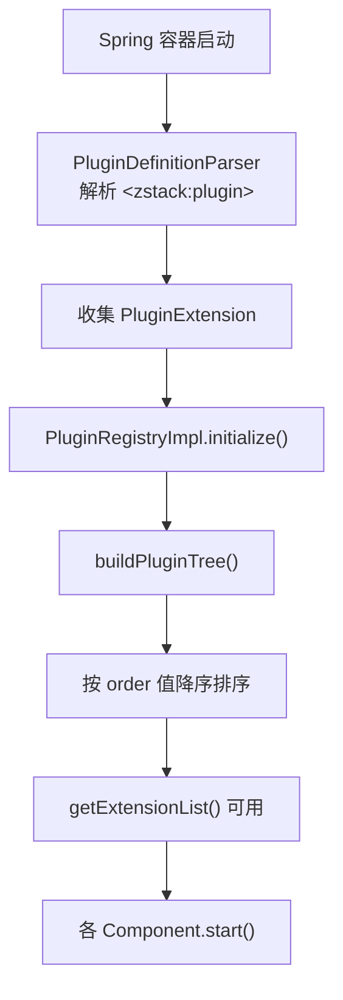

# 03 - 插件框架与扩展点

ZStack 的插件框架是其架构的核心支柱。整个管理节点由 91+ 个 Spring XML 配置文件组装，每个业务组件通过 `zstack:plugin` 自定义标签声明自己实现了哪些扩展点接口，运行时由 `PluginRegistry` 统一收集、排序和分发。这种设计让 ZStack 实现了真正的"约定优于配置"——你只需声明接口实现，框架自动完成注册和发现。

## 加载流程



## 从一个 Spring XML 说起

一切从 Spring XML 开始。以 `HostManager.xml` 为例：

> 源码位置：zstack/conf/springConfigXml/HostManager.xml

```xml
<bean id="HostManager" class="org.zstack.compute.host.HostManagerImpl">
    <zstack:plugin>
        <zstack:extension interface="org.zstack.header.Component" />
        <zstack:extension interface="org.zstack.header.Service" />
        <zstack:extension
                interface="org.zstack.header.cluster.ClusterChangeStateExtensionPoint"
                instance-ref="HostExtensionToCluster" />
        <zstack:extension interface="org.zstack.header.managementnode.ManagementNodeChangeListener" />
        <zstack:extension interface="org.zstack.header.managementnode.ManagementNodeReadyExtensionPoint" />
        <zstack:extension interface="org.zstack.header.vo.FindSameNodeExtensionPoint"/>
    </zstack:plugin>
</bean>

<bean id="HostExtensionToCluster" class="org.zstack.compute.host.HostExtensionToCluster" />
```

这段声明表达了以下含义：

- `HostManagerImpl` 这个 Bean 实现了 6 个扩展点接口
- 其中 `ClusterChangeStateExtensionPoint` 的实现不是 `HostManagerImpl` 本身，而是另一个 Bean `HostExtensionToCluster`（通过 `instance-ref` 指定）
- 其余 5 个扩展点由 `HostManagerImpl` 自身实现

### `instance-ref` 的意义

`instance-ref` 解决了一个常见问题：一个 Bean 需要向多个扩展点注册，但某些扩展点的实现逻辑不适合放在主类中。`HostExtensionToCluster` 就是一个典型的"桥接类"——它将集群状态变更事件转发给主机管理器：

> 源码位置：zstack/compute/src/main/java/org/zstack/compute/host/HostExtensionToCluster.java

```java
class HostExtensionToCluster implements ClusterChangeStateExtensionPoint {
    @Autowired
    private HostExtensionPointEmitter extpEmitter;

    @Override
    public void preChangeClusterState(ClusterInventory inventory,
            ClusterStateEvent event, ClusterState nextState) throws ClusterException {
        if (!event.toString().equals(ClusterStateEvent.disable.toString())
                && !event.toString().equals(ClusterStateEvent.enable.toString())) {
            return;
        }
        HostStateEvent hostEvent = HostStateEvent.valueOf(event.toString());
        List<HostVO> vos = findHostUnderClusterByUuid(inventory.getUuid());
        extpEmitter.preChange(vos, hostEvent);
    }
    // ...
}
```

这种模式在 ZStack 中广泛使用，保持主管理器类的职责单一。

## 自定义 XML 命名空间的实现

`zstack:plugin` 并非 Spring 内置标签，而是 ZStack 通过 Spring 的可扩展 XML 机制自定义的。整个链路如下：

### XSD 定义

> 源码位置：zstack/core/src/main/resources/META-INF/plugin.xsd

```xml
<xsd:schema xmlns="http://zstack.org/schema/zstack"
            xmlns:xsd="http://www.w3.org/2001/XMLSchema"
            targetNamespace="http://zstack.org/schema/zstack">

    <xsd:element name="plugin">
        <xsd:complexType>
            <xsd:sequence>
                <xsd:sequence maxOccurs="unbounded" minOccurs="0">
                    <xsd:element name="extension">
                        <xsd:complexType>
                            <xsd:attribute name="interface" type="xsd:string"/>
                            <xsd:attribute name="instance-ref" type="xsd:string"/>
                            <xsd:attribute name="order" type="xsd:string"/>
                        </xsd:complexType>
                    </xsd:element>
                </xsd:sequence>
            </xsd:sequence>
        </xsd:complexType>
    </xsd:element>
</xsd:schema>
```

XSD 定义了三个属性：
- `interface`：扩展点接口的全限定名（必填）
- `instance-ref`：实现类的 Bean 引用（可选，默认使用父 Bean）
- `order`：排序优先级（可选，默认 0）

### Spring Handler 注册

> 源码位置：zstack/core/src/main/resources/META-INF/spring.handlers

```
http\://zstack.org/schema/zstack=org.zstack.core.componentloader.PluginNameSpaceHandler
```

> 源码位置：zstack/core/src/main/resources/META-INF/spring.schemas

```
http\://zstack.org/schema/zstack/plugin.xsd=META-INF/plugin.xsd
```

Spring 在解析 XML 时，遇到 `http://zstack.org/schema/zstack` 命名空间，就会委托 `PluginNameSpaceHandler` 处理。

### NamespaceHandler

> 源码位置：zstack/core/src/main/java/org/zstack/core/componentloader/PluginNameSpaceHandler.java

```java
public class PluginNameSpaceHandler extends NamespaceHandlerSupport {
    @Override
    public void init() {
        this.registerBeanDefinitionDecorator("plugin", new PluginDefinitionParser());
    }
}
```

注意这里注册的是 `BeanDefinitionDecorator`，不是 `BeanDefinitionParser`。这意味着 `zstack:plugin` 是作为 Bean 的装饰器（decorator）使用的——它不创建新的 Bean，而是在现有 Bean 定义上附加扩展点信息。

### PluginDefinitionParser——解析与收集

> 源码位置：zstack/core/src/main/java/org/zstack/core/componentloader/PluginDefinitionParser.java

```java
public class PluginDefinitionParser implements BeanDefinitionDecorator {
    private static final String EXTENSION_NODE = "zstack:extension";
    private static final String PLUGIN_NODE = "zstack:plugin";

    @Override
    public BeanDefinitionHolder decorate(Node node, BeanDefinitionHolder holder,
            ParserContext ctx) {
        // 1. 确保 PluginRegistry 的 BeanDefinition 已注册
        if (!ctx.getRegistry().containsBeanDefinition(
                PluginRegistry.PLUGIN_REGISTRY_BEAN_NAME)) {
            BeanDefinitionBuilder builder =
                BeanDefinitionBuilder.rootBeanDefinition(PluginRegistryImpl.class);
            ctx.getRegistry().registerBeanDefinition(
                PluginRegistry.PLUGIN_REGISTRY_BEAN_NAME,
                builder.getBeanDefinition());
        }

        // 2. 解析 <zstack:extension> 子元素
        Element root = (Element) node;
        List<Element> children = DomUtils.getChildElementsByTagName(
                root, new String[] { EXTENSION_NODE });
        List<PluginExtension> exts = parsePlugin(all, holder.getBeanDefinition(),
                holder.getBeanName());

        // 3. 将解析结果注入 PluginRegistry 的 extensions 属性
        if (!exts.isEmpty()) {
            BeanDefinition registryBean = ctx.getRegistry().getBeanDefinition(
                PluginRegistry.PLUGIN_REGISTRY_BEAN_NAME);
            MutablePropertyValues props = registryBean.getPropertyValues();
            PropertyValue prop = props.getPropertyValue(
                PluginRegistry.PLUGIN_REGISTRYIMPL_PLUGINS_FIELD_NAME);
            if (prop == null) {
                Map<String, List<PluginExtension>> extensions = new HashMap<>(1);
                extensions.put(ext.getBeanClassName(), exts);
                props.addPropertyValue(
                    PluginRegistry.PLUGIN_REGISTRYIMPL_PLUGINS_FIELD_NAME, extensions);
            } else {
                Map<String, List<PluginExtension>> extensions =
                    (Map<String, List<PluginExtension>>) prop.getValue();
                extensions.computeIfAbsent(ext.getBeanClassName(),
                    k -> new ArrayList<>(exts.size())).addAll(exts);
            }
        }
        return holder;
    }
}
```

核心逻辑：Spring 解析每个 `<zstack:plugin>` 时，将扩展点信息收集到 `PluginRegistry` Bean 的 `extensions` 属性中。这是一个 `Map<String, List<PluginExtension>>`，key 是声明扩展的 Bean 类名，value 是该 Bean 声明的所有扩展点列表。

### PluginExtension 数据模型

> 源码位置：zstack/core/src/main/java/org/zstack/core/componentloader/PluginExtension.java

```java
public class PluginExtension {
    private String beanClassName;      // 声明扩展的 Bean 类名
    private String beanName;           // 声明扩展的 Bean 名称
    private String instanceId;         // instance-ref 指定的 Bean 名称
    private String referenceInterface; // 扩展点接口全限定名
    private Object instance;           // 运行时解析后的实例对象
    private int order;                 // 排序优先级
    private Map<String, String> attributes = new HashMap<>(); // 自定义属性
}
```

## ComponentLoader——Spring IoC 的门面

`ComponentLoader` 是 ZStack 对 Spring IoC 容器的封装，所有 Bean 查找都通过它进行。

> 源码位置：zstack/core/src/main/java/org/zstack/core/componentloader/ComponentLoader.java

```java
public interface ComponentLoader {
    <T> T getComponent(Class<T> clazz);
    boolean hasComponent(Class clazz);
    <T> T getComponentNoExceptionWhenNotExisting(Class<T> clazz);
    <T> T getComponent(String className);
    <T> T getComponentByBeanName(String beanName);
    PluginRegistry getPluginRegistry();
    BeanFactory getSpringIoc();
}
```

### ComponentLoaderImpl 实现

> 源码位置：zstack/core/src/main/java/org/zstack/core/componentloader/ComponentLoaderImpl.java

```java
public class ComponentLoaderImpl implements ComponentLoader {
    private final BeanFactory ioc;
    private PluginRegistryIN pluginRegistry = null;
    private static boolean isInit = false;

    public ComponentLoaderImpl(ApplicationContext appContext) {
        checkInit();
        ioc = appContext;
    }

    public ComponentLoaderImpl() {
        checkInit();
        ioc = new ClassPathXmlApplicationContext(
            String.format("classpath:%s", CoreGlobalProperty.BEAN_CONF));
    }

    @Override
    public PluginRegistry getPluginRegistry() {
        if (pluginRegistry == null) {
            pluginRegistry = ioc.getBean(PluginRegistryIN.class);
            pluginRegistry.initialize();
        }
        return pluginRegistry;
    }

    private void checkInit() {
        if (isInit) {
            throw new CloudRuntimeException(
                "Nested ComponentLoader initialization detected. " +
                "DO NOT call Platform.getComponentLoader() in bean's constructor");
        }
        isInit = true;
    }
}
```

关键设计点：

1. **防嵌套初始化**：`checkInit()` 防止 Bean 构造函数中调用 `Platform.getComponentLoader()` 导致循环初始化
2. **延迟初始化 PluginRegistry**：不在构造函数中初始化，因为 `PluginRegistry.initialize()` 需要 `ComponentLoader` 已经就绪
3. **双构造函数**：Web 启动时传入 `WebApplicationContext`，单元测试时自动创建 `ClassPathXmlApplicationContext`

### 创建时机

在 `Platform.createComponentLoaderFromWebApplicationContext()` 中创建：

> 源码位置：zstack/core/src/main/java/org/zstack/core/Platform.java:652

```java
public static ComponentLoader createComponentLoaderFromWebApplicationContext(
        WebApplicationContext webAppCtx) {
    assert loader == null;
    loader = new ComponentLoaderImpl(webAppCtx);

    // 初始化插件注册表
    loader.getPluginRegistry();

    // 提前启动三个关键组件
    GlobalConfigFacade gcf = loader.getComponent(GlobalConfigFacade.class);
    if (gcf != null) { ((Component)gcf).start(); }

    ThreadFacade thdf = loader.getComponent(ThreadFacade.class);
    if (thdf != null) { thdf.start(); }

    CloudBus bus = loader.getComponentNoExceptionWhenNotExisting(CloudBus.class);
    if (bus != null) { bus.start(); }

    initMessageSource();
    return loader;
}
```

GlobalConfigFacade、ThreadFacade、CloudBus 三个组件在 FlowChain 之前启动，因为后续几乎所有组件都依赖它们。

## PluginRegistry——扩展点的注册中心

`PluginRegistry` 是整个插件框架的核心，负责收集、排序和查询扩展点实现。

### 接口层次

```
PluginRegistry (公开接口)
    ├── getExtensionList(Class<T>)           // 按接口类型获取扩展列表
    ├── getExtensionByInterfaceName(String)  // 按接口名获取
    ├── saveExtensionAsMap()                 // 缓存为 Map（按 key 索引）
    ├── saveExtensionListAsMap()             // 缓存为 Map（按 key 索引，一对多）
    ├── getExtensionFromMap()                // 从 Map 缓存中查询
    ├── getExtensionListFromMap()            // 从 Map 缓存中查询（一对多）
    └── defineDynamicExtension()             // 运行时动态注册

PluginRegistryIN (内部接口，extends PluginRegistry)
    └── initialize()                         // 初始化方法

PluginRegistryImpl (实现类，implements PluginRegistryIN, BannedModule)
```

### 初始化三步曲

> 源码位置：zstack/core/src/main/java/org/zstack/core/componentloader/PluginRegistryImpl.java:80

```java
@Override
public void initialize() {
    buildPluginTree();              // 第一步：从 XML 声明构建扩展树
    continueBuildTreeFromDSL();     // 第二步：从 Java DSL 补充
    sortPlugins();                  // 第三步：按 order 排序
    createClassPluginInstanceMap(); // 第四步：建立 Class→List 映射
    logger.info("Plugin system has been initialized successfully");
}
```

#### 第一步：buildPluginTree()

从 Spring XML 解析阶段收集的 `extensions` Map 出发，将每个 `PluginExtension` 解析为真实的 Java 对象：

```java
private void buildPluginTree() {
    ComponentLoader loader = Platform.getComponentLoader();
    for (Map.Entry<String, List<PluginExtension>> entry : extensions.entrySet()) {
        for (PluginExtension ext : entry.getValue()) {
            Class<?> interfaceClass = Class.forName(ext.getReferenceInterface());

            // 根据 instance-ref 决定使用哪个 Bean 实例
            Object instance;
            if (!"".equals(ext.getInstanceId())) {
                instance = loader.getComponentByBeanName(ext.getInstanceId());
            } else {
                instance = loader.getComponentByBeanName(ext.getBeanName());
            }
            ext.setInstance(instance);

            // 检查实例是否真的实现了声明的接口
            if (!interfaceClass.isInstance(ext.getInstance())) {
                throw new IllegalArgumentException(
                    String.format("%s is not an instance of the interface %s",
                        ext.getInstance().getClass().getCanonicalName(),
                        interfaceClass.getName()));
            }

            // 按接口名分组存储
            List<PluginExtension> exts =
                extensionsByInterfaceName.get(ext.getReferenceInterface());
            if (exts == null) { exts = new ArrayList<>(1); }
            exts.add(ext);
            extensionsByInterfaceName.put(ext.getReferenceInterface(), exts);
        }
    }
}
```

关键校验：`interfaceClass.isInstance(ext.getInstance())` 确保声明的扩展点接口确实被实现类所实现，否则启动时立即报错。

#### 第二步：continueBuildTreeFromDSL()

除了 XML 声明，ZStack 还支持通过 Java 代码声明扩展点（PluginDSL）：

```java
private void continueBuildTreeFromDSL() {
    for (Map.Entry<Class, PluginDefinition> e :
            PluginDSL.getPluginDefinition().entrySet()) {
        Class beanClass = e.getKey();
        PluginDefinition definition = e.getValue();
        Object instance = loader.getComponent(beanClass);

        for (ExtensionDefinition extd : definition.extensions) {
            PluginExtension ext = new PluginExtension();
            ext.setInstance(instance);
            ext.setReferenceInterface(extd.interfaceClass.getName());
            ext.setOrder(extd.order);
            ext.setAttributes(extd.attributes);
            // ... 加入 extensionsByInterfaceName
        }
    }
}
```

`PluginDSL` 提供了一种纯 Java 的扩展点声明方式，主要用于无法通过 XML 配置的场景（如测试或动态注册）。

#### 第三步：sortPlugins()

```java
private void sortPlugins() {
    for (List<PluginExtension> exts : extensionsByInterfaceName.values()) {
        // order 值越大，在列表中越靠前
        exts.sort(Comparator.comparingInt(PluginExtension::getOrder).reversed());
    }
}
```

排序规则：`order` 值越大，优先级越高，在扩展列表中越靠前。例如 `DeadMessageManager` 声明了 `order="999"`，确保它在 `Component` 扩展列表中排最前（因为 `Component.start()` 按列表顺序调用，它需要最先被处理）。

#### 第四步：createClassPluginInstanceMap()

将 `extensionsByInterfaceName`（以接口全限定名为 key）转换为 `extensionsByInterfaceClass`（以 `Class` 对象为 key），方便运行时通过 `getExtensionList(Class<T>)` 查询：

```java
private void createClassPluginInstanceMap() {
    for (Map.Entry<String, List<PluginExtension>> e :
            extensionsByInterfaceName.entrySet()) {
        String className = e.getKey();
        Class clazz = Class.forName(className);
        List instances = new ArrayList();
        for (PluginExtension ext : e.getValue()) {
            if (!instances.contains(ext.getInstance())) {
                instances.add(ext.getInstance());
            }
        }
        extensionsByInterfaceClass.put(clazz, instances);
    }
}
```

注意去重：同一个 Bean 实例可能通过不同方式注册了同一个扩展点，这里确保每个实例只出现一次。

## 运行时查询扩展点

### getExtensionList——最常用的 API

```java
@Override
public <T> List<T> getExtensionList(Class<T> clazz) {
    List<T> exts = extensionsByInterfaceClass.get(clazz);
    return exts == null ? new ArrayList<>() : exts;
}
```

这是整个插件框架使用频率最高的方法。在 ZStack 源码中有 585+ 处调用。典型用法：

```java
// 启动时遍历所有 Component
for (final Component c : pluginRgty.getExtensionList(Component.class)) {
    c.start();
}

// 查询所有 VolumeFactory 实现
List<VolumeFactory> l = pluginRgty.getExtensionList(VolumeFactory.class);

// 查询所有 API 拦截器
for (GlobalApiMessageInterceptor gi :
        pluginRgty.getExtensionList(GlobalApiMessageInterceptor.class)) {
    // ...
}
```

### saveExtensionAsMap——按 key 索引

当需要按某个属性快速查找扩展点实现时，使用 `saveExtensionAsMap`：

```java
// VolumeManagerImpl 中，按 hypervisorType 索引
pluginRgty.saveExtensionAsMap(
    InstantiateDataVolumeOnCreationExtensionPoint.class,
    new Function<Object, InstantiateDataVolumeOnCreationExtensionPoint>() {
        @Override
        public Object call(InstantiateDataVolumeOnCreationExtensionPoint arg) {
            return arg.getHypervisorType();
        }
    });

// 后续通过 hypervisorType 快速查找
InstantiateDataVolumeOnCreationExtensionPoint ext =
    pluginRgty.getExtensionFromMap(hypervisorType,
        InstantiateDataVolumeOnCreationExtensionPoint.class);
```

### defineDynamicExtension——运行时注册

```java
@Override
public void defineDynamicExtension(Class interfaceClass, Object instance) {
    List exts = extensionsByInterfaceClass.computeIfAbsent(
        interfaceClass, k -> new ArrayList());
    exts.add(instance);
}
```

允许在运行时动态添加扩展点实现，主要用于测试场景。

## 核心扩展点接口

ZStack 的 `header` 模块定义了 220+ 个扩展点接口。以下是几个最核心的：

### Component——组件生命周期

> 源码位置：zstack/header/src/main/java/org/zstack/header/Component.java

```java
public interface Component {
    boolean start();
    boolean stop();
}
```

所有需要在管理节点启动时初始化的组件都实现此接口。`ManagementNodeManagerImpl` 通过 `getExtensionList(Component.class)` 获取所有组件并依次调用 `start()`。

### Service——消息服务

> 源码位置：zstack/header/src/main/java/org/zstack/header/Service.java

```java
public interface Service extends Component {
    void handleMessage(Message msg);
    String getId();
    int getSyncLevel();
    List<String> getAliasIds();
}
```

`Service` 继承 `Component`，增加了 CloudBus 消息处理能力。`getId()` 返回服务 ID，CloudBus 据此路由消息。`getSyncLevel()` 控制并发级别（0=异步，1=同步）。

### 典型扩展点分类

| 类别 | 命名模式 | 示例 |
|------|----------|------|
| 生命周期 | `XxxExtensionPoint` | `VmInstanceStartExtensionPoint` |
| 状态变更 | `XxxChangeStateExtensionPoint` | `HostChangeStateExtensionPoint` |
| 删除 | `XxxDeleteExtensionPoint` | `VolumeDeletionExtensionPoint` |
| 创建 | `XxxCreateExtensionPoint` | `VmInstanceCreateExtensionPoint` |
| 连接 | `XxxConnectExtensionPoint` | `PostHostConnectExtensionPoint` |
| API 拦截 | `ApiMessageInterceptor` | `HostApiInterceptor` |
| 级联 | `CascadeExtensionPoint` | `HostCascadeExtension` |
| 管理节点 | `ManagementNodeXxxExtensionPoint` | `ManagementNodeChangeListener` |

## 完整数据流

从 XML 声明到运行时查询，整个插件框架的数据流如下：

```
┌─────────────────────────────────────────────────────────────┐
│                    Spring XML 解析阶段                        │
│                                                             │
│  HostManager.xml          CloudBus.xml         core.xml     │
│  ┌──────────────┐    ┌──────────────┐   ┌──────────────┐   │
│  │ <zstack:     │    │ <zstack:     │   │ <zstack:     │   │
│  │  plugin>     │    │  plugin>     │   │  plugin>     │   │
│  │  <extension  │    │  <extension  │   │  <extension  │   │
│  │   interface= │    │   interface= │   │   interface= │   │
│  │   "..."/>    │    │   "..."/>    │   │   "..."/>    │   │
│  └──────┬───────┘    └──────┬───────┘   └──────┬───────┘   │
│         │                   │                   │           │
│         ▼                   ▼                   ▼           │
│  ┌──────────────────────────────────────────────────┐      │
│  │        PluginDefinitionParser.decorate()          │      │
│  │  收集所有 <zstack:extension> 到 PluginRegistry    │      │
│  │  的 extensions 属性 (Map<String, List<Ext>>)      │      │
│  └──────────────────────┬───────────────────────────┘      │
└─────────────────────────┼───────────────────────────────────┘
                          │
                          ▼
┌─────────────────────────────────────────────────────────────┐
│                  PluginRegistry.initialize()                 │
│                                                             │
│  1. buildPluginTree()                                       │
│     - 遍历 extensions Map                                   │
│     - 通过 ComponentLoader 获取 Bean 实例                    │
│     - 校验 isInstance() 接口实现                             │
│     - 按 interfaceName 分组 → extensionsByInterfaceName      │
│                                                             │
│  2. continueBuildTreeFromDSL()                              │
│     - 从 PluginDSL 静态定义补充                              │
│                                                             │
│  3. sortPlugins()                                           │
│     - 按 order 降序排列（order 越大越靠前）                   │
│                                                             │
│  4. createClassPluginInstanceMap()                          │
│     - Class → List<Instance> 映射                           │
│     - 去重                                                  │
│     → extensionsByInterfaceClass                            │
└──────────────────────┬──────────────────────────────────────┘
                       │
                       ▼
┌─────────────────────────────────────────────────────────────┐
│                     运行时查询                               │
│                                                             │
│  getExtensionList(Component.class)                          │
│    → [CloudBusJMX, DeadMessageManager, CoreManager, ...]    │
│                                                             │
│  getExtensionList(VolumeFactory.class)                      │
│    → [LocalStorageVolumeFactory, CephVolumeFactory, ...]    │
│                                                             │
│  getExtensionList(ClusterChangeStateExtensionPoint.class)   │
│    → [HostExtensionToCluster, ...]                          │
│                                                             │
│  saveExtensionAsMap() + getExtensionFromMap()               │
│    → 按 key 快速索引                                        │
└─────────────────────────────────────────────────────────────┘
```

## BannedModule——模块黑名单

> 源码位置：zstack/core/src/main/java/org/zstack/core/componentloader/BannedModule.java

```java
public interface BannedModule {
    List<String> bannedModules = new ArrayList();

    default boolean isBannedModule(String moduleName) {
        if (bannedModules == null || bannedModules.isEmpty()) {
            return false;
        }
        return bannedModules.stream().anyMatch(moduleName::startsWith);
    }
}
```

`PluginRegistryImpl` 实现了 `BannedModule` 接口。在 `buildPluginTree()` 中，如果扩展点实现类的全限定名匹配黑名单前缀，则跳过注册。默认黑名单为空，这个机制主要用于企业版中屏蔽开源版特有的模块。

## 设计哲学

ZStack 的插件框架体现了几个重要的设计原则：

1. **声明式注册**：开发者只需在 XML 中声明 `<zstack:extension interface="..."/>`，无需编写注册代码。框架在 Spring 容器启动时自动完成收集。

2. **接口驱动**：所有扩展点都是 Java 接口，定义在 `header` 模块中。实现类在具体业务模块中，通过接口解耦。

3. **启动时校验**：`isInstance()` 检查确保声明与实现一致，避免运行时才发现类型不匹配。

4. **排序可控**：`order` 属性让开发者精确控制扩展点的执行顺序，例如 `DeadMessageManager` 设置 `order=999` 确保最优先处理。

5. **多种索引方式**：`getExtensionList` 按类型查询，`saveExtensionAsMap` 按 key 索引，`defineDynamicExtension` 运行时注册，满足不同场景需求。

6. **XML 与 DSL 双通道**：XML 声明是主流方式，PluginDSL 为特殊场景（如测试）提供了 Java 代码声明的能力。

这套插件框架让 ZStack 的 24 个 Maven 模块、91+ 个 Spring 配置文件能够松散耦合地组装在一起，是整个 IaaS 平台可扩展性的基石。
