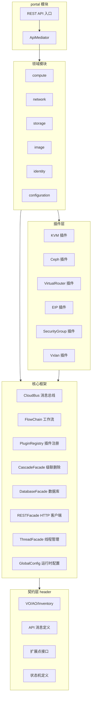
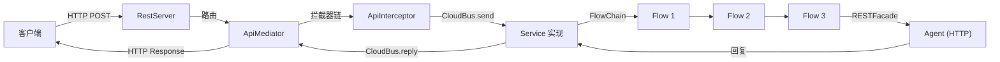

# 01 - 整体架构全景



## 三仓库架构

ZStack IaaS 平台由三个独立 Git 仓库组成，各自承担不同职责：

```
┌─────────────────────────────────────────────────────────────────────┐
│                        用户 / 浏览器                                  │
└──────────────────────────┬──────────────────────────────────────────┘
                           │ HTTP
                           ▼
┌─────────────────────────────────────────────────────────────────────┐
│  zstack-dashboard                                                    │
│  Flask + TypeScript                                                  │
│  端口: 5000 (ZSTACK_DASHBOARD_PORT)                                  │
│  ┌──────────┐  ┌──────────┐  ┌──────────┐                           │
│  │ web.py   │  │ api.ts   │  │ vm.ts    │  ... (27 TS 文件)         │
│  └────┬─────┘  └──────────┘  └──────────┘                           │
│       │ kombu (AMQP)                                                  │
└───────┼─────────────────────────────────────────────────────────────┘
        │
        ▼
┌─────────────────────────────────────────────────────────────────────┐
│  RabbitMQ                                                            │
│  消息中间件                                                           │
└───┬─────────────────────────────────────────────────────────────────┘
    │
    ▼
┌─────────────────────────────────────────────────────────────────────┐
│  zstack — 管理节点 (Management Node)                                  │
│  Java 8 + Spring + Hibernate                                         │
│  端口: 8080 (REST API)                                               │
│                                                                      │
│  ┌────────────┐ ┌───────────┐ ┌──────────────┐ ┌────────────────┐   │
│  │ RESTFacade │ │ CloudBus  │ │ PluginRegistry│ │ CascadeFacade │   │
│  └────────────┘ └─────┬─────┘ └──────────────┘ └────────────────┘   │
│  ┌────────────┐ ┌─────┴─────┐ ┌──────────────┐ ┌────────────────┐   │
│  │ FlowChain  │ │ QueryFacade│ │ GlobalConfig │ │ ThreadFacade  │   │
│  └────────────┘ └───────────┘ └──────────────┘ └────────────────┘   │
│  ┌─────────────────────────────────────────────────────────────┐     │
│  │ Domain Managers: VmInstance / Host / Network / Storage / ...│     │
│  └─────────────────────────────────────────────────────────────┘     │
│  ┌─────────────────────────────────────────────────────────────┐     │
│  │ Plugins: KVM / Ceph / VirtualRouter / SecurityGroup / ...  │     │
│  └─────────────────────────────────────────────────────────────┘     │
│  ┌─────────────────────────────────────────────────────────────┐     │
│  │ Database: Hibernate + QueryDSL + C3P0                       │     │
│  └─────────────────────────────────────────────────────────────┘     │
└───┬──────────────────┬──────────────────┬────────────────────────────┘
    │ HTTP             │ HTTP             │ HTTP
    ▼                  ▼                  ▼
┌──────────────┐  ┌──────────────────┐  ┌──────────────────┐
│ kvmagent     │  │ virtualrouter    │  │ appliancevm      │
│ 端口: 7070   │  │ 端口: 7272       │  │ 端口: 7759       │
│ Python Agent │  │ Python Agent     │  │ Python Agent     │
└──────────────┘  └──────────────────┘  └──────────────────┘
     zstack-utility 仓库
```

### 通信协议

| 通信路径 | 协议 | 说明 |
|---------|------|------|
| Dashboard → 管理节点 | RabbitMQ (AMQP) | Dashboard 通过 `kombu` 库发送 API 消息到 `api.portal` 队列 |
| 管理节点内部 | RabbitMQ (AMQP) | CloudBus 实现服务间异步/同步消息通信 |
| 管理节点 → Agent | HTTP | 管理节点通过 `RESTFacade` 发送 HTTP 请求到 Agent |
| 管理节点 → 数据库 | JDBC | Hibernate + C3P0 连接池（主库 maxPoolSize=100，心跳库 maxPoolSize=5） |

> 源码位置：zstack-dashboard/zstack_dashboard/web.py 第 60-68 行定义了 Connection 类，使用 `kombu` 连接 RabbitMQ

## 管理节点内部架构

### 分层架构

```
┌─────────────────────────────────────────────────────────┐
│                    REST API 层                           │
│  @RestRequest + @APIParam → APIMessage → ApiMediator    │
├─────────────────────────────────────────────────────────┤
│                    消息总线层                             │
│  CloudBusImpl3 (RabbitMQ)                               │
│  send() / call() / route() / publish()                  │
├─────────────────────────────────────────────────────────┤
│                    服务层                                │
│  Manager (extends AbstractService)                      │
│  处理 Message，编排 FlowChain                            │
├─────────────────────────────────────────────────────────┤
│                    工作流层                              │
│  SimpleFlowChain: Flow.run() + Flow.rollback()          │
│  自动回滚机制                                            │
├─────────────────────────────────────────────────────────┤
│                    Agent 通信层                          │
│  RESTFacade → HTTP → kvmagent / virtualrouter / ...     │
├─────────────────────────────────────────────────────────┤
│                    数据访问层                            │
│  DatabaseFacadeImpl (Hibernate + C3P0)                  │
│  QueryFacade (QueryDSL) + Flyway Schema 迁移            │
└─────────────────────────────────────────────────────────┘
```

### 数据流：一次 API 请求的完整路径



```
用户请求 (HTTP POST)
    │
    ▼
RESTFacade (Servlet 容器接收)
    │ 反序列化为 APIMessage
    ▼
ApiMediator (API 消息路由)
    │ 通过 CloudBus 发送到目标 Service
    ▼
CloudBusImpl3 (RabbitMQ)
    │ 路由到对应 ManagementNode 上的 Service
    ▼
XXXManager.handleMessage()
    │ 编排 FlowChain
    ▼
FlowChain (SimpleFlowChain)
    │ Flow1 → Flow2 → Flow3 → ...
    │ 每个 Flow 可能调用 Agent
    ▼
RESTFacade (HTTP 请求)
    │
    ▼
kvmagent (HTTP Server :7070)
    │ 执行操作（创建 VM、挂载卷等）
    │
    ▼
HTTP Response → FlowChain 继续 → CloudBus Reply → RESTFacade → 用户
```

## 核心设计模式

### 1. Plugin/Extension 扩展点机制

ZStack 的核心设计理念是"一切皆插件"。每个功能模块通过 Spring XML 声明自己实现了哪些扩展点接口：

> 源码位置：zstack/conf/springConfigXml/CloudBus.xml

```xml
<bean id="CloudBus" class="org.zstack.core.cloudbus.CloudBusImpl3" depends-on="ThreadFacade,ThreadAspectj"></bean>
```

`PluginRegistryImpl` 在初始化时扫描所有 `<zstack:extension>` 声明，构建扩展点注册表：

> 源码位置：zstack/core/src/main/java/org/zstack/core/componentloader/PluginRegistryImpl.java

```java
public class PluginRegistryImpl implements PluginRegistryIN, BannedModule {
    private Map<String, List<PluginExtension>> extensions = new HashMap<>();
    private Map<String, List<PluginExtension>> extensionsByInterfaceName = new HashMap<>();
    private Map<Class, List> extensionsByInterfaceClass = new HashMap<>();
    private Map<Class, Map<Object, Object>> extensionAsMap = new HashMap<>();
    private Map<Class, Map<Object, List>> extensionListAsMap = new HashMap<>();

    @Override
    public void initialize() {
        buildPluginTree();              // 解析 XML 中的 <zstack:extension> 声明
        continueBuildTreeFromDSL();     // 解析 @PluginDSL 注解声明
        sortPlugins();                  // 按 order 降序排序
        createClassPluginInstanceMap(); // 构建接口 Class → 实例列表映射
        logger.info("Plugin system has been initialized successfully");
    }

    @Override
    public <T> List<T> getExtensionList(Class<T> clazz) {
        List<T> exts = extensionsByInterfaceClass.get(clazz);
        return exts == null ? new ArrayList<>() : exts;
    }
}
```

`buildPluginTree()` 的核心逻辑：遍历所有 Spring XML 中的 `<zstack:extension>` 声明，对每个扩展：

```java
private void buildPluginTree() {
    ComponentLoader loader = Platform.getComponentLoader();
    for (Map.Entry<String, List<PluginExtension>> entry : extensions.entrySet()) {
        for (PluginExtension ext : entry.getValue()) {
            try {
                Class<?> interfaceClass = Class.forName(ext.getReferenceInterface());
                Object instance;
                if (!"".equals(ext.getInstanceId())) {
                    instance = loader.getComponentByBeanName(ext.getInstanceId());
                } else {
                    instance = loader.getComponentByBeanName(ext.getBeanName());
                }
                ext.setInstance(instance);

                String extModuleName = ext.getInstance().getClass().getCanonicalName();
                if (isBannedModule(extModuleName)) {
                    continue;
                }

                if (!interfaceClass.isInstance(ext.getInstance())) {
                    throw new IllegalArgumentException(String.format("%s is not an instance of the interface %s",
                            extModuleName, interfaceClass.getName()));
                }

                List<PluginExtension> exts = extensionsByInterfaceName.get(ext.getReferenceInterface());
                if (exts == null) {
                    exts = new ArrayList<>(1);
                }
                exts.add(ext);
                extensionsByInterfaceName.put(ext.getReferenceInterface(), exts);
            } catch (Exception e) {
                throw new CloudRuntimeException(String.format("%s, mark extension referred to interface [%s] in bean[name=%s, class=%s] as invalid." +
                        " Checking the bean XML file to fix it",
                        e.getMessage(),
                        ext.getReferenceInterface(),
                        ext.getBeanName(),
                        ext.getBeanClassName()), e);
            }
        }
    }
}
```

运行时通过 `getExtensionList()` 获取某个扩展点的所有实现，按 `order` 降序排列（order 越大优先级越高）。

除了 XML 声明，ZStack 还支持通过 `@PluginDSL` 注解声明扩展点，`continueBuildTreeFromDSL()` 处理这部分：

```java
private void continueBuildTreeFromDSL() {
    for (Map.Entry<Class, PluginDefinition> e : PluginDSL.getPluginDefinition().entrySet()) {
        Class beanClass = e.getKey();
        PluginDefinition definition = e.getValue();
        Object instance = loader.getComponent(beanClass);

        for (ExtensionDefinition extd : definition.extensions) {
            PluginExtension ext = new PluginExtension();
            ext.setInstance(instance);
            ext.setOrder(extd.order);
            ext.setReferenceInterface(extd.interfaceClass.getName());
            ext.setAttributes(extd.attributes);
            // ... 添加到 extensionsByInterfaceName
        }
    }
}
```

### 2. CloudBus 消息总线

CloudBus 是 ZStack 管理节点内部通信的核心，基于 RabbitMQ 实现。当前实现类为 `CloudBusImpl3`：

> 源码位置：zstack/core/src/main/java/org/zstack/core/cloudbus/CloudBusImpl3.java

```java
public class CloudBusImpl3 implements CloudBus, CloudBusIN {
    @Autowired
    private ThreadFacade thdf;
    @Autowired
    private ApiTimeoutManager timeoutMgr;
    @Autowired
    private ResourceDestinationMaker destMaker;
    @Autowired
    private PluginRegistry pluginRgty;
    @Autowired
    private DeadMessageManager deadMessageManager;

    final static String SERVICE_ID_SPLITTER = ":::";
    private final String SERVICE_ID = makeLocalServiceId("cloudbus.messages");
    private final String EVENT_ID = makeLocalServiceId("cloudbus.events");

    private final List<Service> services = new ArrayList<>();
    private final Map<Class, List<MarshalReplyMessageExtensionPoint>> replyMessageMarshaller
        = new ConcurrentHashMap<>();
    private final List<CloudBusExtensionPoint> msgExts = new CopyOnWriteArrayList<>();
    private final Map<String, Map<String, CloudBusEventListener>> eventListeners
        = new ConcurrentHashMap<>();
    private final Map<String, EndPoint> endPoints = new HashMap<>();
    private final Map<String, Envelope> envelopes = new ConcurrentHashMap<>();
}
```

核心通信模式：

| 方法 | 说明 |
|------|------|
| `send(Message)` | 单向发送，不需要回复 |
| `send(NeedReplyMessage, CloudBusCallBack)` | 异步发送，回调接收回复 |
| `call(NeedReplyMessage)` | 同步调用，阻塞等待回复 |
| `route(APIMessage)` | 根据 ResourceDestinationMaker 路由到目标节点 |
| `publish(Event)` | 发布事件，所有订阅者收到通知 |

消息回复通过 `Envelope` 机制管理，每个需要回复的消息创建一个 Envelope，包含超时任务和回调：

```java
private abstract class Envelope {
    long startTime;
    abstract void ack(MessageReply reply);
    abstract void cancel(String error);
    abstract void timeout();
}
```

CloudBus 还支持扩展点拦截：
- `BeforeDeliveryMessageInterceptor` — 消息投递前拦截
- `BeforeSendMessageInterceptor` — 消息发送前拦截
- `BeforePublishEventInterceptor` — 事件发布前拦截
- `CloudBusExtensionPoint` — 消息收发通用扩展

### 3. FlowChain 工作流引擎

FlowChain 是 ZStack 最核心的编排模式，所有多步骤操作（创建 VM、添加主机等）都通过 FlowChain 实现：

> 源码位置：zstack/core/src/main/java/org/zstack/core/workflow/SimpleFlowChain.java

```java
@Configurable(preConstruction = true, autowire = Autowire.BY_TYPE)
public class SimpleFlowChain implements FlowTrigger, FlowRollback, FlowChain, FlowChainMutable {
    private List<Flow> flows = new ArrayList<>();
    private final Stack<Flow> rollBackFlows = new Stack<>();
    private final List<Flow> skippedFlows = new ArrayList<>();
    private Map data = new HashMap();
    private int currentLoop = 0;
    private Iterator<Flow> it;
    private FlowErrorHandler errorHandler;
    private FlowDoneHandler doneHandler;
    private FlowFinallyHandler finallyHandler;
    private String name;
    private boolean skipRestRollbacks;
    private java.util.function.Function<Map, ErrorCode> preCheck;
}
```

使用方式：

```java
FlowChain chain = FlowChainBuilder.newSimpleFlowChain();
chain.setName("create-vm");
chain.then(new Flow() {
    String __name__ = "allocate-host";

    @Override
    public void run(FlowTrigger trigger, Map data) {
        // 分配主机
        trigger.next();
    }

    @Override
    public void rollback(FlowRollback trigger, Map data) {
        // 释放主机
        trigger.rollback();
    }
}).then(new Flow() {
    String __name__ = "create-vm-on-kvm";

    @Override
    public void run(FlowTrigger trigger, Map data) {
        // 在 KVM 上创建 VM
        trigger.next();
    }

    @Override
    public void rollback(FlowRollback trigger, Map data) {
        // 销毁 VM
        trigger.rollback();
    }
}).done(new FlowDoneHandler(null) {
    @Override
    public void handle(Map data) {
        // 全部成功
    }
}).error(new FlowErrorHandler(null) {
    @Override
    public void handle(ErrorCode errCode, Map data) {
        // 处理错误
    }
}).start();
```

关键特性：
- **自动回滚**：任何 Flow 失败，已执行的 Flow 按逆序从 `rollBackFlows` 栈弹出并回滚
- **NoRollbackFlow**：不需要回滚的步骤可以继承此类
- **数据共享**：`Map data` 在所有 Flow 之间共享数据
- **`__name__`**：每个 Flow 通过此字段声明名称，用于日志和调试
- **preCheck**：FlowChain 启动前的预检查，返回非 null ErrorCode 则直接失败
- **FlowChainProcessor**：FlowChain 的后处理器，可在执行前后插入逻辑

### 4. CascadeFacade 级联删除

级联删除使用有向图描述资源间的依赖关系：

> 源码位置：zstack/core/src/main/java/org/zstack/core/cascade/CascadeFacadeImpl.java

```java
public class CascadeFacadeImpl implements CascadeFacade, Component {
    private class Node implements Comparable<Node> {
        private CascadeExtensionPoint extension;
        private TreeSet<Node> edges;  // 指向被级联的子资源
        private String name;
    }

    private static class TreeNode implements Comparable<TreeNode> {
        private Node node;
        private TreeSet<TreeNode> leafs;
    }

    @Autowired
    private PluginRegistry pluginRgty;

    private Map<String, Node> nodes = new HashMap<>();
    private Map<String, TreeNode> cascadeTree = new HashMap<>();
    private Map<String, List<AsyncBranchCascadeExtensionPoint>>
        asyncBranchCascadeExtensionPoints = new HashMap<>();
}
```

级联关系示例：
```
Zone → Cluster → Host → VM
                 → PrimaryStorage
     → L2Network → L3Network → VIP
                              → EIP
```

`CascadeFacadeImpl.start()` 在管理节点启动时构建级联图：

```java
@Override
public boolean start() {
    populateNodes();  // 从 CascadeExtensionPoint 扩展点构建 Node 图
    populateTree();   // 将图转换为遍历树
    return true;
}
```

`populateNodes()` 的核心逻辑：每个 `CascadeExtensionPoint` 声明自己的资源名和父资源边（`getEdgeNames()`），构建有向图：

```java
private void populateCascadeNodes(Map<String, CascadeExtensionPoint> exts) {
    for (CascadeExtensionPoint ext : exts.values()) {
        Node n = nodes.get(ext.getCascadeResourceName());
        if (n == null) {
            n = new Node();
            n.setName(ext.getCascadeResourceName());
            n.setExtension(ext);
            n.setEdges(new TreeSet<>());
            nodes.put(n.getName(), n);
        }

        for (String parent : ext.getEdgeNames()) {
            Node p = nodes.get(parent);
            if (p == null) {
                p = new Node();
                p.setName(parent);
                p.setExtension(exts.get(parent));
                nodes.put(parent, p);
            }
            p.getEdges().add(n);  // 父 → 子
        }
    }
}
```

级联删除支持同步和异步两种模式。异步模式使用 FlowChain 编排，将级联路径展开为线性步骤：

```java
@Override
public void asyncCascade(CascadeAction action, final Completion completion) {
    TreeNode root = cascadeTree.get(action.getRootIssuer());
    List<Bucket> paths = new ArrayList<>();
    collectPathsForAsyncCascade(root, true, action.isFullTraverse(), action, paths, new HashSet<>());

    FlowChain chain = FlowChainBuilder.newSimpleFlowChain();
    for (Bucket path : paths) {
        final Node node = path.get(0);
        final CascadeAction caction = path.get(1);
        chain.then(new NoRollbackFlow() {
            String __name__ = String.format("async-cascade(%s)[%s --> %s]",
                caction.getActionCode(), caction.getParentIssuer(), node.getName());
            @Override
            public void run(final FlowTrigger trigger, Map data) {
                runNode(node, caction, new Completion(trigger) { ... });
            }
        });
    }
    chain.done(...).error(...).start();
}
```

还支持 `CascadeAddOnExtensionPoint`（为已有资源类型追加级联规则）和 `AsyncBranchCascadeExtensionPoint`（替换原有级联逻辑）。

### 5. Provider/Backend 模式

网络服务和存储服务采用 Provider/Backend 分层：

- **Provider**：面向用户的抽象层（如 `VirtualRouterProvider`、`SecurityGroupProvider`）
- **Backend**：面向基础设施的实现层（如 `KVMHost`、`CephPrimaryStorageBackend`）

这种分层使得同一 Provider 可以对接不同的 Backend，例如虚拟路由器可以运行在 KVM 或其他 Hypervisor 上。

## Spring 配置体系

ZStack 使用 91+ 个 Spring XML 配置文件，每个模块一个：

> 源码位置：zstack/conf/springConfigXml/

```
springConfigXml/
├── core.xml              # CoreManager, Component/Service 扩展点
├── CloudBus.xml          # CloudBusImpl3, EventFacade, ResourceDestinationMaker
├── DatabaseFacade.xml    # DatabaseFacadeImpl, 数据库配置
├── ManagementNodeManager.xml  # ManagementNodeManagerImpl
├── plugin.xml            # PluginManager
├── CascadeFacade.xml     # CascadeFacadeImpl
├── QueryFacade.xml       # QueryFacade
├── GlobalConfigFacade.xml # GlobalConfigFacade
├── ThreadFacade.xml      # ThreadFacade
├── RESTFacade.xml        # RESTFacade
├── Kvm.xml               # KVM 插件
├── VmInstanceManager.xml # VM 实例管理
├── HostManager.xml       # 主机管理
├── NetworkManager.xml    # 网络管理
├── ...                   # 更多模块配置
```

每个 XML 文件使用 ZStack 自定义的 `zstack` 命名空间声明扩展点：

> 源码位置：zstack/conf/springConfigXml/core.xml

```xml
<beans xmlns:zstack="http://zstack.org/schema/zstack"
       default-init-method="init" default-destroy-method="destroy">

    <bean id="CoreManager" class="org.zstack.core.CoreManagerImpl">
        <zstack:plugin>
            <zstack:extension interface="org.zstack.header.Component"/>
            <zstack:extension interface="org.zstack.header.Service"/>
        </zstack:plugin>
    </bean>
</beans>
```

`default-init-method="init"` 意味着所有 Bean 在创建后会自动调用 `init()` 方法，这是 ZStack 组件初始化的入口之一。

## API 消息路由

API 请求的路由通过 `conf/serviceConfig/` 下的 62 个 XML 文件定义，将每个 `APIMessage` 映射到对应的 Service：

```xml
<!-- serviceConfig/vmInstance.xml -->
<service>
    <id>vmInstance</id>
    <interceptor>VmInstanceApiInterceptor</interceptor>
    <message>
        <name>org.zstack.header.vm.APICreateVmInstanceMsg</name>
    </message>
</service>
```

`ApiMediator` 根据这些配置将 API 消息路由到正确的 ManagementNode 上的 Service：

> 源码位置：zstack/portal/src/main/java/org/zstack/portal/apimediator/ApiMediatorImpl.java

```java
public class ApiMediatorImpl extends AbstractService implements
        ApiMediator, ThreadPoolRegisterExtensionPoint, GlobalApiMessageInterceptor {
    @Autowired
    private CloudBus bus;
    @Autowired
    private ThreadFacade thdf;
    @Autowired
    private DatabaseFacade dbf;
    @Autowired
    private PluginRegistry pluginRgty;
}
```

`ApiMediator` 同时实现 `GlobalApiMessageInterceptor`，可以在所有 API 消息路由前进行拦截和校验（如权限检查、参数校验等）。当拦截器抛出 `StopRoutingException` 时，消息不会被路由到目标 Service。

## DatabaseFacade 数据访问层

> 源码位置：zstack/core/src/main/java/org/zstack/core/db/DatabaseFacadeImpl.java

```java
public class DatabaseFacadeImpl implements DatabaseFacade, Component {
    @PersistenceUnit(unitName = "zstack.jpa")
    private EntityManagerFactory entityManagerFactory;
    @PersistenceContext(unitName = "zstack.jpa")
    private EntityManager entityManager;

    @Autowired
    private PluginRegistry pluginRgty;

    private DataSource dataSource = null;        // 主数据源 (C3P0, maxPoolSize=100)
    private DataSource extraDataSource = null;   // 心跳数据源 (C3P0, maxPoolSize=5)
}
```

关键设计：
- **双数据源**：主数据源用于业务操作，`extraDataSource` 用于心跳检测，避免心跳查询影响业务性能
- **软删除**：通过 `SoftDeleteEntityExtensionPoint` 扩展点支持软删除级联
- **硬删除扩展**：通过 `HardDeleteEntityExtensionPoint` 扩展点支持硬删除前回调
- **事务回调**：`TransactionalCallback` 支持在事务提交后执行异步/同步回调
- **Entity 生命周期**：`EntityInfo` 内部类维护每个 VO 的主键字段、EO 类映射和生命周期监听器

## kvmagent 架构

kvmagent 是运行在计算节点上的 Python Agent：

> 源码位置：zstack-utility/kvmagent/kvmagent/kvmagent.py

```python
class KvmAgent(plugin.Plugin):
    def __init__(self):
        linux.recover_fake_dead('kvmagent')
        super(KvmAgent, self).__init__()

class KvmRESTService(object):
    http_server = http.HttpServer()
    PLUGIN_PATH = 'plugin_path'

    def __init__(self, config={}):
        plugin_path = self._get_config(self.PLUGIN_PATH)
        if not plugin_path:
            plugin_path = os.path.join(os.path.dirname(os.path.realpath(__file__)), 'plugins')
        self.plugin_rgty = plugin.PluginRegistry(self.plugin_path)

    def start(self, in_thread=True):
        self.plugin_rgty.configure_plugins(config)
        self.plugin_rgty.start_plugins()
        self.http_server.start_in_thread()
```

关键设计：
- HTTP Server 监听 **7070** 端口
- 插件从 `kvmagent/plugins/` 目录加载（42 个插件文件）
- 共享库 `zstacklib/` 提供 http、log、jsonobject、linux、daemon 等工具
- 每个插件注册自己的 HTTP 路由处理函数

## Dashboard 架构

Dashboard 是 Web 管理界面：

> 源码位置：zstack-dashboard/zstack_dashboard/web.py

```python
class Connection(object):
    P2P_EXCHANGE = "P2P"
    API_SERVICE_ID = "zstack.message.api.portal"
    BROADCAST_EXCHANGE = "BROADCAST"
    QUEUE_PREFIX = "zstack.ui.message.%s"
```

- Flask 后端，端口从 `ZSTACK_DASHBOARD_PORT` 环境变量读取（默认 5000）
- 通过 `kombu` 连接 RabbitMQ，发送 API 消息到 `api.portal` 队列
- 前端 TypeScript 文件在 `ts/` 目录（27 个文件），编译为单个 `app.js`
- 路由：`/api/sync`、`/api/async`、`/api/query`

## 模块依赖关系

ZStack 的 24 个 Maven 模块之间存在严格的依赖层次：

```
header (接口 + VO 定义，零依赖)
    ↑
core (框架层：CloudBus, FlowChain, PluginRegistry, DatabaseFacade, QueryFacade, ...)
    ↑
┌──────────┬──────────┬──────────┬──────────┐
compute    network    storage    image      identity
    ↑          ↑          ↑         ↑          ↑
    └──────────┴──────────┴─────────┴──────────┘
                        ↑
                    configuration
                        ↑
                    portal (Web 入口 + ManagementNodeManager + ApiMediator)
                        ↑
                    build (打包 + 启动脚本)
                        ↑
            ┌───────────┴───────────┐
            plugin (KVM, Ceph, EIP, VirtualRouter, SecurityGroup, ...)
            longjob, search, tag, ...
```

`header` 模块是所有模块的基础，定义了所有 IaaS 资源的接口和 VO（Value Object）。`core` 模块依赖 `header`，提供框架能力。各域模块（compute、network、storage 等）依赖 `core`，实现具体的业务逻辑。`portal` 模块是 Web 入口，依赖所有域模块。`plugin` 模块提供具体的 Hypervisor/Storage/Network 实现。
