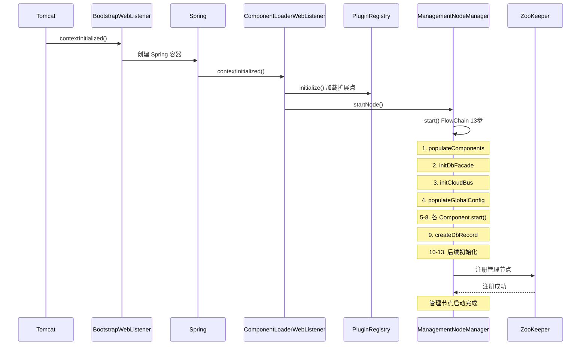

# 02 - 启动流程详解

## 启动总览



## 入口：没有 main() 的 Java 项目

ZStack 管理节点源码中**没有** `main()` 方法。项目构建为 WAR 包，部署到 Tomcat 等 Servlet 容器中运行。启动脚本 `build/zstack` 中的入口类 `org.zstack.portal.main.Main` 是构建产物中的包装类，不在源码中。

实际的启动入口是两个 `ServletContextListener`，按 `web.xml` 中的声明顺序执行：

1. `BootstrapWebListener` — 最早执行，确保 `Platform` 静态块初始化
2. `ComponentLoaderWebListener` — 创建 Spring 容器，启动管理节点

## 第一阶段：Platform 静态初始化

### BootstrapWebListener

> 源码位置：zstack/portal/src/main/java/org/zstack/portal/managementnode/BootstrapWebListener.java

```java
public class BootstrapWebListener implements ServletContextListener {
    @Override
    public void contextInitialized(ServletContextEvent servletContextEvent) {
        try {
            // this make sure Platform's static block executes before spring initialization
            Platform.getUuid();
        } catch (RuntimeException e) {
            new BootErrorLog().write(e.getMessage());
            throw e;
        }
    }

    @Override
    public void contextDestroyed(ServletContextEvent servletContextEvent) {
    }
}
```

`Platform.getUuid()` 触发 `Platform` 类的加载，执行其 `static` 块。这是整个 ZStack 运行时的第一个初始化动作。注释明确说明：确保 Platform 的 static 块在 Spring 初始化之前执行。

### Platform 静态块

> 源码位置：zstack/core/src/main/java/org/zstack/core/Platform.java 第 478-524 行

```java
static {
    FileInputStream in = null;
    try {
        // 1. 扫描 BaseResource 注解，构建资源类型映射
        Set<Class> baseResourceClasses = reflections.getTypesAnnotatedWith(BaseResource.class)
            .stream()
            .filter(clz -> clz.isAnnotationPresent(BaseResource.class))
            .collect(Collectors.toSet());
        for (Class clz : baseResourceClasses) {
            Set<Class> childResourceClasses = reflections.getSubTypesOf(clz);
            childResourceToBaseResourceMap.put(clz.getSimpleName(), clz.getSimpleName());
            for (Class child : childResourceClasses) {
                childResourceToBaseResourceMap.put(child.getSimpleName(), clz.getSimpleName());
            }
        }

        // 2. 加载 zstack.properties 配置文件
        File globalPropertiesFile = PathUtil.findFileOnClassPath("zstack.properties", true);
        in = new FileInputStream(globalPropertiesFile);
        System.getProperties().load(in);

        // 3. 生成管理节点 ID（基于 IP 的 UUID，去掉横线）
        msId = UUID.nameUUIDFromBytes(getManagementServerIp().getBytes())
                    .toString().replaceAll("-", "");

        // 4. 收集 DynamicObject 元数据
        collectDynamicObjectMetadata();

        // 5. 链接全局属性到静态字段
        linkGlobalProperty();
        validateGlobalProperty();

        // 6. 准备数据库连接属性
        prepareDefaultDbProperties();

        // 7. 准备 Hibernate Search 属性
        prepareHibernateSearchProperties();

        // 8. 调用 @StaticInit 标注的静态初始化方法
        callStaticInitMethods();

        // 9. 收集加密方法
        encryptedMethodsMap = getAllEncryptPassword();

        // 10. 写入 PID 文件
        writePidFile();
    } catch (Throwable e) {
        logger.warn(String.format("unhandled exception when in Platform's static block, %s",
            e.getMessage()), e);
        new BootErrorLog().write(e.getMessage());
        if (CoreGlobalProperty.EXIT_JVM_ON_BOOT_FAILURE) {
            System.exit(1);
        } else {
            throw new RuntimeException(e);
        }
    } finally {
        if (in != null) {
            try { in.close(); } catch (IOException e) { }
        }
    }
}
```

关键步骤说明：

| 步骤 | 说明 |
|------|------|
| 加载 zstack.properties | 将配置文件内容注入 `System.getProperties()`，后续所有 GlobalProperty 都从 System Properties 读取 |
| 生成管理节点 ID | `UUID.nameUUIDFromBytes(ip.getBytes())` 去掉横线，得到 32 位 UUID。同一 IP 的节点 ID 相同 |
| collectDynamicObjectMetadata | 扫描 `DynamicObject` 子类，收集字段元数据 |
| linkGlobalProperty | 扫描所有 `@GlobalPropertyDefinition` 注解的类，将 `@GlobalProperty` 标注的静态字段与 System Properties 链接 |
| prepareDefaultDbProperties | 设置 C3P0 数据库连接属性（DbFacadeDataSource + ExtraDataSource） |
| prepareHibernateSearchProperties | 配置 Hibernate Search（使用 Infinispan 作为 Directory Provider，JGroups 作为 Backend） |
| callStaticInitMethods | 调用所有 `@StaticInit` 标注的静态方法，按 order 排序 |
| writePidFile | 将当前进程 PID 写入文件，用于进程管理 |

## 第二阶段：Spring 容器创建

### ComponentLoaderWebListener

> 源码位置：zstack/portal/src/main/java/org/zstack/portal/managementnode/ComponentLoaderWebListener.java

```java
public class ComponentLoaderWebListener implements ServletContextListener {
    private static final CLogger logger = Utils.getLogger(ComponentLoaderWebListener.class);
    private static boolean isInit = false;
    private ManagementNodeManager node;
    private CloudBus bus;

    @Override
    public void contextDestroyed(ServletContextEvent arg0) {
        logger.warn("web listener issued context destroy event, start stopping process");
        if (isInit) {
            throwableSafe(new Runnable() {
                @Override
                public void run() {
                    node.stop();
                }
            });
        }
    }

    @Override
    public void contextInitialized(ServletContextEvent event) {
        try {
            if (!isInit) {
                // 1. 创建 ComponentLoader，加载 Spring 容器
                Platform.createComponentLoaderFromWebApplicationContext(
                    WebApplicationContextUtils.getWebApplicationContext(
                        event.getServletContext()));

                // 2. 获取 ManagementNodeManager 和 CloudBus
                node = Platform.getComponentLoader()
                       .getComponent(ManagementNodeManager.class);
                bus = Platform.getComponentLoader()
                      .getComponent(CloudBus.class);

                // 3. 启动管理节点
                node.startNode();
                isInit = true;
            }
        } catch (Throwable t) {
            logger.warn("failed to start management server", t);
            // have to call bus.stop() because its init has been called by spring
            if (bus != null) {
                bus.stop();
            }

            Throwable root = ExceptionDSL.getRootThrowable(t);
            new BootErrorLog().write(root.getMessage());
            if (CoreGlobalProperty.EXIT_JVM_ON_BOOT_FAILURE) {
                System.exit(1);
            } else {
                throw new CloudRuntimeException(t);
            }
        }
    }
}
```

注意 `contextDestroyed()` 中调用 `node.stop()`，确保 Servlet 容器关闭时管理节点能优雅退出。`isInit` 标志防止重复初始化。

### createComponentLoaderFromWebApplicationContext

> 源码位置：zstack/core/src/main/java/org/zstack/core/Platform.java 第 652-685 行

```java
public static ComponentLoader createComponentLoaderFromWebApplicationContext(
        WebApplicationContext webAppCtx) {
    assert loader == null;
    try {
        if (webAppCtx != null) {
            loader = new ComponentLoaderImpl(webAppCtx);
        } else {
            loader = new ComponentLoaderImpl();
        }
    } catch (Exception e) {
        String err = "unable to create ComponentLoader";
        logger.warn(e.getMessage(), e);
        throw new CloudRuntimeException(err);
    }

    // 2. 初始化 PluginRegistry（扫描所有扩展点声明）
    loader.getPluginRegistry();

    // 3. 启动 GlobalConfigFacade（加载运行时配置）
    GlobalConfigFacade gcf = loader.getComponent(GlobalConfigFacade.class);
    if (gcf != null) {
        ((Component)gcf).start();
    }

    // 4. 启动 ThreadFacade（初始化线程池）
    ThreadFacade thdf = loader.getComponent(ThreadFacade.class);
    if (thdf != null) {
        thdf.start();
    }

    // 5. 启动 CloudBus（连接 RabbitMQ）
    bus = loader.getComponentNoExceptionWhenNotExisting(CloudBus.class);
    if (bus != null) {
        bus.start();
    }

    // 6. 初始化 i18n 消息源
    initMessageSource();

    return loader;
}
```

注意这里的启动顺序：**GlobalConfig → ThreadFacade → CloudBus**。CloudBus 依赖线程池（消息回调在 `@AsyncThread` 线程中执行），所以 ThreadFacade 必须先启动。GlobalConfig 需要在其他组件之前加载，因为很多组件的启动参数来自全局配置。

### ComponentLoaderImpl 与 Spring 容器

> 源码位置：zstack/core/src/main/java/org/zstack/core/componentloader/ComponentLoaderImpl.java

```java
public class ComponentLoaderImpl implements ComponentLoader {
    private final BeanFactory ioc;

    // 从 WebApplicationContext 创建（生产模式）
    public ComponentLoaderImpl(ApplicationContext appContext) {
        checkInit();
        ioc = appContext;
    }

    // 从 classpath 创建（测试模式）
    public ComponentLoaderImpl() {
        checkInit();
        ioc = new ClassPathXmlApplicationContext(
            String.format("classpath:%s", CoreGlobalProperty.BEAN_CONF));
    }

    @Override
    public PluginRegistry getPluginRegistry() {
        if (pluginRegistry == null) {
            pluginRegistry = ioc.getBean(PluginRegistryIN.class);
            pluginRegistry.initialize();  // 构建扩展点注册表
        }
        return pluginRegistry;
    }
}
```

Spring 容器加载时，会读取 `conf/springConfigXml/` 下的 91+ 个 XML 配置文件，创建所有 Bean。每个 Bean 的 `init()` 方法（由 `default-init-method="init"` 触发）在 Bean 创建后自动调用。

### PluginRegistry 初始化

> 源码位置：zstack/core/src/main/java/org/zstack/core/componentloader/PluginRegistryImpl.java

```java
@Override
public void initialize() {
    buildPluginTree();              // 解析 XML 中的 <zstack:extension> 声明
    continueBuildTreeFromDSL();     // 解析 @PluginDSL 注解声明
    sortPlugins();                  // 按 order 降序排序
    createClassPluginInstanceMap(); // 构建 Class → List<Instance> 映射
    logger.info("Plugin system has been initialized successfully");
}
```

`buildPluginTree()` 遍历所有 Spring XML 中的 `<zstack:extension>` 声明，将每个 Bean 实例注册到对应接口的扩展列表中。如果扩展声明了 `instance-id`，则使用指定的 Bean 作为实现实例；否则使用父 Bean 本身。

`sortPlugins()` 按 `order` 降序排列，确保高优先级的扩展排在前面：

```java
private void sortPlugins() {
    for (List<PluginExtension> exts : extensionsByInterfaceName.values()) {
        // greater order means the position is more proceeding in plugin list
        exts.sort(Comparator.comparingInt(PluginExtension::getOrder).reversed());
    }
}
```

`createClassPluginInstanceMap()` 将接口名映射转换为 Class 对象映射，提供 `getExtensionList(Class<T>)` 的快速查找：

```java
private void createClassPluginInstanceMap() {
    for (Map.Entry<String, List<PluginExtension>> e : extensionsByInterfaceName.entrySet()) {
        String className = e.getKey();
        List<PluginExtension> exts = e.getValue();
        Class clazz = Class.forName(className);
        List instances = new ArrayList();
        for (PluginExtension ext : exts) {
            if (!instances.contains(ext.getInstance())) {
                instances.add(ext.getInstance());
            }
        }
        extensionsByInterfaceClass.put(clazz, instances);
    }
}
```

## 第三阶段：ManagementNodeManager 启动

### startNode() 入口

> 源码位置：zstack/portal/src/main/java/org/zstack/portal/managementnode/ManagementNodeManagerImpl.java 第 1118-1136 行

```java
@Override
public void startNode() {
    startInThread();  // 在新线程中启动
    while (isNodeRunning == NODE_STARTING) {
        logger.debug("management node is still initializing ...");
        try {
            TimeUnit.SECONDS.sleep(1);
        } catch (InterruptedException e) {
            Thread.currentThread().interrupt();
            throw new CloudRuntimeException(e);
        }
    }

    if (isNodeRunning == NODE_FAILED) {
        logger.debug("error happened when starting node, stop the management node now");
        stop();
        throw new CloudRuntimeException("failed to start management node");
    }
}
```

`startNode()` 在新线程中调用 `start()`，主线程轮询等待启动完成。`isNodeRunning` 是一个 `volatile int`，有三个状态：

```java
private static int NODE_STARTING = 0;
private static int NODE_RUNNING = 1;
private static int NODE_FAILED = -1;
```

### start() — 13 步 FlowChain

> 源码位置：zstack/portal/src/main/java/org/zstack/portal/managementnode/ManagementNodeManagerImpl.java 第 404-658 行

这是管理节点启动的核心方法，使用 FlowChain 编排 13 个步骤：

```java
@Override
public boolean start() {
    if (started) {
        /* largely for unittest, the ComponentLoaderWebListener and Api
         * may both call start()
         */
        logger.debug("Management Node has already started, ignore this call");
        return true;
    }

    populateExtensions();
    started = true;
    stopped = true;

    class Result {
        boolean success;
    }
    final Result ret = new Result();

    GLock lock = new GLock(INVENTORY_LOCK, INVENTORY_LOCK_TIMEOUT);
    /*
     * The lock is being held until we join in, otherwise the inventory
     * may be deleted by other exiting node because we have not
     * persisted our entry in management_node table yet, or two starting
     * nodes persist inventory concurrently.
     */
    lock.lock();
    try {
        final ManagementNodeManagerImpl self = this;
        FlowChain bootstrap = FlowChainBuilder.newSimpleFlowChain();
        bootstrap.setName("management-node-bootstrap");

        bootstrap.preCheck(data -> {
            return Platform.IS_RUNNING ? null :
                new ErrorCode(SysErrors.INTERNAL.toString(),
                    "the management node is not running for some reason while starting");
        });
```

#### 步骤 1：bootstrap-cloudbus

```java
.then(new Flow() {
    String __name__ = "bootstrap-cloudbus";

    // CloudBus is special, it is initialized in
    // Platform.createComponentLoaderFromWebApplicationContext(),
    // however, when exception happens in bootstrap we need to stop bus
    // in rollback, because the exception cannot make JVM exist and
    // cloudbus.stop is only called in JVM exit hook;
    @Override
    public void run(FlowTrigger trigger, Map data) {
        trigger.next();
    }

    @Override
    public void rollback(FlowRollback trigger, Map data) {
        bus.stop();
        trigger.rollback();
    }
})
```

CloudBus 实际上在 `Platform.createComponentLoaderFromWebApplicationContext()` 中已经启动。此步骤的目的是在 FlowChain 回滚时能够停止 CloudBus，因为启动失败时 JVM 不一定会退出，而 `cloudbus.stop()` 只在 JVM exit hook 中被调用。

#### 步骤 2：populate-components

```java
.then(new NoRollbackFlow() {
    String __name__ = "populate-components";

    @Override
    public void run(FlowTrigger trigger, Map data) {
        populateComponents();
        trigger.next();
    }
})
```

`populateComponents()` 从 PluginRegistry 获取所有 `Component` 接口的实现，包装为 `ComponentWrapper`：

> 源码位置：zstack/portal/src/main/java/org/zstack/portal/managementnode/ManagementNodeManagerImpl.java 第 319-349 行

```java
private void populateComponents() {
    components = new ArrayList<>();
    for (final Component c : pluginRgty.getExtensionList(Component.class)) {
        components.add(new ComponentWrapper() {
            boolean isStart = false;

            @Override
            public void start() {
                logger.info("starting component: " + c.getClass().getName());
                long start = System.currentTimeMillis();
                c.start();
                long end = System.currentTimeMillis();
                logger.info(String.format(
                    "component[%s] starts successfully, cost %d ms to start",
                    c.getClass(), end - start));
                isStart = true;
            }

            @Override
            public void stop() {
                if (isStart) {
                    throwableSafe((Runnable) () -> {
                        c.stop();
                        logger.info("Stopped component: " + c.getClass().getName());
                        isStart = false;
                    }, String.format("unable to stop component[%s]", c.getClass().getName()));
                }
            }
        });
    }

    prepareDbExts = pluginRgty.getExtensionList(PrepareDbInitialValueExtensionPoint.class);
}
```

`ComponentWrapper` 记录每个 Component 是否已启动（`isStart`），确保回滚时只停止已启动的 Component。同时收集 `PrepareDbInitialValueExtensionPoint` 扩展点，用于步骤 4。

#### 步骤 3：register-node-on-cloudbus

```java
.then(new Flow() {
    String __name__ = "register-node-on-cloudbus";

    @Override
    public void run(FlowTrigger trigger, Map data) {
        bus.registerService(self);
        trigger.next();
    }

    @Override
    public void rollback(FlowRollback trigger, Map data) {
        bus.unregisterService(self);
        trigger.rollback();
    }
})
```

将 `ManagementNodeManagerImpl` 注册为 CloudBus 服务，使其能接收路由到本节点的消息。

#### 步骤 4：call-prepare-db-extension

```java
.then(new NoRollbackFlow() {
    String __name__ = "call-prepare-db-extension";

    @Override
    public void run(FlowTrigger trigger, Map data) {
        callPrepareDbExtensions();
        trigger.next();
    }
})
```

调用所有 `PrepareDbInitialValueExtensionPoint` 实现，为数据库准备初始值（如默认账户、默认区域等）。

#### 步骤 5：start-components（核心步骤）

```java
.then(new Flow() {
    String __name__ = "start-components";

    @Override
    public void run(FlowTrigger trigger, Map data) {
        startComponents();
        trigger.next();
    }

    @Override
    public void rollback(FlowRollback trigger, Map data) {
        stopComponents();
        trigger.rollback();
    }
})
```

这是最关键的步骤。`startComponents()` 依次调用每个 `Component.start()`：

```java
private void startComponents() {
    for (ComponentWrapper c : components) {
        c.start();
    }
}
```

包括但不限于以下 Component：

| Component | 职责 |
|-----------|------|
| DatabaseFacadeImpl | 数据库连接 + Hibernate SessionFactory 初始化 |
| GlobalConfigFacadeImpl | 加载运行时全局配置（已在 Platform 中启动，此处为二次确认） |
| CloudBusImpl3 | RabbitMQ 连接 + 队列声明（已在 Platform 中启动，此处为二次确认） |
| RESTFacade | HTTP 客户端初始化 |
| ThreadFacadeImpl | 线程池初始化（已在 Platform 中启动） |
| PluginRegistryImpl | 扩展点注册 + 排序（已在 ComponentLoader 中初始化） |
| CascadeFacadeImpl | 级联删除图构建（`populateNodes()` + `populateTree()`） |
| QueryFacadeImpl | 查询引擎初始化 |
| EventFacadeImpl | 事件系统初始化 |
| 各域 Manager | VmInstanceManager、HostManager、NetworkManager 等 |
| 各插件 Manager | KvmManager、CephManager、VirtualRouterManager 等 |

每个 Component 的启动耗时会被记录：

```
INFO  starting component: org.zstack.core.db.DatabaseFacadeImpl
INFO  component[class org.zstack.core.db.DatabaseFacadeImpl] starts successfully, cost 2345 ms to start
```

#### 步骤 6：create-DB-record

```java
.then(new Flow() {
    String __name__ = "create-DB-record";

    @Override
    public void run(FlowTrigger trigger, Map data) {
        new SQLBatch() {
            @Override
            protected void scripts() {
                String ip = Platform.getManagementServerIp();
                String uuid = Platform.getManagementServerId();

                // 清理可能残留的旧记录
                sql(ManagementNodeVO.class)
                    .eq(ManagementNodeVO_.uuid, uuid).hardDelete();

                // 插入当前节点记录
                ManagementNodeVO vo = new ManagementNodeVO();
                vo.setHostName(ip);
                vo.setUuid(uuid);
                persist(vo);
                reload(vo);
                node = vo;
            }
        }.execute();
        trigger.next();
    }

    @Override
    public void rollback(FlowRollback trigger, Map data) {
        if (node != null) {
            dbf.remove(node());
        }
        trigger.rollback();
    }
})
```

在 `ManagementNodeVO` 表中注册当前管理节点，用于多节点发现和心跳检测。先删除可能残留的旧记录（同一 IP 的节点重启场景），再插入新记录。

#### 步骤 7：start-heartbeat

```java
.then(new NoRollbackFlow() {
    String __name__ = "start-heartbeat";

    @Override
    public void run(FlowTrigger trigger, Map data) {
        setupHeartbeat();
        trigger.next();
    }
})
```

心跳线程定期更新 `ManagementNodeVO.heartBeat` 字段，并检测其他节点的存活状态。如果某个节点心跳超时，会被判定为死亡并从集群中移除。心跳使用独立的 `extraDataSource`（C3P0, maxPoolSize=5），避免影响业务数据库连接池。

#### 步骤 8：start-api-mediator

```java
.then(new Flow() {
    String __name__ = "start-api-mediator";

    @Override
    public void run(FlowTrigger trigger, Map data) {
        apim.start();
        trigger.next();
    }

    @Override
    public void rollback(FlowRollback trigger, Map data) {
        apim.stop();
        trigger.rollback();
    }
})
```

`ApiMediator` 启动后，管理节点开始接受 API 请求。`ApiMediator` 负责将 API 消息路由到正确的 Service。

#### 步骤 9：set-node-to-running

```java
.then(new NoRollbackFlow() {
    String __name__ = "set-node-to-running";

    @Override
    public void run(FlowTrigger trigger, Map data) {
        node.setState(ManagementNodeState.RUNNING);
        node = dbf.updateAndRefresh(node);
        trigger.next();
    }
})
```

将数据库中的节点状态更新为 `RUNNING`。

#### 步骤 10：I-join

```java
.then(new NoRollbackFlow() {
    String __name__ = "I-join";

    @Override
    public void run(FlowTrigger trigger, Map data) {
        nodeLifeCycle.iJoin(ManagementNodeInventory.valueOf(node));
        trigger.next();
    }
})
```

通知本节点的 `ManagementNodeChangeListener`，本节点已加入集群。`nodeLifeCycle` 是一个内部监听器，它会调用 `ResourceDestinationMaker.iJoin()` 将本节点加入一致性哈希环，并通知所有 `ManagementNodeChangeListener` 扩展点：

> 源码位置：zstack/portal/src/main/java/org/zstack/portal/managementnode/ManagementNodeManagerImpl.java 第 164-228 行

```java
private final ManagementNodeChangeListener nodeLifeCycle = new ManagementNodeChangeListener() {
    @Override
    public void iJoin(ManagementNodeInventory inv) {
        ManagementNodeChangeListener l = (ManagementNodeChangeListener) destinationMaker;
        l.iJoin(inv);

        CollectionUtils.safeForEach(lifeCycleExtension, arg -> arg.iJoin(inv));
    }
    // ... nodeJoin, nodeLeft, iAmDead 类似
};
```

#### 步骤 11：node-is-ready

```java
.then(new NoRollbackFlow() {
    String __name__ = "node-is-ready";

    @Override
    public void run(FlowTrigger trigger, Map data) {
        for (ManagementNodeReadyExtensionPoint ext :
                pluginRgty.getExtensionList(ManagementNodeReadyExtensionPoint.class)) {
            ext.managementNodeReady();
        }
        trigger.next();
    }
})
```

调用所有 `ManagementNodeReadyExtensionPoint` 实现，通知它们管理节点已就绪。这是插件执行启动后初始化的时机。

#### 步骤 12：listen-node-life-cycle-events

```java
.then(new NoRollbackFlow() {
    String __name__ = "listen-node-life-cycle-events";

    @Override
    public void run(FlowTrigger trigger, Map data) {
        evtf.on(ManagementNodeCanonicalEvent.NODE_LIFECYCLE_PATH,
                nodeLifeCycleCallback);
        trigger.next();
    }
})
```

订阅 RabbitMQ 上的节点生命周期事件，监听其他节点的加入和离开。

#### 步骤 13：say-I-join

```java
.then(new NoRollbackFlow() {
    String __name__ = "say-I-join";

    @Override
    public void run(FlowTrigger trigger, Map data) {
        ManagementNodeLifeCycleData d = new ManagementNodeLifeCycleData();
        d.setNodeUuid(node().getUuid());
        d.setInventory(ManagementNodeInventory.valueOf(node()));
        d.setLifeCycle(LifeCycle.NodeJoin.toString());
        evtf.fire(ManagementNodeCanonicalEvent.NODE_LIFECYCLE_PATH, d);
        trigger.next();
    }
})
```

通过 RabbitMQ 广播本节点的加入事件，集群中其他管理节点收到后会更新本地的哈希环。

### FlowChain 完成与错误处理

```java
.done(new FlowDoneHandler(null) {
    @Override
    public void handle(Map data) {
        ret.success = true;
    }
}).error(new FlowErrorHandler(null) {
    @Override
    public void handle(ErrorCode errCode, Map data) {
        new BootErrorLog().write(errCode.toString());
        ret.success = false;
    }
}).start();
```

启动完成后：

```java
if (!ret.success || !Platform.IS_RUNNING) {
    logger.warn(String.format("management node[%s] failed to start for some reason",
        Platform.getUuid()));
    stopped = true;

    if (CoreGlobalProperty.EXIT_JVM_ON_BOOT_FAILURE) {
        logger.debug(String.format("unable to start management node[%s], " +
            "see previous exception. exitJVMOnBootFailure is set to true, exit JVM now",
            Platform.getManagementServerId()));
        System.exit(1);
    } else {
        throw new CloudRuntimeException(String.format(
            "unable to start management node[%s], see previous exception",
            Platform.getManagementServerId()));
    }
}

stopped = false;

installShutdownHook();
registerDebugDumpNodeInfo();
DebugSignalHandler.listenTo("USR2", this);

logger.info("Management node: " + getId() + " starts successfully");

synchronized (this) {
    isNodeRunning = NODE_RUNNING;
    while (isRunning) {
        try {
            if (this.sigUsr2) {
                dumpDebugMessages();
                this.sigUsr2 = false;
            }
            this.wait(TimeUnit.SECONDS.toMillis(1));
        } catch (InterruptedException e) {
            logger.warn("Interrupted while daemon is running, continue ...", e);
            Thread.currentThread().interrupt();
        }
    }
}

logger.debug("quited main-loop, start stopping management node");
stop();
return true;
```

启动成功后，管理节点进入主循环（`wait/notify` 模式），每秒唤醒一次检查 `isRunning` 标志和 `SIGUSR2` 信号。`SIGUSR2` 信号用于触发调试信息转储。

## 启动流程时序图

```
Tomcat 启动
    │
    ▼
BootstrapWebListener.contextInitialized()
    │
    ▼
Platform static 块执行
    ├── 扫描 BaseResource 注解，构建资源类型映射
    ├── 加载 zstack.properties → System.getProperties()
    ├── 生成管理节点 UUID (基于 IP, 32位无横线)
    ├── collectDynamicObjectMetadata()
    ├── linkGlobalProperty() + validateGlobalProperty()
    ├── prepareDefaultDbProperties() (C3P0 双数据源)
    ├── prepareHibernateSearchProperties() (Infinispan + JGroups)
    ├── callStaticInitMethods() (@StaticInit)
    ├── getAllEncryptPassword() (@EncryptColumn)
    └── writePidFile()
    │
    ▼
ComponentLoaderWebListener.contextInitialized()
    │
    ▼
Platform.createComponentLoaderFromWebApplicationContext()
    ├── 创建 ComponentLoaderImpl（包装 Spring ApplicationContext）
    ├── Spring 加载 91+ XML 配置文件，创建所有 Bean
    ├── 每个 Bean 调用 init() 方法 (default-init-method="init")
    ├── PluginRegistry.initialize()
    │   ├── buildPluginTree() — 解析 <zstack:extension>
    │   ├── continueBuildTreeFromDSL() — 解析 @PluginDSL
    │   ├── sortPlugins() — 按 order 降序
    │   └── createClassPluginInstanceMap() — Class → List<Instance>
    ├── GlobalConfigFacade.start() — 加载运行时配置
    ├── ThreadFacade.start() — 初始化线程池
    ├── CloudBus.start() — 连接 RabbitMQ，声明队列
    └── initMessageSource() — i18n
    │
    ▼
ManagementNodeManager.startNode()
    │ startInThread() → @AsyncThread
    ▼
ManagementNodeManager.start() — 13 步 FlowChain
    │ GLock 分布式锁 (INVENTORY_LOCK, 10分钟超时)
    │ preCheck: Platform.IS_RUNNING
    ├── 1. bootstrap-cloudbus（回滚锚点，rollback 时 bus.stop()）
    ├── 2. populate-components（收集 Component + PrepareDbInitialValueExtensionPoint）
    ├── 3. register-node-on-cloudbus（注册服务，rollback 时 unregisterService）
    ├── 4. call-prepare-db-extension（数据库初始值）
    ├── 5. start-components（启动所有 Component）★
    │   ├── DatabaseFacadeImpl.start()
    │   ├── CascadeFacadeImpl.start() (populateNodes + populateTree)
    │   ├── QueryFacadeImpl.start()
    │   ├── EventFacadeImpl.start()
    │   ├── VmInstanceManager.start()
    │   ├── HostManager.start()
    │   ├── KvmManager.start()
    │   └── ... (所有 Component)
    ├── 6. create-DB-record（注册 ManagementNodeVO，rollback 时删除）
    ├── 7. start-heartbeat（独立 C3P0 数据源心跳）
    ├── 8. start-api-mediator（API 路由，rollback 时 apim.stop()）
    ├── 9. set-node-to-running（更新节点状态为 RUNNING）
    ├── 10. I-join（通知 ResourceDestinationMaker + 扩展点）
    ├── 11. node-is-ready（通知 ManagementNodeReadyExtensionPoint）
    ├── 12. listen-node-life-cycle-events（订阅集群事件）
    └── 13. say-I-join（广播 NodeJoin 事件到 RabbitMQ）
    │
    ▼
installShutdownHook() + registerDebugDumpNodeInfo()
DebugSignalHandler.listenTo("USR2")
    │
    ▼
进入主循环（synchronized wait/notify, 每秒唤醒）
管理节点就绪，等待 API 请求
```

## 回滚机制

FlowChain 的核心特性是自动回滚。如果 13 步中的任何一步失败：

1. 已执行的 Flow 按逆序从 `rollBackFlows` 栈中弹出
2. 每个 Flow 的 `rollback()` 方法被调用
3. 标记为 `NoRollbackFlow` 的步骤跳过回滚

各步骤的回滚行为：

| 步骤 | 名称 | 回滚行为 |
|------|------|---------|
| 1 | bootstrap-cloudbus | `bus.stop()` — 停止 CloudBus |
| 2 | populate-components | 无回滚（NoRollbackFlow） |
| 3 | register-node-on-cloudbus | `bus.unregisterService(self)` — 注销服务 |
| 4 | call-prepare-db-extension | 无回滚（NoRollbackFlow） |
| 5 | start-components | `stopComponents()` — 停止所有已启动的 Component |
| 6 | create-DB-record | `dbf.remove(node())` — 删除 ManagementNodeVO 记录 |
| 7 | start-heartbeat | 无回滚（NoRollbackFlow） |
| 8 | start-api-mediator | `apim.stop()` — 停止 API 路由 |
| 9 | set-node-to-running | 无回滚（NoRollbackFlow） |
| 10 | I-join | 无回滚（NoRollbackFlow） |
| 11 | node-is-ready | 无回滚（NoRollbackFlow） |
| 12 | listen-node-life-cycle-events | 无回滚（NoRollbackFlow） |
| 13 | say-I-join | 无回滚（NoRollbackFlow） |

例如，如果步骤 8（start-api-mediator）失败，回滚顺序为：
- 步骤 7：无回滚（NoRollbackFlow）
- 步骤 6：删除 ManagementNodeVO 记录
- 步骤 5：停止所有已启动的 Component
- 步骤 4：无回滚
- 步骤 3：从 CloudBus 注销服务
- 步骤 2：无回滚
- 步骤 1：停止 CloudBus

回滚完成后，如果 `CoreGlobalProperty.EXIT_JVM_ON_BOOT_FAILURE` 为 `true`，JVM 直接退出；否则抛出 `CloudRuntimeException`。

## 多节点启动的并发控制

`start()` 方法使用 `GLock`（基于数据库的分布式锁）确保同一时刻只有一个管理节点在执行启动流程：

```java
GLock lock = new GLock(INVENTORY_LOCK, INVENTORY_LOCK_TIMEOUT);
lock.lock();
try {
    // 13 步 FlowChain
} finally {
    lock.unlock();
}
```

锁名称为 `"ManagementNodeManager.inventory_lock"`，超时时间 600 秒（10 分钟）。这防止了两个管理节点同时写入 `ManagementNodeVO` 表导致的冲突，也防止了正在退出的节点删除新启动节点的记录。

## 启动后的状态

管理节点启动完成后进入以下状态：

- **CloudBus**：已连接 RabbitMQ，服务队列已声明
- **API 端点**：REST API 已就绪，可以接受 HTTP 请求
- **数据库**：Hibernate SessionFactory 已初始化，C3P0 连接池已建立
- **心跳**：定期更新心跳时间戳，监控其他节点
- **集群**：已加入一致性哈希环，可以接收路由消息
- **组件**：所有 Component 已启动，所有 Service 已注册

此时管理节点日志中会出现：

```
INFO  Management node: zstack.message.management-node.xxxxx starts successfully
```

## 关闭流程

当 Servlet 容器关闭或收到退出信号时：

1. `ComponentLoaderWebListener.contextDestroyed()` 调用 `node.stop()`
2. 或 JVM Shutdown Hook 触发 `stop(true)`
3. `stop()` 方法设置 `isRunning = false`，唤醒主循环
4. 主循环退出后调用 `stopComponents()` 停止所有 Component
5. CloudBus 断开 RabbitMQ 连接
6. 数据库连接池关闭
