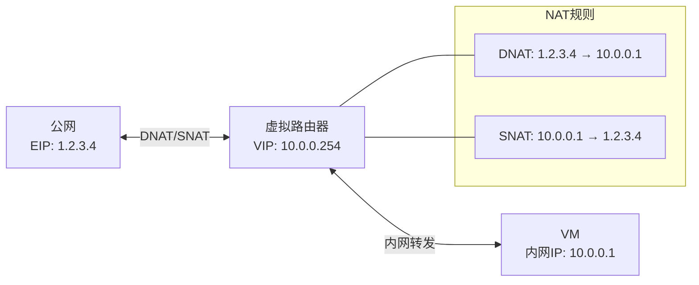

# EIP/VIP/NAT 网络服务

EIP（弹性 IP）、VIP（虚拟 IP）和 NAT 是 ZStack 网络服务的核心组件。EIP 让 VM 获得公网可达地址，VIP 为负载均衡和端口转发提供锚点，NAT 实现地址转换。本章分析三者的源码实现。

## 三者关系

```
┌─────────────────────────────────────────────────────┐
│  VIP (虚拟 IP)                                       │
│  ├── 公网 L3 上的一个 IP 地址                          │
│  ├── 可被 EIP 独占使用                                 │
│  ├── 可被 PortForwarding 独占使用                      │
│  ├── 可被 SLB 共享使用                                 │
│  └── 生命周期独立于 EIP/PF                             │
├─────────────────────────────────────────────────────┤
│  EIP (弹性 IP)                                       │
│  ├── 绑定 VIP + VM 网卡                               │
│  ├── DNAT: VIP:port → VM_IP:port                     │
│  ├── SNAT: VM_IP → VIP                               │
│  └── 后端: Flat (分布式) / VR (集中式)                  │
├─────────────────────────────────────────────────────┤
│  SNAT (源地址转换)                                    │
│  ├── 让私网 VM 访问外网                                │
│  ├── Flat: namespace + iptables                      │
│  └── VR: iptables on VR                              │
└─────────────────────────────────────────────────────┘
```

## VipManagerImpl — VIP 生命周期

> 源码路径：`zstack/plugin/vip/src/main/java/org/zstack/network/service/vip/VipManagerImpl.java`（556 行）

### 创建 VIP

```java
private void handle(APICreateVipMsg msg) {
    FlowChain chain = FlowChainBuilder.newShareFlowChain();
    chain.setName("create-vip");
    chain.then(new ShareFlow() {
        @Override
        public void setup() {
            flow(new Flow() {
                @Override
                public void run(FlowTrigger trigger, Map data) {
                    // 1. 从公网 L3 分配 IP
                    IpInventory ip = l3Mgr.allocateIp(
                        msg.getL3NetworkUuid(), null, null);
                    data.put("ip", ip);
                    trigger.next();
                }
                @Override
                public void rollback(FlowRollback trigger, Map data) {
                    // 回滚：释放 IP
                    IpInventory ip = (IpInventory) data.get("ip");
                    l3Mgr.releaseIp(ip.getIp(), ip.getL3NetworkUuid());
                    trigger.rollback();
                }
            });
            flow(new Flow() {
                @Override
                public void run(FlowTrigger trigger, Map data) {
                    // 2. 在数据库创建 VIP 记录
                    IpInventory ip = (IpInventory) data.get("ip");
                    VipVO vip = new VipVO();
                    vip.setIp(ip.getIp());
                    vip.setL3NetworkUuid(ip.getL3NetworkUuid());
                    vip = dbf.persistAndRefresh(vip);
                    data.put("vip", vip);
                    trigger.next();
                }
            });
            done(...);
            error(...);
        }
    }).start();
}
```

### VIP 使用状态管理

> 源码路径：`zstack/utils/src/main/java/org/zstack/utils/VipUseForList.java`

ZStack 使用 `VipUseForList` 工具类（非枚举）管理 VIP 的用途。VIP 的用途通过 `VipNetworkServicesRefVO` 关系表追踪：

```java
// VipUseForList — VIP 用途常量
public class VipUseForList {
    // 静态常量定义 VIP 可被哪些服务使用
    public static final String EIP_NETWORK_SERVICE_TYPE = "Eip";
    public static final String LB_NETWORK_SERVICE_TYPE = "LoadBalancer";
    public static final String SLB_NETWORK_SERVICE_TYPE = "SLB";
    public static final String PORTFORWARDING_NETWORK_SERVICE_TYPE = "PortForwarding";
    public static final String IPSEC_NETWORK_SERVICE_TYPE = "IPsec";
    public static final String SNAT_NETWORK_SERVICE_TYPE = "SNAT";

    private List<String> useForList;  // 当前 VIP 的用途列表
    // validate(): EIP 和其他服务不能共用同一 VIP
    // validateNewAdded(): EIP 和 SLB 必须独占 VIP
}
```

```java
// VipVO 中的用途追踪
@Entity
@Table
public class VipVO {
    // 已废弃的 useFor 字段（仅保留向后兼容）
    @Deprecated
    @Column private String useFor;

    // 当前权威来源：VipNetworkServicesRefVO 关系表
    @OneToMany(fetch = FetchType.EAGER)
    @JoinColumn(name = "vipUuid", insertable = false, updatable = false)
    private Set<VipNetworkServicesRefVO> servicesRefs = new HashSet<>();

    // getServicesTypes() 从 servicesRefs 派生 Set<String>
    // getUseFor() 已 @Deprecated，内部委托给 getServicesTypes()
}
```

VIP 的独占/共享规则：
- **EIP**：独占 VIP（不能与 PortForwarding/LB 共用）
- **PortForwarding**：独占 VIP
- **SLB**：独占 VIP
- **LoadBalancer**：可共享

### VIP 端口范围

```java
// VIP 支持端口范围管理
// VipGetUsedPortRangeExtensionPoint 扩展点
// 让 EIP/PF/LB 报告已使用的端口范围
public List<VipPortRange> getUsedPortRanges(String vipUuid) {
    List<VipPortRange> ranges = new ArrayList<>();
    for (VipGetUsedPortRangeExtensionPoint ext :
            pluginRgty.getExtensionList(
                VipGetUsedPortRangeExtensionPoint.class)) {
        ranges.addAll(ext.getVipUsedPortRange(vipUuid));
    }
    return ranges;
}
```

## EipManagerImpl — EIP 生命周期

> 源码路径：`zstack/plugin/eip/src/main/java/org/zstack/network/service/eip/EipManagerImpl.java`（1766 行）

### 创建 EIP

```java
private void handle(APICreateEipMsg msg) {
    FlowChain chain = FlowChainBuilder.newShareFlowChain();
    chain.setName("create-eip");
    chain.then(new ShareFlow() {
        @Override
        public void setup() {
            flow(new Flow() {
                @Override
                public void run(FlowTrigger trigger, Map data) {
                    // 1. 获取或创建 VIP
                    VipInventory vip;
                    if (msg.getVipUuid() != null) {
                        vip = getVip(msg.getVipUuid());
                    } else {
                        // 自动创建 VIP
                        vip = createVip(msg.getL3NetworkUuid());
                    }
                    data.put("vip", vip);
                    trigger.next();
                }
            });
            flow(new Flow() {
                @Override
                public void run(FlowTrigger trigger, Map data) {
                    // 2. 创建 EIP 数据库记录
                    EipVO eip = new EipVO();
                    eip.setVipIp(vip.getIp());
                    eip.setVipUuid(vip.getUuid());
                    eip.setGuestL3NetworkUuid(
                        msg.getVmNicL3NetworkUuid());
                    eip.setState(EipState.Enabled);
                    eip = dbf.persist(eip);
                    data.put("eip", eip);
                    trigger.next();
                }
            });
            done(...);
            error(...);
        }
    }).start();
}
```

### 绑定 EIP 到 VM 网卡

```java
public void attachEip(EipVO eip, VmNicInventory nic, Completion completion) {
    FlowChain chain = FlowChainBuilder.newShareFlowChain();
    chain.setName("attach-eip");
    chain.then(new ShareFlow() {
        @Override
        public void setup() {
            flow(new Flow() {
                @Override
                public void run(FlowTrigger trigger, Map data) {
                    // 1. 检查 VM 状态
                    checkVmStateBeforeAttachEipToBackend(nic);
                    trigger.next();
                }
            });
            flow(new Flow() {
                @Override
                public void run(FlowTrigger trigger, Map data) {
                    // 2. 在后端应用 EIP
                    EipBackend backend = getEipBackend(eip);
                    backend.applyEip(eip, nic, new Completion(trigger) {
                        @Override
                        public void success() { trigger.next(); }
                        @Override
                        public void fail(ErrorCode err) { trigger.fail(err); }
                    });
                }
                @Override
                public void rollback(FlowRollback trigger, Map data) {
                    // 回滚：从后端删除 EIP
                    EipBackend backend = getEipBackend(eip);
                    backend.revokeEip(eip, nic, null);
                    trigger.rollback();
                }
            });
            flow(new Flow() {
                @Override
                public void run(FlowTrigger trigger, Map data) {
                    // 3. 更新数据库
                    eip.setVmNicUuid(nic.getUuid());
                    eip = dbf.update(eip);
                    trigger.next();
                }
            });
            // 4. 附加 Flow（其他服务的联动）
            for (Flow f : getAdditionalApplyEipFlow(eip, nic)) {
                flow(f);
            }
            done(...);
            error(...);
        }
    }).start();
}
```

### EIP 后端选择

```java
private EipBackend getEipBackend(EipVO eip) {
    // 根据 VIP 所在 L3 网络的 Provider 类型选择后端
    NetworkServiceProviderVO provider = getNetworkServiceProvider(
        eip.getVipL3NetworkUuid(), NetworkServiceType.EIP);

    if (provider.getType().equals(
            NetworkServiceProviderType.Flat)) {
        return flatEipBackend;    // 分布式 EIP
    } else {
        return vrEipBackend;      // VR 集中式 EIP
    }
}
```

### EIP 可挂载网卡过滤

```java
// filterAttachableL3Network() — 过滤可挂载 EIP 的 L3 网络
// 条件：
// 1. L3 网络必须由支持 EIP 的 Provider 服务
// 2. VIP 所在 L3 与 VM 网卡所在 L3 不能相同
// 3. IP 版本必须匹配
// 4. VR 模式下，VIP 和 VM 网卡必须在同一个 VR 上

// vmIpChanged() — VM IP 变更时的 EIP 联动
// 当 VM 网卡 IP 变更时，需要更新 EIP 的 DNAT 规则
```

## EIP 流量路径



## EIP 数据面实现

### Flat EIP（分布式）

> 源码路径：`zstack-utility/kvmagent/kvmagent/plugins/deip.py`

```
VM (10.0.0.5)
  │
  ▼
vm_bridge (br_eth0)
  │
  ├── pri_odev (veth 外端, 在 vm_bridge 上)
  │     │
  │     pri_idev (veth 内端, 在 namespace 中, IP: 10.0.0.5)
  │
  ├── pub_odev (veth 外端, 在 public_bridge 上)
  │     │
  │     pub_idev (veth 内端, 在 namespace 中, IP: 172.20.51.136)
  │
  ▼
namespace (br_eth0_172_20_51_136)
  ├── iptables DNAT: 172.20.51.136 → 10.0.0.5
  └── iptables SNAT: 10.0.0.5 → 172.20.51.136
```

### VR EIP（集中式）

```
VM (10.0.0.5)
  │
  ▼
Guest L3 → VR (eth2: 10.0.0.1)
              │
              ├── iptables DNAT: VIP → 10.0.0.5
              └── iptables SNAT: 10.0.0.5 → VIP
              │
              ▼
VR (eth1: 公网) → 外部网络
```

## VIP 服务释放

```java
// releaseServicesOnVip() — 释放 VIP 上的所有服务
public void releaseServicesOnVip(VipInventory vip, Completion completion) {
    // 1. 释放 EIP
    Set<String> serviceTypes = vip.getServicesTypes();
    if (serviceTypes.contains(VipUseForList.EIP_NETWORK_SERVICE_TYPE)) {
        deleteEipByVip(vip.getUuid());
    }
    // 2. 释放 PortForwarding
    if (serviceTypes.contains(VipUseForList.PORTFORWARDING_NETWORK_SERVICE_TYPE)) {
        deletePortForwardingByVip(vip.getUuid());
    }
    // 3. 从 VR 释放 VIP
    releaseVipOnBackend(vip);
}
```

## EIP 与 VM 生命周期联动

```java
// vmPreAttachL3Network() — VM 挂载 L3 前检查 EIP
// 如果 VM 已有 EIP，新挂载的 L3 网络必须与 EIP VIP 兼容

// filterAttachableL3Network() — 过滤可挂载的 L3 网络
// 排除与已有 EIP 冲突的 L3 网络

// vmIpChanged() — VM IP 变更时更新 EIP
// 当 VM 网卡 IP 变更（如 reAllocateNicIp），需要：
// 1. 删除旧的 DNAT 规则
// 2. 添加新的 DNAT 规则
```

## 小结

| 组件 | 职责 | 关键类 |
|------|------|--------|
| VIP | 公网 IP 锚点，被 EIP/PF/LB 使用 | `VipManagerImpl` (556行) |
| EIP | 弹性 IP，1:1 NAT | `EipManagerImpl` (1766行) |
| SNAT | 源地址转换，让 VM 访问外网 | VR/Flat 各自实现 |
| EipBackend | EIP 后端接口 | `FlatEipBackend`, `VrEipBackend` |

EIP/VIP/NAT 的设计精髓：**VIP 是资源锚点，EIP 是服务绑定，Backend 是实现多态**。VIP 独立于 EIP 存在，使得同一个 VIP 可以在不同服务间切换使用。
