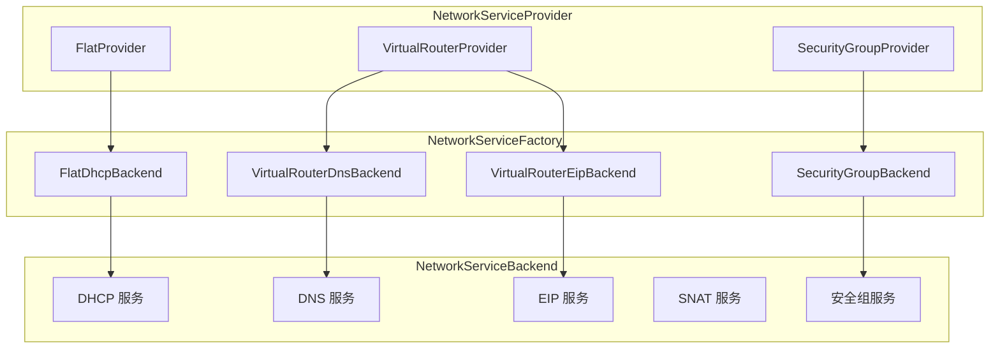
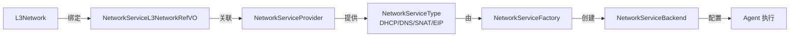

# 网络服务提供者模型

ZStack 网络架构的核心抽象是 **NetworkServiceProvider** 模型。它将网络服务（DHCP、DNS、SNAT、EIP 等）与 L3 网络解耦，通过 Provider → L3 绑定关系实现灵活组合。本章从源码层面剖析这一模型的设计与实现。

## 整体架构

```
┌─────────────────────────────────────────────────┐
│              NetworkServiceManager               │
│         (调度器，编排各 Provider)                  │
├─────────────────────────────────────────────────┤
│  NetworkServiceProvider (接口)                    │
│  ├── FlatProvider        — 分布式网关             │
│  ├── VirtualRouter       — 集中式 VR 网关         │
│  └── SecurityGroup       — 安全组                 │
├─────────────────────────────────────────────────┤
│  NetworkServiceType (6种服务)                     │
│  ├── DHCP / DNS / SNAT                           │
│  ├── PortForwarding / CentralizedDNS / HostRoute │
├─────────────────────────────────────────────────┤
│  绑定表: NetworkServiceL3NetworkRefVO             │
│  (L3网络 + Provider + Service 三元组)             │
└─────────────────────────────────────────────────┘
```

## 三层模型



## NetworkServiceType — 六种网络服务

> 源码路径：`zstack/header/src/main/java/org/zstack/header/network/service/NetworkServiceType.java`

```java
public class NetworkServiceType {
    private static Map<String, NetworkServiceType> types = Collections.synchronizedMap(new HashMap<String, NetworkServiceType>());
    // 为 VM 提供 DHCP 地址分配
    public static NetworkServiceType DHCP = new NetworkServiceType("DHCP");
    // 为 VM 提供 DNS 解析
    public static NetworkServiceType DNS = new NetworkServiceType("DNS");
    // 源地址转换，让 VM 可访问外网
    public static NetworkServiceType SNAT = new NetworkServiceType("SNAT");
    // 端口转发（DNAT）
    public static NetworkServiceType PortForwarding = new NetworkServiceType("PortForwarding");
    // 集中式 DNS（由 VR 统一代理）
    public static NetworkServiceType Centralized_DNS = new NetworkServiceType("CentralizedDNS");
    // 下发主机路由到 VM
    public static NetworkServiceType HostRoute = new NetworkServiceType("HostRoute");

    private final String typeName;
    // ...
}
```

这六种服务类型是类型对象（typed object），而非 Java 枚举或简单字符串常量。每个字段是 `NetworkServiceType` 实例，通过 `typeName` 标识。任何 Provider 可以声明支持其中一种或多种。

## NetworkServiceProviderType — Provider 元数据

> 源码路径：`zstack/header/src/main/java/org/zstack/header/network/service/NetworkServiceProviderType.java`

```java
public class NetworkServiceProviderType {
    private static Map<String, NetworkServiceProviderType> types = Collections.synchronizedMap(new HashMap<String, NetworkServiceProviderType>());
    private final String typeName;                    // Provider 类型名
    private boolean createDhcpNameSpace = true;       // 是否创建 DHCP namespace
    private boolean allocateDhcpServerIp = true;      // 是否需要分配 DHCP 服务器 IP
    // ...
}
```

两个布尔属性控制 DHCP 行为差异（默认均为 `true`，由各 Provider 按需覆盖）：

| Provider | createDhcpNameSpace | allocateDhcpServerIp | 含义 |
|----------|---------------------|---------------------|------|
| Flat | true | true | 在每台主机创建 namespace 提供 DHCP，同时分配 DHCP 服务器 IP |
| VirtualRouter | true | true | VR 自身作为 DHCP 服务器，需分配 IP；`createDhcpNameSpace=true` 是因为 VR 也需要 DHCP namespace 来管理 dnsmasq |

## NetworkServiceProviderVO — Provider 持久化

> 源码路径：`zstack/header/src/main/java/org/zstack/header/network/service/NetworkServiceProviderVO.java`

```java
@Entity
@Table
@Inheritance(strategy = InheritanceType.JOINED)
public class NetworkServiceProviderVO {
    @Column private String uuid;
    @Column private String type;            // "Flat" / "VirtualRouter" / "SecurityGroup"
    @Column private String name;
    @Column private String description;
    // EAGER 加载：该 Provider 支持的所有网络服务类型
    @ElementCollection(fetch = FetchType.EAGER)
    @CollectionTable(name = "NetworkServiceTypeVO",
        joinColumns = @JoinColumn(name = "networkServiceProviderUuid"))
    @Column(name = "type")
    private Set<String> networkServiceTypes = new HashSet<String>();
    // EAGER 加载：该 Provider 挂载的 L2 网络引用
    @OneToMany(fetch = FetchType.EAGER)
    @JoinColumn(name = "networkServiceProviderUuid", insertable = false, updatable = false)
    private Set<NetworkServiceProviderL2NetworkRefVO> attachedL2NetworkRefs = new HashSet<NetworkServiceProviderL2NetworkRefVO>();
}
```

关键设计：Provider 与 L2 网络是 **一对一** 关系。每个 L2 网络上只能挂载一个同类型的 Provider。

## NetworkServiceL3NetworkRefVO — 三元组绑定表

> 源码路径：`zstack/header/src/main/java/org/zstack/header/network/service/NetworkServiceL3NetworkRefVO.java`

```java
@Entity
@Table
public class NetworkServiceL3NetworkRefVO {
    @Id
    @Column private String id;
    @Column private String l3NetworkUuid;               // L3 网络
    @Column private String networkServiceProviderUuid;   // Provider
    @Column private String networkServiceType;           // 服务类型 (DHCP/DNS/SNAT...)
}
```

这张表是整个网络服务模型的核心。一个 L3 网络可以同时绑定多个 Provider 的多种服务：

### 服务绑定



```
L3-A + FlatProvider + DHCP     → Flat 在主机上提供 DHCP
L3-A + FlatProvider + DNS      → Flat 在主机上提供 DNS
L3-A + FlatProvider + SNAT     → Flat 在主机上提供 SNAT
L3-B + VirtualRouter + DHCP    → VR 提供 DHCP
L3-B + VirtualRouter + SNAT    → VR 提供 SNAT
L3-B + VirtualRouter + EIP     → VR 提供 EIP（EIP 定义在 EipConstant.EIP_NETWORK_SERVICE_TYPE = "Eip"）
```

## NetworkServiceManagerImpl — 核心调度器

> 源码路径：`zstack/network/src/main/java/org/zstack/network/service/NetworkServiceManagerImpl.java`（543 行）

### 服务发现：根据 L3 网络查找 Provider

```java
// 查找 L3 网络上指定服务类型的 Provider
public NetworkServiceProviderVO getNetworkServiceProvider(
        String l3NetworkUuid, String networkServiceType) {
    // 从绑定表查询：L3 + ServiceType → Provider
    NetworkServiceL3NetworkRefVO ref = queryNetworkServiceL3NetworkRef(
        l3NetworkUuid, networkServiceType);
    if (ref == null) {
        return null;  // 该 L3 未绑定此服务
    }
    return dbf.findByUuid(
        ref.getNetworkServiceProviderUuid(),
        NetworkServiceProviderVO.class);
}
```

### applyNetworkServices — 网络服务编排入口

这是网络服务最核心的方法，在 VM 创建流程中被调用：

```java
public void applyNetworkServices(VmInstanceSpec spec, Completion completion) {
    // 1. 收集 VM 所有网卡需要的网络服务
    List<NetworkServiceExtensionPoint> extensions =
        pluginRgty.getExtensionList(NetworkServiceExtensionPoint.class);

    // 2. 按 L3 网络分组，构建 FlowChain
    FlowChain chain = FlowChainBuilder.newShareFlowChain();
    chain.setName("apply-network-services");
    chain.then(new ShareFlow() {
        @Override
        public void setup() {
            // 对每个 L3 网络上的每种服务，执行对应的 Extension
            for (VmNicInventory nic : spec.getDestNics()) {
                for (String serviceType : getNetworkServiceTypes(nic)) {
                    flow(new Flow() {
                        @Override
                        public void run(FlowTrigger trigger, Map data) {
                            // 委托给具体的 Extension 实现
                            applyNetworkService(
                                spec, nic, serviceType,
                                new Completion(trigger) { ... });
                        }
                        @Override
                        public void rollback(...) { ... }
                    });
                }
            }
            done(...);
            error(...);
        }
    }).start();
}
```

### 调用时机：VM 生命周期的两个钩子

```java
// 时机1：VM 创建前 — 准备网络资源（如分配 VIP、创建 namespace）
// VmInstanceBase 中 BEFORE_VM_CREATED 事件
applyNetworkServices(spec, BEFORE);

// 时机2：VM 创建后 — 应用网络规则（如 iptables、DHCP 配置）
// VmInstanceBase 中 AFTER_VM_CREATED 事件
applyNetworkServices(spec, AFTER);
```

两阶段设计的原因：某些服务（如 EIP）需要先分配 IP 资源，再在 VM 启动后配置规则。

## FlatProvider — 最简实现

> 源码路径：`zstack/plugin/flatNetworkProvider/src/main/java/org/zstack/network/service/flat/FlatProvider.java`

```java
public class FlatProvider implements NetworkServiceProvider {
    private NetworkServiceProviderVO self;

    @Override
    public void handleMessage(Message msg) {
        // Flat 不处理任何消息，所有逻辑在 Extension 中
    }

    @Override
    public void attachToL2Network(L2NetworkInventory l2Network,
            APIAttachNetworkServiceProviderToL2NetworkMsg msg) {
        // Flat 挂载到 L2 时无需额外操作
    }

    @Override
    public void detachFromL2Network(L2NetworkInventory l2Network,
            APIDetachNetworkServiceProviderFromL2NetworkMsg msg) {
        // Flat 从 L2 卸载时无需额外操作
    }
}
```

Flat 的实现极其简洁——Provider 本身是空壳，真正的逻辑分散在各个 `NetworkServiceExtensionPoint` 实现中（如 `FlatDhcpBackend`、`FlatEipBackend`）。

## Provider 自动挂载机制

VR Provider 在 L2 网络创建后自动挂载：

> 源码路径：`zstack/plugin/virtualRouterProvider/src/main/java/org/zstack/network/service/virtualrouter/VirtualRouterManagerImpl.java:899`

```java
@Override
public void afterCreateL2Network(L2NetworkInventory l2) {
    // VR 只支持 NoVlan 和 Vlan 两种 L2 类型
    if (!l2.getType().equals(L2NetworkType.L2NoVlanNetwork.toString())
     && !l2.getType().equals(L2NetworkType.L2VlanNetwork.toString())) {
        return;
    }
    // 自动将 VR Provider 挂载到新创建的 L2 网络
    attachVirtualRouterNetworkServiceProviderToL2Network(l2.getUuid());
}
```

Flat Provider 也有类似的自动挂载逻辑（在 `FlatProviderFactory.afterCreateL2Network()` 中）。

## 小结

| 概念 | 职责 | 关键类 |
|------|------|--------|
| NetworkServiceType | 定义6种服务类型 | `NetworkServiceType` |
| NetworkServiceProvider | 服务提供者接口 | `FlatProvider`, `VirtualRouter` |
| NetworkServiceProviderType | Provider 元数据 | `NetworkServiceProviderType` |
| NetworkServiceL3NetworkRefVO | L3+Provider+Service 绑定 | `NetworkServiceL3NetworkRefVO` |
| NetworkServiceManagerImpl | 调度编排 | `NetworkServiceManagerImpl` |
| NetworkServiceExtensionPoint | 具体服务实现扩展点 | 各 Backend 类 |

Provider 模型的精髓：**服务类型与实现解耦**。同一个 L3 网络上的 DHCP 服务，可以由 Flat（分布式）或 VirtualRouter（集中式）提供，上层调用者无需关心。
