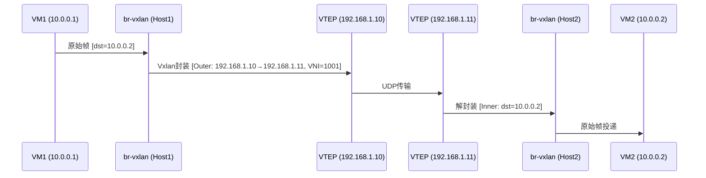

# Overlay 网络与 Vxlan 隧道

Vxlan 是 ZStack 实现跨可用区网络的核心技术。本章分析 Vxlan 网络池、VTEP 管理、FDB 表维护的完整实现。

## Vxlan 架构全景

```
┌──────────────────────────────────────────────────────┐
│                  VxlanNetworkPool                     │
│  (L2 网络容器，管理 VNI 范围和 VTEP)                    │
│  ├── VniRange: 1 - 16777215                          │
│  ├── VtepVO (本地 VTEP)                               │
│  └── RemoteVtepVO (远端 VTEP，跨可用区)                 │
├──────────────────────────────────────────────────────┤
│  VxlanNetwork (具体 Vxlan 段)                         │
│  ├── vni: 100                                        │
│  ├── poolUuid → VxlanNetworkPool                     │
│  └── 继承 L2NetworkVO                                │
├──────────────────────────────────────────────────────┤
│  数据面 (kvmagent network_plugin)                     │
│  ├── 创建 Vxlan 网桥: br_vxlan_<vni>                 │
│  ├── VTEP 接口: <phys>.<vtep_port>                   │
│  └── FDB 表: bridge fdb add <remote_vtep> dev <vtep> │
└──────────────────────────────────────────────────────┘
```

## Vxlan 架构

```mermaid
graph TB
    subgraph VxlanPool["VxlanNetworkPool (L2)"]
        VNI["VNI Range<br/>1000-2000"]
        VTEP1["VTEP: Host1<br/>192.168.1.10"]
        VTEP2["VTEP: Host2<br/>192.168.1.11"]
        RemoteVTEP["Remote VTEP<br/>跨Zone"]
    end
    subgraph VxlanNet["VxlanNetwork (L2)"]
        VNIA["VNI: 1001"]
    end
    subgraph Host1["Host1"]
        VM1["VM1<br/>10.0.0.1"]
        BrVxlan1["br-vxlan"]
    end
    subgraph Host2["Host2"]
        VM2["VM2<br/>10.0.0.2"]
        BrVxlan2["br-vxlan"]
    end

    VxlanPool --> VxlanNet
    VxlanNet --> VNIA
    VM1 --> BrVxlan1
    VM2 --> BrVxlan2
    BrVxlan1 <|"Vxlan 隧道<br/>VNI:1001"|> BrVxlan2
```

## VxlanNetworkPoolVO — 网络池

> 源码路径：`zstack/plugin/vxlan/src/main/java/org/zstack/network/l2/vxlan/vxlanNetworkPool/VxlanNetworkPoolVO.java`

```java
@Entity
@Table
@PrimaryKeyJoinColumn(name = "uuid", referencedColumnName = "uuid")
public class VxlanNetworkPoolVO extends L2NetworkVO {
    // physicalInterface 继承自 L2NetworkAO（L2NetworkVO 的父类）
    // EAGER: 本地 VTEP 集合
    @OneToMany(fetch = FetchType.EAGER)
    @JoinColumn(name = "poolUuid", insertable = false, updatable = false)
    private Set<VtepVO> attachedVtepRefs = new HashSet<VtepVO>();
    // EAGER: 远端 VTEP 集合
    @OneToMany(fetch = FetchType.EAGER)
    @JoinColumn(name = "poolUuid", insertable = false, updatable = false)
    private Set<RemoteVtepVO> remoteVteps = new HashSet<RemoteVtepVO>();
    // EAGER: VNI 范围集合
    @OneToMany(fetch = FetchType.EAGER)
    @JoinColumn(name = "l2NetworkUuid", insertable = false, updatable = false)
    private Set<VniRangeVO> attachedVniRanges = new HashSet<>();
}
```

VxlanNetworkPool 本身也是一种 L2 网络（继承 L2NetworkVO），但它的角色是 **容器**——管理 VNI 范围和 VTEP，不直接承载 VM 流量。

## VxlanNetworkVO — 具体 Vxlan 段

> 源码路径：`zstack/plugin/vxlan/src/main/java/org/zstack/network/l2/vxlan/vxlanNetwork/VxlanNetworkVO.java`

```java
@Entity
@Table
@PrimaryKeyJoinColumn(name = "uuid", referencedColumnName = "uuid")
public class VxlanNetworkVO extends L2NetworkVO {
    @Column private Integer vni;           // Vxlan Network Identifier
    @Column private String poolUuid;       // 所属 VxlanNetworkPool
}
```

> **注**：`VxlanNetworkVO` 和 `VxlanNetworkPoolVO` 都使用 `@PrimaryKeyJoinColumn`（而非 `@Inheritance`）声明与 `L2NetworkVO` 的 JOINED 继承关系。`@Inheritance(strategy = JOINED)` 只在根实体 `L2NetworkVO` 上声明。

VxlanNetwork 继承 L2NetworkVO，因此可以像普通 L2 网络一样挂载到集群、创建 L3 网络。区别在于它的实现走 Vxlan 隧道。

## VTEP 数据模型

### 本地 VTEP

> 源码路径：`zstack/plugin/vxlan/src/main/java/org/zstack/network/l2/vxlan/vtep/VtepVO.java`

```java
@Entity
@Table
public class VtepVO {
    @Column private String uuid;
    @Column private String hostUuid;       // VTEP 所在主机
    @Column private String clusterUuid;    // 所属集群
    @Column private String vtepIp;         // VTEP IP 地址
    @Column private Integer port;          // VTEP 端口 (默认 4789)
    @Column private String poolUuid;       // 所属 VxlanNetworkPool
    @Column private String type;           // VTEP 类型
    @Column private String physicalInterface;  // 物理网卡名
    @Column private Timestamp createDate;
    @Column private Timestamp lastOpDate;
}
```

### 远端 VTEP（跨可用区关键）

> 源码路径：`zstack/plugin/vxlan/src/main/java/org/zstack/network/l2/vxlan/vtep/RemoteVtepVO.java`

```java
@Entity
@Table
public class RemoteVtepVO {
    @Column private String uuid;
    @Column private String clusterUuid;    // 远端集群
    @Column private String vtepIp;         // 远端 VTEP IP
    @Column private Integer port;          // 远端端口
    @Column private String poolUuid;       // 同一个 VxlanNetworkPool
    @Column private String type;           // VTEP 类型
    @Column private Timestamp createDate;
    @Column private Timestamp lastOpDate;
}
```

> **注**：`VtepVO` 有 `hostUuid` 和 `physicalInterface` 字段（本地 VTEP 需要知道在哪台主机的哪个网卡上），而 `RemoteVtepVO` 没有这两个字段（远端 VTEP 只需知道 IP 和端口即可通信）。两者都有 `type` 字段标识 VTEP 类型。

`RemoteVtepVO` 是跨可用区 Vxlan 的核心——它记录了远端可用区的 VTEP 信息，使得本地主机可以向远端发送封装后的 Vxlan 报文。

## VxlanNetworkFactory — 创建与挂载

> 源码路径：`zstack/plugin/vxlan/src/main/java/org/zstack/network/l2/vxlan/vxlanNetwork/VxlanNetworkFactory.java`

### 创建 Vxlan 网络

```java
@Override
public L2NetworkInventory createL2Network(APICreateL2NetworkMsg msg) {
    APICreateVxlanNetworkMsg vmsg = (APICreateVxlanNetworkMsg) msg;

    VxlanNetworkVO vo = new VxlanNetworkVO();
    vo.setVni(vmsg.getVni());
    vo.setPoolUuid(vmsg.getPoolUuid());
    // ... 填充 L2NetworkVO 基类字段
    vo.setType(L2NetworkConstant.L2_VXLAN_NETWORK_TYPE);
    vo = dbf.persistAndRefresh(vo);
    return VxlanNetworkInventory.valueOf(vo);
}
```

### 挂载到集群 — 准备 VTEP

```java
@Override
public void afterAttachL2NetworkToCluster(
        L2NetworkInventory l2, ClusterInventory cluster) {
    VxlanNetworkVO vxlan = (VxlanNetworkVO) l2;

    // 对集群中每台主机，准备 VTEP
    for (HostInventory host : hosts) {
        prepareVtepOnHost(vxlan, host);
    }
}

private void prepareVtepOnHost(VxlanNetworkVO vxlan, HostInventory host) {
    // 1. 检查/创建 VtepVO 记录
    // 2. 调用 kvmagent 创建 Vxlan 网桥
    // 3. 填充 FDB 表（远端 VTEP 信息）
    CreateVxlanBridgeCmd cmd = new CreateVxlanBridgeCmd();
    cmd.setBridgeName(getBridgeName(vxlan));
    cmd.setVtepIp(vtep.getVtepIp());
    cmd.setVni(vxlan.getVni());
    cmd.setPeers(getRemoteVteps(vxlan.getPoolUuid()));
    // 发送到 kvmagent
    http.call(host.getManagementIp(), KVM_CREATE_VXLAN_BRIDGE_PATH, cmd);
}
```

### VM 迁移支持

VxlanNetworkFactory 实现了 `VmInstanceMigrateExtensionPoint`：

```java
@Override
public void beforeMigrateVm(VmInstanceInventory vm) {
    // 迁移前：在目标主机准备 Vxlan 网络
    for (VmNicInventory nic : vm.getVmNics()) {
        L3NetworkVO l3 = dbf.findByUuid(nic.getL3NetworkUuid());
        if (isVxlanL2(l3.getL2NetworkUuid())) {
            prepareVtepOnTargetHost(l3, vm.getTargetHostUuid());
        }
    }
}
```

## VxlanNetworkPoolFactory — 池管理

> 源码路径：`zstack/plugin/vxlan/src/main/java/org/zstack/network/l2/vxlan/vxlanNetworkPool/VxlanNetworkPoolFactory.java`

PoolFactory 拦截两个关键 API：

### 拦截 L2 挂载到集群

```java
@Override
public void afterAttachL2NetworkToCluster(
        L2NetworkInventory l2, ClusterInventory cluster) {
    // VxlanNetworkPool 挂载到集群时：
    // 1. 为集群中每台主机创建 VtepVO
    // 2. 将远端 VTEP 信息同步到本地主机
    // 3. 在主机上创建 VTEP 接口
}
```

### 拦截 L3 网络创建

```java
@Override
public void beforeCreateL3Network(APICreateL3NetworkMsg msg) {
    // 检查 L3 网络的 L2 是否为 VxlanNetworkPool
    // 如果是，拒绝直接在 Pool 上创建 L3
    // L3 必须创建在具体的 VxlanNetwork 上
}
```

## kvmagent 端 — Vxlan 网桥创建

> 源码路径：`zstack-utility/kvmagent/kvmagent/plugins/network_plugin.py`

```python
KVM_REALIZE_L2VXLAN_PATH = "/network/l2vxlan/createbridge"

# Java 端: CreateVxlanBridgeCmd extends AgentCommand（不继承 CreateBridgeCmd）
# 字段: bridgeName, vtepIp, vni, dstport, l2NetworkUuid, peers(List<String>), mtu, igmpVersion, mldVersion
# 注意: 无 physicalInterfaceName 字段（与 CreateVlanBridgeCmd 不同）

@kvmagent.handle_request(KVM_REALIZE_L2VXLAN_PATH)
def create_vxlan_bridge(req):
    cmd = jsonobject.loads(req[http.REQUEST_BODY])
    # 1. 创建 VTEP 接口
    shell.call("ip link add %s type vxlan id %d dstport %d "
               "local %s nolearning"
               % (vtep_dev, cmd.vni, cmd.dstport, cmd.vtepIp))
    # 2. 创建网桥并加入 VTEP
    shell.call("brctl addbr %s" % cmd.bridgeName)
    shell.call("brctl addif %s %s" % (cmd.bridgeName, vtep_dev))
    # 3. 填充 FDB 表（远端 VTEP）
    for peer in cmd.peers:
        shell.call("bridge fdb append 00:00:00:00:00:00 "
                   "dev %s dst %s" % (vtep_dev, peer))
```

### FDB 表维护

```python
KVM_POPULATE_VXLAN_FDB_PATH = "/network/l2vxlan/populatefdb"

# Java 端: PopulateVxlanFdbCmd extends AgentCommand
# 字段: Integer vni, List<String> peers
# 对应响应: PopulateVxlanFdbResponse extends AgentResponse（无额外字段）

@kvmagent.handle_request(KVM_POPULATE_VXLAN_FDB_PATH)
def populate_fdb(req):
    cmd = jsonobject.loads(req[http.REQUEST_BODY])
    vtep_dev = get_vtep_dev(cmd.vni)
    for peer in cmd.peers:
        # 添加远端 VTEP IP 到 FDB 表
        shell.call("bridge fdb append 00:00:00:00:00:00 "
                   "dev %s dst %s" % (vtep_dev, peer))
```

## 延迟挂载机制

> 源码路径：`zstack/plugin/vxlan/src/main/java/org/zstack/network/l2/vxlan/vxlanNetwork/VxlanNetworkFactory.java`

```java
// 全局配置控制是否延迟准备 Vxlan 网络
// CLUSTER_LAZY_ATTACH = true 时，不在挂载时立即准备
// 而是在 VM 创建时按需准备
if (!VxlanNetworkGlobalConfig.CLUSTER_LAZY_ATTACH.value(Boolean.class)) {
    prepareVtepOnHost(vxlan, host);
}
```

延迟挂载优化了大规模集群的启动时间——不在 L2 挂载时为所有主机准备 VTEP，而是在 VM 实际需要时才准备。

## 跨可用区 Vxlan 流量路径

### 通信流程



```
VM-A (可用区1)                    VM-B (可用区2)
    │                                 │
    ▼                                 ▼
 br_vxlan_100                     br_vxlan_100
    │                                 │
    ▼                                 ▼
 vxlan0 (VTEP)                    vxlan0 (VTEP)
 vtepIp: 10.0.1.1                 vtepIp: 10.0.2.1
    │                                 │
    ▼                                 ▼
 UDP封装 → 物理网络 → UDP解封装
    └─────────────────────────────────┘
         RemoteVtepVO 记录对端信息
```

关键数据流：
1. VM-A 发送报文到 VM-B
2. br_vxlan_100 查 FDB 表，发现目标 MAC 在远端 VTEP 10.0.2.1
3. vxlan0 将报文封装为 UDP（目标 10.0.2.1:4789）
4. 物理网络路由到可用区2
5. 可用区2 的 vxlan0 解封装，br_vxlan_100 转发给 VM-B

## 小结

| 组件 | 职责 | 源码位置 |
|------|------|----------|
| VxlanNetworkPoolVO | VNI 范围和 VTEP 容器 | `plugin/vxlan/.../VxlanNetworkPoolVO.java` |
| VxlanNetworkVO | 具体 Vxlan 段 (vni + pool) | `plugin/vxlan/.../VxlanNetworkVO.java` |
| VtepVO | 本地 VTEP 记录 | `plugin/vxlan/.../VtepVO.java` |
| RemoteVtepVO | 远端 VTEP 记录（跨可用区） | `plugin/vxlan/.../RemoteVtepVO.java` |
| VxlanNetworkFactory | 创建/挂载/迁移 | `plugin/vxlan/.../VxlanNetworkFactory.java` |
| network_plugin.py | 主机端 Vxlan 网桥 | `kvmagent/plugins/network_plugin.py` |

Vxlan 的设计精髓：**Pool 管范围，Network 管段，VTEP 管隧道，FDB 管转发**。四层分离使得跨可用区网络只需维护 RemoteVtepVO 即可实现。
