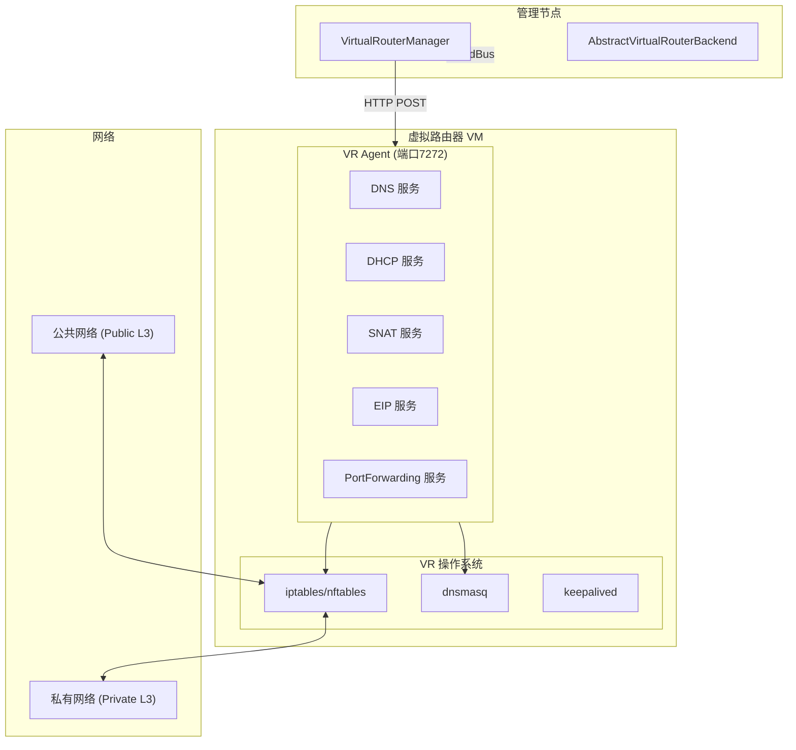

# 虚拟路由器网关

虚拟路由器（VirtualRouter，简称 VR）是 ZStack 的集中式网络服务网关。它以虚拟机形态运行，提供 DHCP、DNS、SNAT、EIP、PortForwarding、VIP、LB、HA 等全部网络服务。本章分析 VR 的架构与实现。

## VR 架构全景

```
┌──────────────────────────────────────────────────────┐
│              VirtualRouterManagerImpl (2874行)         │
│  ├── VR 生命周期管理（创建/启动/销毁/重连）              │
│  ├── VR 网卡规格（管理 + 公网 + Guest L3）              │
│  ├── VR 服务编排（DHCP/SNAT/EIP/PF/LB）                │
│  └── VR HA（keepalived 主备切换）                       │
├──────────────────────────────────────────────────────┤
│  VirtualRouterVmVO                                    │
│  ├── 继承 ApplianceVmVO                               │
│  ├── publicNetworkUuid (公网 L3)                      │
│  └── virtualRouterVips (VIP 列表)                      │
├──────────────────────────────────────────────────────┤
│  VR Agent (virtualrouter)                             │
│  ├── 端口 7272                                        │
│  ├── 9 个插件 (dhcpservice, snat, eip, vip, ...)      │
│  └── 基于 zstacklib                                   │
└──────────────────────────────────────────────────────┘
```

## 架构概览



## VirtualRouterVmVO — VR 数据模型

> 源码路径：`zstack/plugin/virtualRouterProvider/src/main/java/org/zstack/network/service/virtualrouter/VirtualRouterVmVO.java`

```java
@Entity
@Table
public class VirtualRouterVmVO extends ApplianceVmVO {
    @Column private String publicNetworkUuid;  // 公网 L3 网络
    // EAGER: VR 上的 VIP 集合
    @OneToMany(mappedBy = "virtualRouterVmUuid")
    private Set<VirtualRouterVipVO> virtualRouterVips = new HashSet<>();
}
```

VR 继承 `ApplianceVmVO`（设备虚拟机基类），拥有管理 IP、Agent 状态等字段。`publicNetworkUuid` 标识 VR 的公网出口。

## VirtualRouterConstant — Agent HTTP 路径

> 源码路径：`zstack/plugin/virtualRouterProvider/src/main/java/org/zstack/network/service/virtualrouter/VirtualRouterConstant.java`

```java
public class VirtualRouterConstant {
    // VR Agent 的 HTTP 端点路径
    String VR_ADD_DHCP_PATH = "/adddhcp";
    String VR_REMOVE_DHCP_PATH = "/removedhcp";
    String VR_SET_SNAT_PATH = "/setsnat";
    String VR_REMOVE_SNAT_PATH = "/removesnat";
    String VR_CREATE_EIP = "/createeip";
    String VR_REMOVE_EIP = "/removeeip";
    String VR_CREATE_VIP = "/createvip";
    String VR_REMOVE_VIP = "/removevip";
    String VR_CREATE_PORT_FORWARDING = "/createportforwarding";
    String VR_REVOKE_PORT_FORWARDING = "/revokeportforwarding";
    // VR 类型
    String VIRTUAL_ROUTER_PROVIDER_TYPE = "VirtualRouter";
    // VYOS_ROUTER_PROVIDER_TYPE 定义在 VyosConstants 中（非此类）
}
```

> 源码路径：`zstack/plugin/virtualRouterProvider/src/main/java/org/zstack/network/service/virtualrouter/vyos/VyosConstants.java`

```java
public class VyosConstants {
    String VYOS_ROUTER_PROVIDER_TYPE = "vrouter";  // 注意：值为小写 "vrouter"
}
```

## VR 创建流程

> 源码路径：`zstack/plugin/virtualRouterProvider/src/main/java/org/zstack/network/service/virtualrouter/VirtualRouterManagerImpl.java`

### acquireVirtualRouterVm — 获取 VR

```java
public void acquireVirtualRouterVm(L3NetworkInventory guestL3,
        VmInstanceSpec spec, Completion completion) {
    // 1. 查找已有 VR
    VirtualRouterVmVO vr = getVirtualRouterVm(guestL3, host);
    if (vr != null && vr.getState() == Running) {
        // 复用已有 VR
        completion.success();
        return;
    }

    // 2. 需要创建新 VR
    acquireVirtualRouterVmInternal(guestL3, spec, completion);
}
```

### acquireVirtualRouterVmInternal — 创建新 VR

```java
private void acquireVirtualRouterVmInternal(L3NetworkInventory guestL3,
        VmInstanceSpec spec, Completion completion) {
    // GLock 同步：同一 L3 网络不会并发创建 VR
    new ChainTask(new Completion(completion) {
        @Override
        public void success() {
            // 再次检查，防止并发创建
            VirtualRouterVmVO vr = getVirtualRouterVm(guestL3, host);
            if (vr != null) {
                completion.success();
                return;
            }

            // 构建 VR 虚拟机规格
            ApplianceVmSpec vrSpec = buildApplianceVmSpec(guestL3, spec);

            // 调用 ApplianceVmFactory 创建 VR
            apvmf.createApplianceVm(vrSpec, new Completion(completion) {
                @Override
                public void success() {
                    // VR 创建成功
                    completion.success();
                }
                @Override
                public void fail(ErrorCode err) {
                    completion.fail(err);
                }
            });
        }
    }).run();
}
```

### VR 网卡规格

```java
private ApplianceVmSpec buildApplianceVmSpec(
        L3NetworkInventory guestL3, VmInstanceSpec spec) {
    ApplianceVmSpec vrSpec = new ApplianceVmSpec();

    // 网卡1: 管理网卡 — 连接管理网络
    vrSpec.setManagementNetwork(managementL3);

    // 网卡2: 公网网卡 — 连接公网（SNAT/EIP 出口）
    vrSpec.setPublicNetwork(publicL3);

    // 网卡3+: Guest 网卡 — 连接 Guest L3 网络
    // VR 为每个需要服务的 Guest L3 添加一张网卡
    for (L3NetworkInventory l3 : guestL3s) {
        vrSpec.addGuestL3Network(l3);
    }

    return vrSpec;
}
```

VR 的网卡布局：

```
VR 虚拟机
├── eth0: 管理网卡 (管理网络 L3)
├── eth1: 公网网卡 (公网 L3, SNAT/EIP 出口)
├── eth2: Guest 网卡1 (Guest L3-A)
├── eth3: Guest 网卡2 (Guest L3-B)
└── ...
```

## VR 服务编排

### afterCreateL2Network — 自动挂载

```java
@Override
public void afterCreateL2Network(L2NetworkInventory l2) {
    // VR 只支持 NoVlan 和 Vlan 两种 L2 类型
    if (!l2.getType().equals(L2NetworkType.L2NoVlanNetwork.toString())
     && !l2.getType().equals(L2NetworkType.L2VlanNetwork.toString())) {
        return;
    }
    // 自动将 VR Provider 挂载到新创建的 L2 网络
    attachVirtualRouterNetworkServiceProviderToL2Network(l2.getUuid());
}
```

### afterAddIpRange — 网关 IP 分配

```java
@Override
public void afterAddIpRange(IpRangeInventory ipr, List<String> sysTags) {
    // 当添加 IP 范围时，将网关 IP 分配给 VR
    // VR 需要网关 IP 作为 DHCP 网关和默认路由
    L3NetworkVO l3 = dbf.findByUuid(ipr.getL3NetworkUuid());
    VirtualRouterVmVO vr = getVirtualRouterVm(l3);
    if (vr != null) {
        allocateGatewayIpToVr(vr, ipr);
    }
}
```

## VR HA — 主备切换

VR 支持 HA（高可用），通过 keepalived 实现：

```java
// VirtualRouterHaBackend 处理 VR 主备切换
// 主 VR 故障时，备 VR 自动接管

// VR 迁移前的 HA 处理
@Override
public void preVmMigration(VmInstanceInventory vm) {
    if (isVirtualRouter(vm)) {
        // 迁移前：将主 VR 降级为备
        // 避免迁移过程中出现双主
        demoteMasterVr(vm);
    }
}
```

## VR 版本检查

```java
@Override
public void handle(CheckVirtualRouterVmVersionMsg msg) {
    // 检查 VR Agent 版本是否与管理节点兼容
    // 版本不匹配时发出告警
    VirtualRouterVmVO vr = dbf.findByUuid(
        msg.getVirtualRouterUuid(), VirtualRouterVmVO.class);
    String agentVersion = vr.getAgentVersion();
    // 比较版本号...
}
```

## VR 级联删除

VR 的级联删除涉及 VIP、EIP、SNAT 等资源的清理：

```java
// CascadeFacade 处理 VR 级联删除
// 删除顺序：EIP → PortForwarding → SNAT → VIP → VR

// applianceVmsToBeDeleted() 收集需要删除的 VR
// applianceVmsAdditionalPublicNic() 处理 VR 额外公网网卡
// applianceVmsDeleteIpByIpRanges() 按 IP 范围清理
```

## VR 与 VIP 的关系

> 源码路径：`zstack/plugin/virtualRouterProvider/src/main/java/org/zstack/network/service/virtualrouter/vip/VirtualRouterVipBaseBackend.java`（363 行）

```java
public class VirtualRouterVipBaseBackend {
    // VIP 在 VR 上的创建
    public void createVipOnVirtualRouter(VipInventory vip,
            VirtualRouterVmVO vr, Completion completion) {
        // 1. 找到 VIP 所在的 L3 网络对应的 VR 网卡
        // 2. 调用 VR Agent 创建 VIP
        //    POST http://vr:7272/createvip
        // 3. 更新 VirtualRouterVipVO 绑定记录
    }

    // VIP 从 VR 上释放
    public void releaseVipOnVirtualRouter(VipInventory vip,
            VirtualRouterVmVO vr, NoErrorCompletion completion) {
        // POST http://vr:7272/deletevip
    }
}
```

## VR 网卡过滤 — EIP 可挂载性

VR 的 EIP 可挂载性判断是最复杂的逻辑之一：

```java
// filterVmNicsForEipInVirtualRouter() (约100行)
// 判断 VM 网卡是否可以挂载 EIP
// 条件：
// 1. VM 网卡所在 L3 网络必须由 VR 提供服务
// 2. VIP 所在 L3 网络必须与 VR 的公网 L3 在同一个 L2
// 3. IP 版本必须匹配（IPv4 EIP 只能绑定 IPv4 网卡）
// 4. VR 必须运行中
```

## VR 迁移后处理

```java
@Override
public void afterMigrateVm(VmInstanceInventory vm) {
    // VR 迁移后同步 VIP 信息
    // 特别是 SR-IOV VF 网卡的 VIP 需要重新配置
    if (isVirtualRouter(vm)) {
        syncVipsOnVirtualRouter(vm);
    }
}
```

## 小结

| 功能 | 方法 | Agent 路径 |
|------|------|-----------|
| 创建 VR | `acquireVirtualRouterVmInternal()` | — |
| DHCP | `addDhcpToVirtualRouter()` | `/adddhcp` |
| SNAT | `setSnatOnVirtualRouter()` | `/setsnat` |
| EIP | `createEipOnVirtualRouter()` | `/createeip` |
| VIP | `createVipOnVirtualRouter()` | `/createvip` |
| PortForwarding | `createPortForwardingOnVirtualRouter()` | `/createportforwarding` |
| HA | `VirtualRouterHaBackend` | keepalived |
| 版本检查 | `handle(CheckVirtualRouterVmVersionMsg)` | — |

VR 的设计精髓：**一台虚拟机承载所有网络服务**。优点是功能完整、集中管理；缺点是单点故障（需 HA）和性能瓶颈（所有流量经过 VR）。
