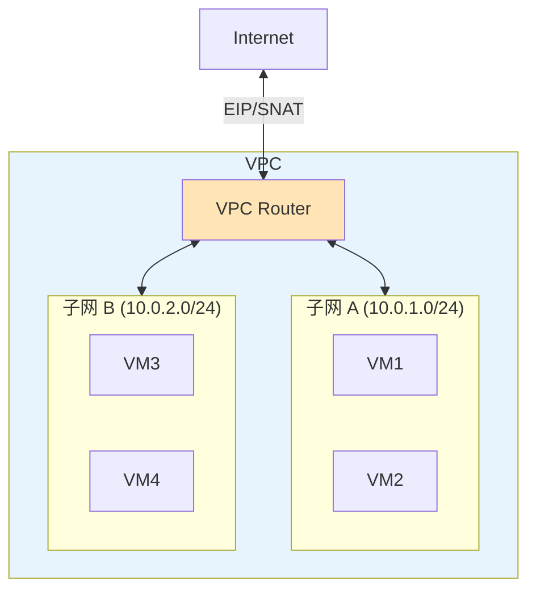

# VPC 架构与路由模型

⚠️ **VPC 功能为 ZStack 企业版特性，以下内容基于概念设计和公开文档，非开源代码实现。** 开源代码中仅有数据库 schema（DDL）和 SDK Inventory 桩代码，无 Java 实现类。

## VPC 架构全景

```
┌──────────────────────────────────────────────────────┐
│                    VPC                                │
│  ├── 多个 L3 网络挂载到 VPC Router                     │
│  ├── 路由表控制子网间流量                               │
│  ├── 策略路由实现高级路由                               │
│  ├── 防火墙规则                                       │
│  ├── SNAT 出口                                       │
│  └── HA 主备切换                                      │
├──────────────────────────────────────────────────────┤
│  VPC Router (VyOS 虚拟机)                             │
│  ├── 运行 zvr.bin (Go 程序, 端口 7272)                 │
│  ├── 多网卡：管理 + 公网 + 多个 Guest L3               │
│  ├── 路由表/策略路由/防火墙/SNAT/QoS                   │
│  └── keepalived HA                                   │
├──────────────────────────────────────────────────────┤
│  ⚠️ 企业版专有                                        │
│  开源代码中只有数据库 DDL 和 SDK Inventory 桩代码       │
│  没有 Java 实现类（@Entity VO 类）                     │
└──────────────────────────────────────────────────────┘
```

## VPC 概念模型



## 开源代码中的 VPC 痕迹

开源代码中不存在 `VpcVO`、`VpcNetworkRefVO`、`VpcInventory` 等类。VPC 的核心数据模型属于企业版。但以下内容在开源代码中可以找到：

### 数据库 Schema（DDL）

开源代码的 `conf/db/upgrade/` 中包含 VPC 相关的建表语句，这些表由企业版模块使用：

**VpcRouterVmVO**（V2.4.0 引入）— VPC 路由器虚拟机

| 字段 | 类型 | 说明 |
|------|------|------|
| uuid | VARCHAR(32) PK | 路由器 UUID（关联 ApplianceVmVO） |

> 此表仅包含 uuid，是 ApplianceVmVO 的子类型标记表。`applianceVmType = 'vpcvrouter'` 的 ApplianceVm 会被插入此表。

**RouterAreaVO**（V3.4.0 引入）— OSPF 路由区域

| 字段 | 类型 | 说明 |
|------|------|------|
| uuid | VARCHAR(32) PK | 区域 UUID |
| areaId | VARCHAR(64) | OSPF Area ID（IPv4 地址格式，如 0.0.0.1） |
| type | VARCHAR(16) | 区域类型，默认 'Standard' |
| authentication | VARCHAR(16) | 认证方式，默认 'None' |
| password | VARCHAR(16) | 认证密码 |
| keyId | INT UNSIGNED | 认证 Key ID |

**NetworkRouterAreaRefVO**（V3.4.0 引入）— 网络与路由区域的绑定

| 字段 | 类型 | 说明 |
|------|------|------|
| uuid | VARCHAR(32) PK | 记录 UUID |
| routerAreaUuid | VARCHAR(32) FK → RouterAreaVO | 所属路由区域 |
| vRouterUuid | VARCHAR(32) FK → VpcRouterVmVO | VPC 路由器 |
| l3NetworkUuid | VARCHAR(32) FK → L3NetworkEO | 关联的 L3 网络 |

外键关系：
```
RouterAreaVO ←── NetworkRouterAreaRefVO ──→ VpcRouterVmVO
                          │
                          └──→ L3NetworkEO
```

### SDK Inventory 桩代码

开源 SDK 中包含以下 VPC 相关的 Inventory 桩代码（仅有字段定义，无业务逻辑）：

**VpcRouterVmInventory** — 继承自 `VirtualRouterVmInventory`

| 字段 | 类型 | 说明 |
|------|------|------|
| dns | List | DNS 配置 |
| haRef | List | HA 引用 |

**RouterAreaInventory**

| 字段 | 类型 | 说明 |
|------|------|------|
| uuid | String | 区域 UUID |
| areaId | String | OSPF Area ID |
| type | String | 区域类型 |
| authentication | String | 认证方式 |
| password | String | 认证密码 |
| keyId | Integer | 认证 Key ID |

**NetworkRouterAreaRefInventory**

| 字段 | 类型 | 说明 |
|------|------|------|
| uuid | String | 记录 UUID |
| vRouterUuid | String | VPC 路由器 UUID |
| applianceVmType | String | 设备虚拟机类型（默认 "vpcvrouter"） |
| routerAreaUuid | String | 路由区域 UUID |
| l3NetworkUuid | String | L3 网络 UUID |

> 注意：`VpcVO`、`VpcNetworkRefVO`、`VpcInventory` 在开源代码中**不存在**。VPC 作为逻辑容器的数据模型属于企业版实现。

## VPC Router — VyOS 虚拟机

VPC Router 是 VPC 的核心网元，基于 VyOS 操作系统：

```
VPC Router (VyOS VM)
├── eth0: 管理网卡
├── eth1: 公网网卡 (SNAT/EIP 出口)
├── eth2: Guest L3-A (子网 A)
├── eth3: Guest L3-B (子网 B)
└── eth4: Guest L3-C (子网 C)

路由表:
  10.0.1.0/24 → eth2  (子网 A 直连)
  10.0.2.0/24 → eth3  (子网 B 直连)
  10.0.3.0/24 → eth4  (子网 C 直连)
  0.0.0.0/0   → eth1  (默认路由，经公网)

策略路由:
  from 10.0.1.0/24 → table 100 (子网 A 专用路由)
  from 10.0.2.0/24 → table 200 (子网 B 专用路由)

防火墙:
  子网 A ↔ 子网 B: ALLOW
  子网 A ↔ 子网 C: DENY
```

### zvr.bin — VPC Router Agent

VPC Router 运行 `zvr.bin`（Go 程序），监听端口 7272：

```
zvr.bin (Go)
├── HTTP Server :7272
├── 路由表管理
├── 策略路由管理
├── 防火墙规则管理
├── SNAT/DNAT 管理
├── QoS 管理
├── keepalived HA
└── OSPF/BGP 路由协议
```

> 注意：zvr.bin 的源码不在当前工作区（zstack-utility/virtualrouter/ 下是 Python 版 VR agent，不是 Go 版 zvr）

## VPC 与 VirtualRouter 的区别

| 特性 | VirtualRouter | VPC Router |
|------|--------------|------------|
| 操作系统 | Linux + Python Agent | VyOS + Go Agent (zvr) |
| 路由能力 | 静态路由 | 静态路由 + 策略路由 + OSPF/BGP |
| 防火墙 | iptables 基础规则 | 完整防火墙（入/出/转发） |
| 子网隔离 | 无（同 VR 下子网互通） | 有（路由表控制） |
| 跨可用区 | Vxlan Overlay | OSPF 动态路由 |
| HA | keepalived | keepalived + VRRP |
| QoS | 无 | 有 |
| 版本 | 开源 | 企业版 |

## VPC 路由模型

### 路由表

VPC Router 维护多张路由表：

```
主路由表 (table 254):
  10.0.1.0/24 dev eth2  (直连)
  10.0.2.0/24 dev eth3  (直连)
  0.0.0.0/0 via 172.20.0.1 dev eth1  (默认)

自定义路由表 (table 100):
  10.0.1.0/24 dev eth2
  0.0.0.0/0 via 172.20.0.1 dev eth1

自定义路由表 (table 200):
  10.0.2.0/24 dev eth3
  # 无默认路由 → 子网 B 不能访问外网
```

### 策略路由

```bash
# 子网 A 的流量走 table 100
ip rule add from 10.0.1.0/24 table 100
# 子网 B 的流量走 table 200
ip rule add from 10.0.2.0/24 table 200
```

策略路由实现了：
- 不同子网可以有不同的出口路由
- 某些子网可以禁止访问外网
- 某些子网可以走专用线路

### OSPF 跨可用区路由

基于开源代码中 `RouterAreaVO` + `NetworkRouterAreaRefVO` 的 schema 设计，OSPF 区域管理的数据模型如下：

```
RouterAreaVO 定义 OSPF 区域:
  uuid: 区域唯一标识
  areaId: OSPF Area ID (如 0.0.0.1)
  type: 区域类型 (Standard)
  authentication: 认证方式

NetworkRouterAreaRefVO 建立网络与区域的绑定:
  routerAreaUuid → RouterAreaVO
  vRouterUuid → VpcRouterVmVO
  l3NetworkUuid → L3NetworkEO

拓扑示例:
可用区1: VPC Router-A (OSPF Area 0.0.0.1)
  ├── L3-A (10.0.1.0/24)
  └── L3-B (10.0.2.0/24)

可用区2: VPC Router-B (OSPF Area 0.0.0.2)
  ├── L3-C (10.0.3.0/24)
  └── L3-D (10.0.4.0/24)

OSPF 邻居关系:
  Router-A ←→ Router-B
  交换路由信息:
    Router-A 学习到: 10.0.3.0/24 via Router-B
    Router-B 学习到: 10.0.1.0/24 via Router-A
```

## VPC 不定义新 L2/L3 类型

VPC 的一个重要设计决策：**不定义新的 L2/L3 网络类型**。

```
传统方式:
  VpcL2Network → VpcL3Network → VpcRouter

ZStack 方式:
  L2NoVlanNetwork / L2VlanNetwork / VxlanNetwork (复用现有类型)
  L3Network (复用现有类型)
  VPC Router (通过挂载多个 L3 网卡实现路由)
```

这意味着 VPC 是一个 **逻辑概念**，通过将多个 L3 网络挂载到同一个 VPC Router 来实现。底层网络基础设施完全复用。

## VPC 防火墙模型

```
VPC 防火墙规则:
  ├── 入方向规则 (Ingress)
  │   ├── 源 CIDR
  │   ├── 目标 CIDR
  │   ├── 协议/端口
  │   └── 动作 (ALLOW/DENY)
  ├── 出方向规则 (Egress)
  │   └── ...
  └── 转发规则 (Forward)
      └── 子网间转发控制
```

与安全组的区别：
- 安全组：VM 级别，iptables + ipset
- VPC 防火墙：子网级别，VyOS 防火墙规则

## 小结

| 组件 | 职责 | 开源状态 |
|------|------|----------|
| VpcRouterVmVO | VPC 路由器标记表 | DDL + SDK 桩 |
| RouterAreaVO | OSPF 区域 | DDL + SDK 桩 |
| NetworkRouterAreaRefVO | 网络-区域绑定 | DDL + SDK 桩 |
| VpcVO / VpcNetworkRefVO | VPC 逻辑容器 | ❌ 不存在于开源代码 |
| VPC Router | VyOS + zvr.bin | 企业版专有 |
| 路由表/策略路由 | 子网间路由控制 | 企业版专有 |
| 防火墙 | 子网级别访问控制 | 企业版专有 |

VPC 的设计精髓：**不定义新网络类型，通过路由器挂载多个 L3 实现逻辑隔离**。这种设计使得 VPC 可以复用所有现有的 L2/L3 基础设施，同时通过路由表和防火墙实现比 VR 更精细的流量控制。
