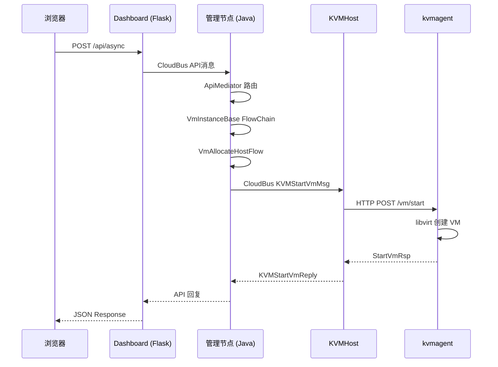

# 跨仓库调用链追踪

ZStack 由三个独立仓库组成，一次用户操作往往跨越全部三个仓库。本文以"创建 VM"为例，追踪完整的跨仓库调用链。

## 三仓库协作模型

```
zstack-dashboard          zstack                    zstack-utility
(TypeScript + Flask)      (Java 管理节点)            (Python Agent)
─────────────────         ──────────────            ──────────────
前端 UI 操作               API 接收 → 业务编排        执行具体操作
    │                         │                        │
    ├── HTTP ───────────────> Flask ──RabbitMQ──> CloudBus
    │                         │                        │
    │                         ├── FlowChain 编排        ├── kvmagent
    │                         ├── CloudBus 消息         ├── virtualrouter
    │                         └── HTTP 回调 Agent       └── zstacklib
```

## 调用链总览



## 案例：创建 VM 全链路追踪

### 第 1 步：前端发起请求

`zstack-dashboard/ts/vm.ts`（VmInstanceManager）

```typescript
createVm(msg: ApiHeader.APICreateVmInstanceMsg, done: Function) {
    this.api.asyncApi(msg, done);
}
```

前端构造 `APICreateVmInstanceMsg`，通过 `asyncApi` 发送 POST `/api/async`。

### 第 2 步：Dashboard 后端转发

`zstack-dashboard/zstack_dashboard/web.py:451-464`

```python
def api_async_call(self, msg_str):
    receipt = self.Receipt()
    def cb(evt):
        receipt.status = receipt.DONE
        receipt.rsp = evt
    self.api_tasks[receipt.id] = receipt
    self.bus.send(msg_str, cb)  # 发送到 RabbitMQ
    return receipt.to_json()     # 返回 Receipt ID
```

CloudBus.send() 将消息发布到 P2P exchange，routing key 为 `zstack.message.api.portal`。

### 第 3 步：管理节点 API 接收

`zstack/header/src/main/java/org/zstack/header/vm/APICreateVmInstanceMsg.java`

```java
@RestRequest(
    path = "/vm-instances",
    method = HttpMethod.POST,
    parameterName = "params",
    responseClass = APICreateVmInstanceEvent.class
)
public class APICreateVmInstanceMsg extends APIMessage {
    @APIParam(resourceType = VmInstanceVO.class)
    private String name;
    @APIParam
    private String instanceOfferingUuid;
    @APIParam
    private String imageUuid;
    @APIParam
    private List<String> l3NetworkUuids;
    // ...
}
```

APIMediator 接收消息，路由到 VmInstanceBase。

### 第 4 步：管理节点 FlowChain 编排

`zstack/compute/src/main/java/org/zstack/compute/vm/VmInstanceBase.java`

```java
@Override
public void handleApiMessage(APIMessage msg) {
    if (msg instanceof APICreateVmInstanceMsg) {
        handleApiMessage((APICreateVmInstanceMsg) msg);
    }
}

private void handleApiMessage(APICreateVmInstanceMsg msg) {
    VmInstanceSpec spec = new VmInstanceSpec();
    // 填充 spec ...

    FlowChain chain = FlowChainBuilder.newShareFlowChain();
    chain.setData(spec);
    chain.then(new Flow[] {
        // 1. 分配主机和主存储
        new VmAllocateHostAndPrimaryStorageFlow(),
        // 2. 分配网卡
        new VmAllocateNicFlow(),
        // 3. 分配云盘
        new VmAllocateVolumeFlow(),
        // 4. 在 Hypervisor 上创建 VM
        new VmCreateOnHypervisorFlow(),
        // 5. 启动 VM（调用 Agent）
        new VmStartOnHypervisorFlow(),
        // 6. 后处理
        new VmInstantiateResourcePostFlow(),
    }).done(() -> {
        // 成功，发送 APIReply
        APICreateVmInstanceEvent evt = new APICreateVmInstanceEvent(msg.getId());
        evt.setInventory(VmInstanceInventory.valueOf(self));
        bus.publish(evt);
    }).error(() -> {
        // 失败，回滚
    }).start();
}
```

> **注**：以上 FlowChain 步骤为简化示意。实际创建 VM 的 FlowChain 更复杂，包含 `VmInstantiateResourcePreFlow`、`VmAllocateNicIpFlow`、`VmAllocateCdRomFlow` 等更多步骤，且 `VmAllocateHostAndPrimaryStorageFlow` 内部会编排 `VmAllocateHostFlow` 和 `VmAllocatePrimaryStorageFlow`。

### 第 5 步：CloudBus 发送 HTTP 到 Agent

`zstack/plugin/kvm/src/main/java/org/zstack/kvm/KVMHost.java`

VmStartOnHypervisorFlow 最终调用 KVMHost。KVMHost 在构造函数中通过 `UriComponentsBuilder` 构建完整 URL：

```java
// KVMHost 构造函数中构建 URL
UriComponentsBuilder ub = UriComponentsBuilder.fromHttpUrl(baseUrl);
ub.path(KVMConstant.KVM_START_VM_PATH);  // "/vm/start"
startVmPath = ub.build().toString();
// 结果如: "http://192.168.1.10:7070/vm/start"
```

然后通过内部 `Http<T>` 类发送异步 HTTP 请求：

```java
new Http<>(startVmPath, cmd, StartVmResponse.class)
    .call(new ReturnValueCompletion<StartVmResponse>(msg, completion) {
    @Override
    public void success(StartVmResponse ret) {
        // VM 启动成功
        completion.success(ret);
    }
    @Override
    public void fail(ErrorCode error) {
        completion.fail(error);
    }
});
```

`Http<T>.call()` 内部调用 `restf.asyncJsonPost()`：

```java
restf.asyncJsonPost(path, cmd, header,
    new JsonAsyncRESTCallback<T>(completion) {
        @Override
        public void fail(ErrorCode err) {
            completion.fail(err);
        }
        @Override
        public void success(T ret) {
            completion.success(ret);
        }
        @Override
        public Class<T> getReturnClass() {
            return responseClass;
        }
    });
```

HTTP 请求路径：`POST http://{hostIp}:7070/vm/start`

### 第 6 步：kvmagent 执行

`zstack-utility/kvmagent/kvmagent/plugins/vm_plugin.py`

VmPlugin 在 `start()` 方法中注册路由：

```python
class VmPlugin(kvmagent.KvmAgent):
    KVM_START_VM_PATH = "/vm/start"
    KVM_STOP_VM_PATH = "/vm/stop"
    KVM_REBOOT_VM_PATH = "/vm/reboot"
    KVM_DESTROY_VM_PATH = "/vm/destroy"
    KVM_MIGRATE_VM_PATH = "/vm/migrate"
    KVM_ATTACH_VOLUME = "/vm/attachdatavolume"
    KVM_DETACH_VOLUME = "/vm/detachdatavolume"

    def start(self):
        http_server = kvmagent.get_http_server()
        http_server.register_async_uri(self.KVM_START_VM_PATH, self.start_vm, cmd=StartVmCmd())
        http_server.register_async_uri(self.KVM_STOP_VM_PATH, self.stop_vm)
        http_server.register_async_uri(self.KVM_REBOOT_VM_PATH, self.reboot_vm)
        http_server.register_async_uri(self.KVM_DESTROY_VM_PATH, self.destroy_vm)
        http_server.register_async_uri(self.KVM_MIGRATE_VM_PATH, self.migrate_vm)
        http_server.register_async_uri(self.KVM_ATTACH_VOLUME, self.attach_data_volume)
        http_server.register_async_uri(self.KVM_DETACH_VOLUME, self.detach_data_volume)
        # ... 更多路由注册
```

Handler 使用 `@kvmagent.replyerror` 装饰器，通过 `req[http.REQUEST_BODY]` 获取请求体，使用 `Vm` 类和 libvirt API 操作 VM：

```python
@kvmagent.replyerror
def start_vm(self, req):
    cmd = jsonobject.loads(req[http.REQUEST_BODY])
    rsp = StartVmResponse()
    try:
        self._record_operation(cmd.vmInstanceUuid, self.VM_OP_START)
        self._start_vm(cmd)
        logger.debug('successfully started vm[uuid:%s, name:%s]'
                      % (cmd.vmInstanceUuid, cmd.vmName))
    except kvmagent.KvmError as e:
        rsp.error = linux.get_exception_stacktrace()
        rsp.success = False

    if rsp.success:
        vm = get_vm_by_uuid(cmd.vmInstanceUuid)
        # 收集设备信息 ...
    return jsonobject.dumps(rsp)
```

> **注**：`_start_vm()` 内部使用 `Vm` 类构建 libvirt XML，通过 `libvirt.defineXML()` + `libvirt.create()` 启动 VM，而非 `shell.run('virsh ...')`。

### 第 7 步：回复链路

```
kvmagent HTTP 200 OK
    │
    <── KVMHost.restf.asyncJsonPost() 回调 ── FlowChain done()
    │
    ├── 发布 APICreateVmInstanceEvent 到 CloudBus
    │
    <── Dashboard CloudBus._message_handler() 收到回复
    │
    ├── receipt.status = DONE, receipt.rsp = reply
    │
    <── 前端 poll() 收到 status=DONE
    │
    └── callback(rsp) → 更新 UI
```

## 跨仓库调用链全景图

```
[前端 TypeScript]          [后端 Flask]           [管理节点 Java]           [Agent Python]
─────────────────          ────────────           ───────────────           ──────────────
VmInstanceManager
  .createVm()
    │
    ├── POST /api/async ──> Server.api_async_call()
    │                       │
    │                       ├── CloudBus.send() ──> APIMediator
    │                       │                      │
    │                       │                      ├── VmInstanceBase
    │                       │                      │   └── FlowChain
    │                       │                      │       ├── VmAllocateHostAndPrimaryStorageFlow
    │                       │                      │       ├── VmAllocateNicFlow
    │                       │                      │       ├── VmAllocateVolumeFlow
    │                       │                      │       ├── VmCreateOnHypervisorFlow
    │                       │                      │       │   └── VirtualRouter
    │                       │                      │       │       └── HTTP :7272 ──> vr_agent
    │                       │                      │       ├── VmStartOnHypervisorFlow
    │                       │                      │       │   └── KVMHost
    │                       │                      │       │       └── HTTP :7070 ──> kvmagent
    │                       │                      │       │                         vm_plugin
    │                       │                      │       │                         .start_vm()
    │                       │                      │       │                           └── libvirt API
    │                       │                      │       └── VmInstantiateResourcePostFlow
    │                       │                      │
    │                       │                      └── APIReply ──> RabbitMQ
    │                       │
    │                       <── _message_handler()
    │                       │
    │   <── poll() DONE ────┘
    │
    └── 更新 UI Grid
```

## 关键跨仓库接口

### 管理节点 → kvmagent

| 路径 | 功能 | Agent 文件 |
|------|------|-----------|
| `/vm/start` | 启动 VM | vm_plugin.py |
| `/vm/stop` | 停止 VM | vm_plugin.py |
| `/vm/reboot` | 重启 VM | vm_plugin.py |
| `/vm/destroy` | 销毁 VM | vm_plugin.py |
| `/vm/migrate` | 迁移 VM | vm_plugin.py |
| `/vm/attachdatavolume` | 挂载云盘 | vm_plugin.py |
| `/vm/detachdatavolume` | 卸载云盘 | vm_plugin.py |
| `/vm/attachnic` | 挂载网卡 | vm_plugin.py |
| `/vm/detachnic` | 卸载网卡 | vm_plugin.py |
| `/host/connect` | 连接主机 | host_plugin.py |
| `/network/l2novlan/createbridge` | 创建网桥 | network_plugin.py |

### 管理节点 → virtualrouter

| 路径 | 功能 | Agent 文件 |
|------|------|-----------|
| `/createvip` | 创建 VIP | vip.py |
| `/createeip` | 创建 EIP | eip.py |
| `/createportforwarding` | 创建端口转发 | port_forwarding.py |
| `/setdns` | 设置 DNS | dns.py |
| `/adddhcp` | 添加 DHCP | dnsmasq.py |
| `/setsnat` | 设置 SNAT | snat.py |
| `/configurenic` | 配置网卡 | configure_nic.py |

### Dashboard → 管理节点

| HTTP 路径 | RabbitMQ 路由 | 功能 |
|-----------|--------------|------|
| `/api/sync` | P2P → api.portal | 同步 API |
| `/api/async` | P2P → api.portal | 异步 API |
| `/api/query` | 无（本地查询） | 轮询异步结果 |

## 追踪技巧

### 1. 通过 correlationId 追踪

每条消息的 headers 中包含 `correlationId`，在三个仓库的日志中搜索同一个 correlationId 即可追踪完整链路。

### 2. 通过 vmInstanceUuid 追踪

VM UUID 贯穿整个调用链，在日志中搜索 UUID 可追踪该 VM 的所有操作。

### 3. 通过 REST facade 日志

管理节点的 REST facade 会记录所有发往 Agent 的 HTTP 请求和响应，日志路径：`/var/log/zstack/management-server.log`。

### 4. 通过 Agent 日志

kvmagent 日志：`/var/log/zstack/zstack-kvmagent.log`
virtualrouter 日志：`/var/log/zstack/zstack-virtualrouter.log`

### 5. 通过 RabbitMQ 管理 UI

访问 `http://rabbitmq-host:15672`，查看队列消息流量，确认消息是否到达和消费。
