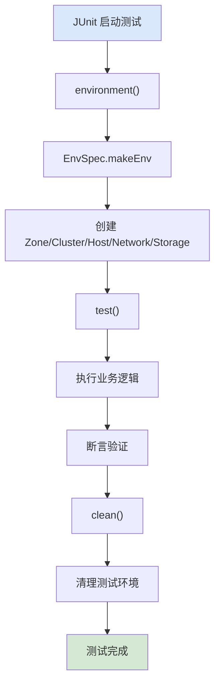

# 测试体系与模拟器

ZStack 的测试体系基于 Groovy DSL，通过 testlib 框架提供声明式环境构建和模拟器（Simulator）机制，无需真实硬件即可测试完整业务流程。

## 测试架构概览

```
test/src/test/groovy/          测试用例（Groovy）
testlib/                       测试框架
├── SubCase.groovy             测试基类
├── Test.groovy                测试运行器
├── SpringSpec.groovy          Spring 配置声明
├── EnvSpec.groovy             环境规格 DSL
├── Spec.groovy                资源规格基类
├── KVMHostSpec.groovy         KVM 主机规格
├── VmSpec.groovy              VM 规格
├── L3NetworkSpec.groovy       L3 网络规格
├── Simulator.groovy           模拟器注解
├── ApiHelper.groovy           API 调用辅助
└── ...                        其他资源规格
```

## 测试生命周期



## SubCase：测试基类

`zstack/testlib/src/main/java/org/zstack/testlib/SubCase.groovy`

```groovy
abstract class SubCase extends Test implements Case {
    final void run() {
        try {
            environment()   // 1. 构建测试环境
            test()          // 2. 执行测试逻辑
        } catch (Throwable t) {
            collectErrorLog()
            throw t
        } finally {
            clean()         // 3. 清理环境
            methodsOnClean.each { it() }
        }
    }
}
```

每个测试用例需要实现三个方法：
- `environment()` — 声明测试环境
- `test()` — 测试逻辑
- `clean()` — 清理（可选）

## SpringSpec：Spring 配置选择

`zstack/testlib/src/main/java/org/zstack/testlib/SpringSpec.groovy`

测试用例通过 SpringSpec 声明需要加载的 Spring XML：

```groovy
class SpringSpec {
    List<String> CORE_SERVICES = [
        "HostManager.xml",
        "ZoneManager.xml",
        "ClusterManager.xml",
        "PrimaryStorageManager.xml",
        "ImageManager.xml",
        "VmInstanceManager.xml",
        "AccountManager.xml",
        // ... 16 个核心服务
    ]

    void includeCoreServices() { CORE_SERVICES.each { include(it) } }
    void kvm() { include("Kvm.xml") }
    void ceph() { include("ceph.xml") }
    void virtualRouter() {
        include("ApplianceVmFacade.xml")
        include("VirtualRouter.xml")
        include("NetworkService.xml")
        include("vip.xml")
    }
    void flatNetwork() {
        include("flatNetworkProvider.xml")
        include("sdnController.xml")
        include("vxlan.xml")
    }
    void securityGroup() { include("SecurityGroupManager.xml") }
    void eip() { include("vip.xml"); include("eip.xml") }
}
```

## EnvSpec：声明式环境构建

`zstack/testlib/src/main/java/org/zstack/testlib/EnvSpec.groovy`

EnvSpec 是测试框架的核心，提供 DSL 声明测试环境：

```groovy
static EnvSpec makeEnv(@DelegatesTo(strategy=Closure.DELEGATE_FIRST,
                                      value=EnvSpec.class) Closure c) {
    def spec = new EnvSpec()
    c.delegate = spec
    c.resolveStrategy = Closure.DELEGATE_FIRST
    c()
    return spec
}
```

### 环境声明示例

```groovy
// 在 Test 子类中
@Override
void setSpringSpec() {
    _springSpec = makeSpring {
        includeCoreServices()
        kvm()
        virtualRouter()
        flatNetwork()
        securityGroup()
        eip()
    }
}

@Override
void environment() {
    env = makeEnv {
        zone {
            name = "zone1"

            cluster {
                name = "cluster1"
                hypervisorType = "KVM"

                kvmHost {
                    name = "host1"
                    managementIp = "192.168.1.10"
                }

                kvmHost {
                    name = "host2"
                    managementIp = "192.168.1.11"
                }
            }

            l2NoVlanNetwork {
                name = "l2-flat"
                physicalInterface = "eth0"

                l3Network {
                    name = "l3-pub"
                    category = "Public"

                    ipRange {
                        name = "pub-range"
                        startIp = "10.0.0.10"
                        endIp = "10.0.0.100"
                        gateway = "10.0.0.1"
                        netmask = "255.255.255.0"
                    }

                    service {
                        provider = "Flat"
                        networkServiceTypes = ["EIP"]
                    }
                }
            }

            nfsPrimaryStorage {
                name = "nfs-ps"
                url = "nfs://127.0.0.1/nfs_root"
            }

            sftpBackupStorage {
                name = "sftp-bs"
                url = "/backupStorage"
                username = "admin"
                password = "password"

                image {
                    name = "test-image"
                    url = "http://127.0.0.1/image.qcow2"
                    format = "qcow2"
                    mediaType = "RootVolumeTemplate"
                    guestOsType = "Linux"
                }
            }
        }

        instanceOffering {
            name = "offering1"
            cpuNum = 2
            memorySize = 2147483648  // 2GB
        }
    }
}
```

### 资源规格层级

```
EnvSpec
├── ZoneSpec
│   ├── ClusterSpec
│   │   └── KVMHostSpec
│   ├── L2NetworkSpec (L2NoVlan / L2Vlan / L2Vxlan)
│   │   └── L3NetworkSpec
│   │       ├── IpRangeSpec
│   │       └── NetworkServiceSpec
│   ├── NfsPrimaryStorageSpec / CephPrimaryStorageSpec / LocalStorageSpec
│   └── SftpBackupStorageSpec / CephBackupStorageSpec
│       └── ImageSpec
├── InstanceOfferingSpec
├── DiskOfferingSpec
├── SecurityGroupSpec
│   └── SecurityGroupRuleSpec
├── EipSpec
├── VipSpec
└── AccountSpec
```

## Simulator：HTTP 模拟器

ZStack 的 Simulator 机制拦截管理节点发往 Agent 的 HTTP 请求，返回预设的响应，无需真实 Agent。

### 模拟器注解

`zstack/testlib/src/main/java/org/zstack/testlib/Simulator.groovy`

```groovy
// 在 Spec 中声明模拟器
@Simulator
class KVMHostSpec extends HostSpec {
    // Spec 自动注册 HTTP 模拟器
}
```

### 手动注册模拟器

```groovy
// 在测试用例中注册自定义 HTTP handler
env.simulator("kvm/startvm") { HttpEntity<String> e ->
    def cmd = json(e.body)
    // 自定义响应逻辑
    if (cmd.vmName == "fail-vm") {
        return httpError("simulated failure")
    }
    return httpSuccess()
}

// 条件模拟器
env.conditionSimulator("kvm/startvm",
    { HttpEntity<String> e ->
        def cmd = json(e.body)
        return cmd.vmName == "special-vm"  // 仅对特定 VM 生效
    },
    { HttpEntity<String> e ->
        return httpSuccess([vmInstanceUuid: json(e.body).vmInstanceUuid])
    }
)
```

### 消息模拟器

```groovy
// 拦截 CloudBus 消息
env.message(APICreateVmInstanceMsg.class) { APICreateVmInstanceMsg msg ->
    // 自定义消息处理
    APICreateVmInstanceEvent evt = new APICreateVmInstanceEvent(msg.getId())
    evt.setInventory(mockVmInventory)
    bus.publish(evt)
}

// 带条件的消息模拟器
env.message(APICreateVmInstanceMsg.class,
    { APICreateVmInstanceMsg msg -> msg.name == "test" },
    { APICreateVmInstanceMsg msg ->
        // 仅对 name=="test" 的消息生效
    }
)
```

## 测试用例编写模式

### 基本模式

```groovy
class TestCreateVm extends SubCase {
    EnvSpec env

    @Override
    void setSpringSpec() {
        _springSpec = makeSpring {
            includeCoreServices()
            kvm()
            virtualRouter()
            flatNetwork()
        }
    }

    @Override
    void environment() {
        env = makeEnv {
            zone {
                name = "z1"
                cluster {
                    name = "c1"
                    hypervisorType = "KVM"
                    kvmHost { name = "h1"; managementIp = "192.168.1.10" }
                }
                l2NoVlanNetwork {
                    name = "l2"
                    l3Network {
                        name = "l3"
                        category = "Private"
                        ipRange { name = "ipr"; startIp = "10.0.0.2"; endIp = "10.0.0.254"; gateway = "10.0.0.1"; netmask = "255.255.255.0" }
                    }
                }
                nfsPrimaryStorage { name = "ps"; url = "nfs://127.0.0.1/nfs" }
                sftpBackupStorage {
                    name = "bs"; url = "/bs"; username = "admin"; password = "password"
                    image { name = "img"; url = "http://127.0.0.1/img.qcow2"; format = "qcow2"; mediaType = "RootVolumeTemplate"; guestOsType = "Linux" }
                }
            }
            instanceOffering { name = "off"; cpuNum = 1; memorySize = 1073741824 }
        }
    }

    @Override
    void test() {
        env.create {
            // 环境创建完成后的回调
        }

        // 使用 SDK API 测试
        def result = createVmInstance {
            name = "test-vm"
            instanceOfferingUuid = env.specByName("off").inventory.uuid
            imageUuid = env.specByName("img").inventory.uuid
            l3NetworkUuids = [env.specByName("l3").inventory.uuid] as List
            defaultL3NetworkUuid = env.specByName("l3").inventory.uuid
            zoneUuid = env.specByName("z1").inventory.uuid
        }

        assert result.inventory.state == "Running"

        // 测试停止 VM
        stopVmInstance { uuid = result.inventory.uuid }
        // 测试启动 VM
        startVmInstance { uuid = result.inventory.uuid }
    }

    @Override
    void clean() {
        env.delete()
    }
}
```

### 使用 Spec 操作资源

```groovy
// 通过名称查找 Spec
def host = env.find("h1", KVMHostSpec.class)

// 通过 Spec 创建资源
env.create("h1")  // 仅创建 h1 及其依赖

// 删除资源
env.delete("h1")

// 重新创建
env.recreate("h1")
```

### 模拟失败场景

```groovy
@Override
void test() {
    env.create {}

    // 模拟 Agent 启动 VM 失败
    env.simulator("kvm/startvm") { HttpEntity<String> e ->
        return httpError("out of memory")
    }

    // 创建 VM 应该失败
    expect(AssertionError) {
        createVmInstance {
            name = "fail-vm"
            // ...
        }
    }

    // 恢复正常模拟器
    env.cleanSimulator("kvm/startvm")
}
```

## Test 基类的关键能力

`zstack/testlib/src/main/java/org/zstack/testlib/Test.groovy`

### ZQL 查询

```groovy
protected List zqlQuery(String text) {
    return zQLQuery { zql = text }.results[0].inventories
}
```

### 消息拦截

```groovy
// 拦截发送的消息
env.message(APICreateVmInstanceMsg.class) { msg ->
    // 在消息到达目标服务之前拦截
}

// 拦截消息回复
env.messageAfterDelivery(APICreateVmInstanceMsg.class) { msg ->
    // 在消息处理完成后拦截
}
```

### HTTP Handler 计数

```groovy
// 获取某个 HTTP 路径被调用的次数
int count = env.getHttpHandlerCount("kvm/startvm")
assert count == 1
```

## 运行测试

```bash
# 运行所有测试
mvn test

# 运行单个测试类
mvn -Dtest=TestCreateVm test

# 运行指定 SubCase
mvn -Dtest=TestCreateVm -Dcases=TestCreateVm test

# 跳过测试
mvn -DskipTests clean install
```

## 测试框架设计哲学

1. **声明式环境**：用 DSL 声明"我需要什么"，而非"怎么做"
2. **模拟器优先**：所有 Agent 交互通过 Simulator 模拟，无需真实基础设施
3. **自动清理**：SubCase 的 finally 块确保环境清理
4. **SDK 驱动**：测试用例通过 ZStack SDK API 操作，与用户使用方式一致
5. **Spec 依赖图**：资源规格自动解析依赖关系，按正确顺序创建/删除
